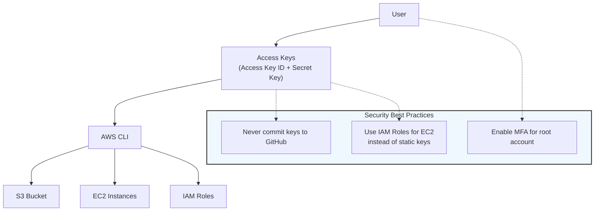
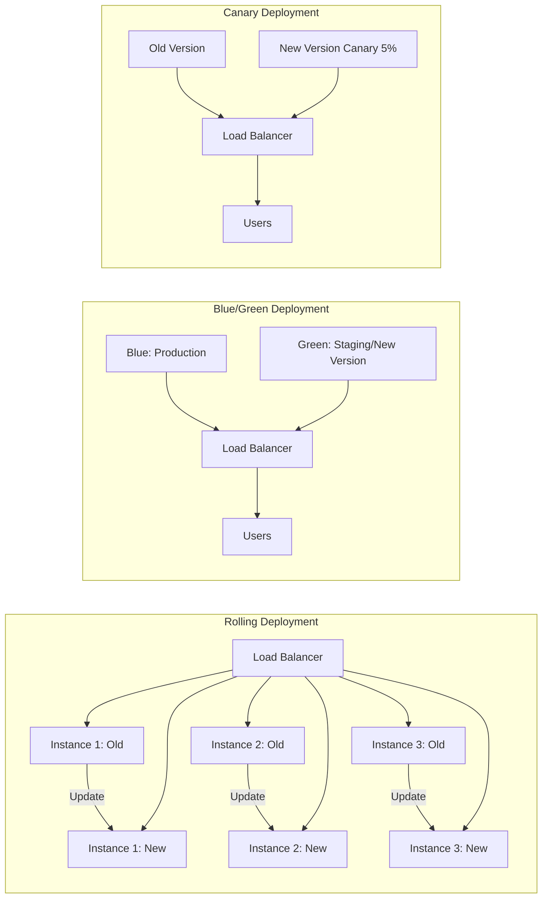

DevOps Engineer (0 - 3 yrs)
Course Type: role-specific
Role: DevOps Engineer
Course Title: DevOps Fundamentals - Career Launch

Course Description: Master DevOps fundamentals from the ground up with hands-on labs and real-world projects. Perfect for beginners with 0-3 years of experience looking to break into DevOps or level up from IT support roles. Build a strong foundation in Linux, Git, CI/CD, Docker, and AWS through practical exercises designed for junior-level interviews at startups and mid-sized companies.


Module 1: Welcome to DevOps (4 classes)
Module 2: Linux Essentials (15 classes)
Module 3: Version Control with Git (12 classes)
Module 4: Introduction to Cloud Computing with AWS (15 classes)
Module 5: Docker Basics (10 classes)
Module 6: CI/CD Fundamentals (12 classes)
Module 7: Basic Infrastructure as Code (10 classes)
Module 8: Introduction to Kubernetes (12 classes)
Module 9: Basic Monitoring and Logging (8 classes)
Module 10: DevOps Interview Preparation for Juniors (10 classes)

Total: 108 classes
Estimated Time: 60-80 hours
Target Audience: 0-3 years experience
Outcome: Ready for junior DevOps roles at startups and mid-sized companies

DevOps Engineer (0 - 3 yrs)
Course Type: role-specific
Role: DevOps Engineer
Course Title: DevOps Fundamentals - Career Launch

Course Description: Master DevOps fundamentals from the ground up with hands-on labs and real-world projects. Perfect for beginners with 0-3 years of experience looking to break into DevOps or level up from IT support roles. Build a strong foundation in Linux, Git, CI/CD, Docker, and AWS through practical exercises designed for junior-level interviews at startups and mid-sized companies.


Module 1: Welcome to DevOps (4 classes)
Module 2: Linux Essentials (15 classes)
Module 3: Version Control with Git (12 classes)
Module 4: Introduction to Cloud Computing with AWS (15 classes)
Module 5: Docker Basics (10 classes)
Module 6: CI/CD Fundamentals (12 classes)
Module 7: Basic Infrastructure as Code (10 classes)
Module 8: Introduction to Kubernetes (12 classes)
Module 9: Basic Monitoring and Logging (8 classes)
Module 10: DevOps Interview Preparation for Juniors (10 classes)

Total: 108 classes
Estimated Time: 60-80 hours
Target Audience: 0-3 years experience
Outcome: Ready for junior DevOps roles at startups and mid-sized companies

Module 1:
Title: Welcome to DevOps
Description: Build a solid foundation for your DevOps career. Understand the role, master essential skills, and navigate your first steps into DevOps.
Order: 1
Learning Outcomes:
Understand what DevOps is and why it matters
Know the essential skills for entry-level positions
Get a realistic career and learning roadmap

Topic 1.1:
Title: DevOps Fundamentals & Learning Path
Order: 1

Class 1.1.1:
	Title: What is DevOps and Why It Matters
	Description: Core concepts, roles, and career opportunities.
Content Type: text
Duration: 300 
Order: 1
		Text Content :

# DevOps Essentials

## What is DevOps?

DevOps is a cultural movement: **"You build it, you run it."** It breaks down silos between development and operations through three principles:

1. **Collaboration:** Teams work together from day one, not just at deployment time
2. **Automation:** Infrastructure as code, scripted deployments, continuous testing
3. **Continuous Delivery:** Small, frequent changes instead of big quarterly releases

---

## DevOps Role Variants

* **DevOps Engineer:** Generalist at startups/mid-size companies (CI/CD, cloud, on-call)
* **SRE (Site Reliability Engineer):** Focused on reliability, SLOs, error budgets (large tech companies)
* **Platform Engineer:** Builds internal developer platforms and "golden paths"
* **Cloud Engineer:** Specializes in cloud architecture and governance (AWS/GCP/Azure)

---

## Why This Career?

* **Demand:** 20%+ annual job growth, 15-25% salary premium over traditional IT ops
* **Remote-friendly:** Manage cloud infrastructure from anywhere
* **Career paths:** Technical leadership, management, specialization (DevSecOps, MLOps), consulting
* **T-shaped skills:** Broad exposure + deep expertise = highly adaptable across industries

---

## What You'll Learn (This Course)

1. **Linux Fundamentals** → Command line, scripting, system administration
2. **Git & Version Control** → Collaboration, infrastructure as code
3. **Cloud Basics (AWS)** → EC2, S3, VPC, IAM, RDS
4. **Docker & Containers** → Packaging applications
5. **CI/CD Pipelines** → Automating testing and deployments
6. **Infrastructure as Code** → Terraform, CloudFormation, Ansible
7. **Kubernetes Basics** → Container orchestration
8. **Monitoring & Logging** → Observability and alerting
9. **Interview Prep** → Get your first DevOps role

**Timeline:** 60-80 hours. Work through this at your pace, but commit to hands-on practice daily.

---

Class 1.1.2:
	Title: Essential Skills You'll Master
	Description: Quick overview of what you need to know.
Content Type: text
Duration: 250 
Order: 2
		Text Content :

# The DevOps Skill Matrix

## Foundation Skills (Months 1-3)

**Linux & Command Line**
* Navigate filesystems, manipulate text streams, understand permissions
* Monitor processes and resources
* Write basic Bash scripts to automate tasks

**Git & Version Control**
* Clone, pull, commit, push workflows
* Branching, merging, and conflict resolution
* Why secrets never go in Git

**Basic Scripting**
* **Bash:** Glue Linux commands, quick automation
* **Python:** Complex logic, API calls, data processing

---

## Cloud Skills (Months 4-6)

**AWS Core Services**
* EC2 (virtual machines), S3 (object storage), VPC (networking)
* RDS (managed databases), IAM (access control)
* Understanding cost optimization

---

## Intermediate Skills (Months 7-12)

**Docker & Containers:** Images, Dockerfiles, registries, multi-stage builds

**CI/CD Automation:** Pipelines, GitHub Actions, deployment strategies

**Infrastructure as Code:** Terraform, Ansible, CloudFormation basics

**Kubernetes Fundamentals:** Pods, Deployments, Services, basic scaling

**Monitoring:** Metrics, logging, alerting, observability

---

Class 1.1.3:
	Title: Your Learning Strategy
	Description: How to approach this journey effectively.
Content Type: text
Duration: 300 
Order: 3
		Text Content :

# How to Learn DevOps (The Right Way)

## The 80/20 Rule

Focus on the 20% that delivers 80% of value:
* Strong Linux fundamentals beat knowing every AWS service
* One deep language (Python or Go) beats surface-level knowledge of many
* Understanding principles beats memorizing tools
* Hands-on labs beat watching videos

---

## Learning Best Practices

### 1. Build & Break Things
* Don't just watch videos—code and deploy
* Set up a cheap AWS account (free tier works)
* Make mistakes in safe environments

### 2. Use Real-World Projects
* Containerize an application you wrote
* Set up CI/CD for something you built
* Each project becomes a portfolio piece

### 3. Consistency Over Intensity
* 1 hour daily beats 8 hours on weekends
* Expect 3-6 months for foundational skills
* Celebrate small wins

---

## Realistic Milestones

**Months 1-3:** Linux fundamentals + Git basics.

**Months 4-6:** Cloud basics + Docker. You can deploy simple applications.

**Months 7-9:** CI/CD + basic Infrastructure as Code. You can automate pipelines.

**Months 10-12:** Deepen one area. Competitive for junior roles.

---

Class 1.1.4:
	Title: Your First DevOps Interview
	Description: What to expect and how to prepare.
Content Type: text
Duration: 300 
Order: 4
		Text Content :

# Getting Your First DevOps Job

## What Interviews Test

**60% Technical:** Linux, Bash/Python scripting, basic cloud, troubleshooting

**30% Problem-Solving:** Logical thinking, clear communication, resourcefulness

**10% Cultural Fit:** Honesty, learning mindset, team compatibility

---

## Common Questions

**Linux:** "Check disk space?" → `df -h` and drill down with `du`

**AWS:** "Host a static website cheaply?" → S3 + CloudFront

**Docker:** "What problem does Docker solve?" → Packaging with dependencies

**CI/CD:** "Explain a pipeline." → Commit → build/test → deploy if passing

**Bash:** "Backup logs script?" → Loop, compress, cleanup old files

---

## 30-Day Interview Prep

**Week 1-2:** Linux refresher (1hr/day), write 5-10 Bash scripts

**Week 3:** Deploy to AWS, create Docker image, simple pipeline

**Week 4:** 5-10 mock interviews, practice explaining projects

---

## Job Hunting

* **Target:** Startups (10-100 people), "Junior" titles, mid-size companies
* **Portfolio:** GitHub repo with Linux scripts, Terraform, Docker, CI/CD
* **Timeline:** Apply at 60% readiness. You'll learn on the job.

---

Topic 1.2:
Title: Module Challenge
Order: 2

Class 1.2.1:
Title: DevOps Foundations Challenge
Description: Test your understanding of DevOps fundamentals and learning strategy.
Content Type: contest
Duration: 1800
Order: 1
Contest URL: 
Contest Questions: 10
Contest Syllabus:
What DevOps is and core principles
DevOps roles and career paths
Essential skills for entry-level
Learning timeline and milestones
Interview preparation basics
Portfolio building
When to apply for jobs
Realistic expectations for beginners


Module 2:
Title: Linux Essentials
Description: Master the Linux operating system, the backbone of modern infrastructure. From file system navigation to advanced shell scripting and process management, build the command-line fluency required for DevOps and Backend Engineering roles.
Order: 2
Learning Outcomes:
Navigate the Linux filesystem efficiently
Manage processes and system resources
Secure systems with file permissions and users
Automate tasks using Bash scripting

Topic 2.1:
Title: Linux Fundamentals
Order: 1

Class 2.1.1:
	Title: Linux Architecture & File System
	Description: Understanding the kernel, shell, and directory structure.
Content Type: text
Duration: 300 
Order: 1
		Text Content :
# Linux Fundamentals for 0-3 Years Experience

## 1. Kernel vs. Shell
* **Kernel:** The core of Linux. Manages CPU, Memory, Disk I/O, and hardware drivers. Users don’t interact directly; all commands go through the shell.  
* **Shell:** Command-line interface that interprets your commands and communicates with the kernel. Common shells: Bash, Zsh, Fish.

---

## 2. Directory Structure
Linux organizes everything under the **Root (`/`)** directory.

| Directory | Purpose |
|-----------|---------|
| `/bin`    | Essential binaries/commands (ls, cp, mv) |
| `/sbin`   | System binaries (ifconfig, fsck) |
| `/etc`    | Configuration files (nginx.conf, passwd) |
| `/var`    | Variable files like logs and spool files (`/var/log`) |
| `/home`   | User home directories |
| `/root`   | Root user’s home |
| `/tmp`    | Temporary files |
| `/usr`    | User-installed programs and libraries |

---

## 3. File Permissions & Ownership
Linux is multi-user; file security is critical.

* **Ownership:** Each file has an **owner** and a **group**.
* **Permissions:** Read (`r`), Write (`w`), Execute (`x`).

```bash
ls -l /home
# drwxr-xr-x 2 samarth samarth 4096 Dec 24 10:00 mydir
````

* `d` → directory
* `rwx` (owner)
* `r-x` (group)
* `r-x` (others)

*Change Ownership:*

`chown user:group file.txt`

*Change Permissions:*

`chmod 755 file.sh`

---

## 4. Process Management

* List processes: `ps aux`

* Kill a process: `kill -9 <PID>`

* Top / htop for live monitoring

---

## 5. Networking Basics

* Check interfaces: `ip addr`

* Test connectivity: `ping google.com`

* Check open ports: `netstat -tulpn`

* Listen on port (Debug): `nc -lvp 8080`

---

## 6. Logs & Monitoring

* System logs:

``` bash
tail -f /var/log/syslog
tail -f /var/log/auth.log
```
```
* Disk usage:

```bash
df -h
du -sh /var/log
```

* Memory usage:

```bash
free -h
```

---

## 7. Package Management

* **Debian/Ubuntu:**

```bash
apt update && apt install nginx
```

* **RHEL/CentOS:**

```bash
yum install httpd
```

---

## 8. Bash Basics

* Variables:

```bash
NAME="Scaler"
echo $NAME
```

* Loops:

```bash
for i in {1..5}; do echo $i; done
```

* Functions:

```bash
greet() {
  local name=$1
  echo "Hello $name"
}
greet "Scaler"
```


---

Class 2.1.2:
	Title: Essential Commands Part 1 (Navigation & Files)
	Description: Moving around and manipulating files.
Content Type: text
Duration: 300 
Order: 2
		Text Content :

# Linux Navigation & File Operations

## 1. Knowing Where You Are
* **Print Working Directory:**
```bash
pwd
````

Shows the full path of your current directory.

* **List Contents:**

```bash
ls
ls -l    # Long listing: permissions, owner, size, date
ls -a    # Include hidden files starting with '.'
```
```

---

## 2. Moving Around

* **Change Directory:**

```bash
cd /path/to/dir   # Absolute path
cd ~              # Go to home directory
cd ..             # Go up one level
cd -              # Go to previous directory
```

* **Absolute Path:** Starts from root (`/etc/nginx`)
* **Relative Path:** Starts from current location (`./scripts`)

---

## 3. Creating & Deleting Files and Directories

* **Make Directory:**

```bash
mkdir my_folder
```

* **Create Empty File:**

```bash
touch file.txt
```

* **Remove File:**

```bash
rm file.txt
```

* **Remove Directory Recursively:**

```bash
rm -rf my_folder   # !!! Use with caution
```

---

## 4. Copying & Moving

* **Copy File or Directory:**

```bash
cp file.txt /backup/
cp -r folder /backup/   # Recursive copy
```

* **Move/Rename File or Directory:**

```bash
mv old_name.txt new_name.txt
mv folder /new/location/
```

---

## 5. Viewing File Contents

* **Head / Tail:**

```bash
head file.txt       # First 10 lines
tail file.txt       # Last 10 lines
tail -f file.log    # Follow live logs
```

* **Less / More:**

```bash
less file.txt
more file.txt
```

* **Cat / Split / Combine:**

```bash
cat file1.txt file2.txt > combined.txt
split -l 1000 bigfile.txt part_
```


---

Class 2.1.3:
	Title: Essential Commands Part 2 (Text Processing & System Info)
	Description: Searching and inspecting file contents.
Content Type: text
Duration: 350 
Order: 3
		Text Content :

# Linux Reading and Searching

## 1. Inspecting Content
* **Display Entire File:**
```bash
cat file.txt
````

* **First Few Lines:**

`head -n 5 file.txt   # First 5 lines`

* **Last Few Lines:**

`tail -n 5 file.txt   # Last 5 lines`

* **Follow Live Logs:**

`tail -f /var/log/syslog   # Real-time monitoring`

---

## 2. Searching with Grep

`grep` allows pattern matching in files and directories.

* **Search in a Single File:**

`grep "error" logfile.txt`

* **Recursive Search in a Directory:**

`grep -r "config" /etc/`

* **Ignore Case:**

`grep -i "warning" /var/log/syslog`

* **Show Line Numbers:**

`grep -n "failure" logfile.txt`

* **Find a File by Name:**

`find / -name "nginx.conf"`

* **Combine `find` and `grep`:**

`find /etc/ -type f -name "*.conf" -exec grep "timeout" {} \;`

---

Class 2.1.4:
	Title: Text Editors (nano and basic vim)
	Description: Editing configuration files on the server.
Content Type: text
Duration: 300 
Order: 4
		Text Content :
# Editing Files on the Server

## 1. Nano: The Simple Editor
Beginner-friendly, easy to use.
* **Open a File:** 
`nano filename`

* **Save File:** `Ctrl + O`
* **Exit Editor:** `Ctrl + X`
* **Search:** `Ctrl + W`
* **Cut/Copy/Paste:** `Ctrl + K` / `Ctrl + U`

---

## 2. Vim: The Professional Standard

Powerful editor available on almost every Linux server. Requires learning modes and commands.

### Vim Modes

* **Normal Mode:** Navigation and commands (Press `Esc` to enter).
* **Insert Mode:** Type and edit text (Press `i` or `a` to enter).
* **Visual Mode:** Select text (Press `v`).
* **Command Mode:** Execute commands like save, quit, search (Press `:`).

### Essential Survival Commands

1. `vim file` → Open a file
2. Press `i` → Enter Insert Mode to type text
3. Press `Esc` → Return to Normal Mode
4. `:w` → Save (Write)
5. `:q` → Quit
6. `:wq` → Save and Quit
7. `:q!` → Quit without saving
8. `u` → Undo last change
9. `Ctrl + r` → Redo
10. `/pattern` → Search for a pattern
11. `:%s/old/new/g` → Replace all occurrences of "old" with "new"

---

### Vim Command Cheat Sheet

| Command         | Mode            | Description                                 |
| --------------- | --------------- | ------------------------------------------- |
| `i`             | Normal → Insert | Enter Insert Mode before cursor             |
| `a`             | Normal → Insert | Enter Insert Mode after cursor              |
| `v`             | Normal → Visual | Start visual selection                      |
| `Esc`           | Any → Normal    | Return to Normal Mode                       |
| `:w`            | Command         | Save file                                   |
| `:q`            | Command         | Quit                                        |
| `:wq`           | Command         | Save and quit                               |
| `:q!`           | Command         | Quit without saving                         |
| `u`             | Normal          | Undo last change                            |
| `Ctrl+r`        | Normal          | Redo last undone change                     |
| `/pattern`      | Normal          | Search for a pattern                        |
| `:%s/old/new/g` | Command         | Replace all occurrences of "old" with "new" |
| `dd`            | Normal          | Delete current line                         |
| `yy`            | Normal          | Copy current line                           |
| `p`             | Normal          | Paste after cursor                          |
| `0`             | Normal          | Go to beginning of line                     |
| `$`             | Normal          | Go to end of line                           |
| `gg`            | Normal          | Go to beginning of file                     |
| `G`             | Normal          | Go to end of file                           |


---

Class 2.1.5:
	Title: Pipes, Redirection & Text Processing
	Description: Connecting commands together.
Content Type: text
Duration: 400 
Order: 5
		Text Content :
# The Power of Pipes

Linux commands are designed to be **composable**, meaning the output of one command can be passed as input to another. This is where **pipes** and **redirection** come into play.

---

## 1. The Pipe (`|`)

The pipe symbol `|` takes the **stdout** (standard output) of the command on the left and feeds it as **stdin** (standard input) to the command on the right.  

Example:

```bash
# List all running processes, filter for python processes, and count them
ps aux | grep python | wc -l
```
```

**Explanation:**

1. `ps aux` → Lists all processes.
2. `grep python` → Filters only lines containing "python".
3. `wc -l` → Counts the number of lines returned (i.e., number of Python processes running).

**Tip:** Pipes allow you to chain multiple commands, creating complex workflows in a single line.

---

## 2. Output Redirection

Redirection sends output **to a file** instead of the screen.

| Operator | Example                    | Description                                    |
| -------- | -------------------------- | ---------------------------------------------- |
| `>`      | `echo "Hello" > file.txt`  | Overwrites file with new content               |
| `>>`     | `echo "World" >> file.txt` | Appends output to the file without overwriting |

**Important:** Using `>` will **destroy existing file content**, while `>>` preserves it.

---

## 3. Standard Streams

Linux commands have three default data streams:

| Stream     | File Descriptor | Description                               |
| ---------- | --------------- | ----------------------------------------- |
| **stdin**  | 0               | Standard input (Keyboard by default)      |
| **stdout** | 1               | Standard output (Screen by default)       |
| **stderr** | 2               | Standard error output (Screen by default) |

**Examples:**

```bash
# Redirect standard output to a file
ls -l > files.txt

# Redirect standard error to a file
ls /nonexistent 2> error.log

# Redirect both stdout and stderr
ls /nonexistent > all.log 2>&1
```

**Explanation:**

* `2>` → Redirects errors (stderr) only
* `> filename` → Redirects standard output only
* `2>&1` → Redirect stderr to the same destination as stdout

**Tip:** Combining pipes and redirection allows powerful command chains, e.g.,

```bash
ps aux | grep python > python_processes.txt 2> errors.log
```

This stores normal output in `python_processes.txt` and errors in `errors.log`.

---

Topic 2.2:
Title: Process & Resource Management
Order: 2

Class 2.2.1:
Title: Process Management Basics
Description: Managing running applications.
Content Type: text
Duration: 350
Order: 1
Text Content :

# Controlling Processes

Linux gives you full control over the processes running on your system. Understanding how to view, manage, and terminate processes is crucial for troubleshooting and performance tuning.

---

## 1. Viewing Processes

* `ps aux`  
  Lists all running processes on the system with details such as:

| Column | Description |
|--------|-------------|
| USER   | Owner of the process |
| PID    | Process ID (unique number) |
| %CPU   | CPU usage percentage |
| %MEM   | Memory usage percentage |
| VSZ    | Virtual memory size (KB) |
| RSS    | Resident memory size (KB) |
| TTY    | Terminal associated with the process |
| STAT   | Process state (e.g., `R` for running, `S` for sleeping) |
| COMMAND| Command that started the process |

**Tip:** Combine with `grep` to filter processes:  

```bash
ps aux | grep nginx
````

---

## 2. Killing Processes

Sometimes a process hangs or consumes excessive resources. Linux provides signals to terminate processes:

| Command                  | Signal             | Description                                                                                   |
| ------------------------ | ------------------ | --------------------------------------------------------------------------------------------- |
| `kill [PID]`             | SIGTERM (15)       | Gracefully asks the process to exit. Process can clean up resources.                          |
| `kill -9 [PID]`          | SIGKILL (9)        | Forcefully kills the process. Cannot be ignored. Immediate termination. **Use with caution.** |
| `pkill <process_name>`   | SIGTERM by default | Kill a process by name. Convenient for processes where PID is unknown.                        |
| `killall <process_name>` | SIGTERM by default | Kills all processes with the given name.                                                      |

**Tip:** Always try `SIGTERM` first to allow clean shutdown. Use `SIGKILL` only if the process refuses to terminate.

**Example:**

```bash
# Graceful termination
kill 1234

# Force kill
kill -9 1234

# Kill by process name
pkill python3
```
```


---

Class 2.2.2:
Title: System Monitoring
Description: CPU, Memory, and Disk usage analysis.
Content Type: text
Duration: 300
Order: 2
Text Content :

# Health Checks

## 1. CPU & Memory

* `top`: Real-time view of system resources.
* `htop`: A prettier, more interactive version of `top`.
* `free -h`: Shows available RAM in human-readable format (GB/MB).

---

## 2. Disk Usage

* `df -h`: Disk Free. Shows total disk space available on mounted drives.
* `du -sh folder/`: Disk Usage. Shows how much space a specific folder is taking.

---

Class 2.2.3:
Title: User & Group Management
Description: Administering system users.
Content Type: text
Duration: 300
Order: 3
Text Content :

# Users and Groups

Managing users and groups is essential for controlling access, enforcing security, and maintaining a multi-user Linux environment.

---

## 1. The Superuser (Root)

The **root** user has unrestricted access to all files and commands. Misuse can break the system.

* `sudo <command>` – Execute a command with root privileges without logging in as root.
* `su -` – Switch to the root user session entirely.

**Tip:** Avoid logging in as root directly. Use `sudo` for safety and auditing.

---

## 2. Managing Users

| Command | Purpose |
|---------|---------|
| `useradd -m john` | Create a new user `john` with a home directory (`/home/john`) |
| `passwd john` | Set or change the password for user `john` |
| `usermod -aG sudo john` | Add user `john` to the `sudo` group (grant administrative privileges) |
| `id john` | Display user ID, group ID, and supplementary groups |
| `deluser john` | Remove user `john` from the system (use `--remove-home` to delete home folder) |

**Best Practices:**

* Use groups to manage permissions instead of assigning privileges individually.
* Limit root access; give users `sudo` rights only when necessary.
* Regularly review users and group memberships to maintain security.


---

Topic 2.3:
Title: File Permissions & Security
Order: 3

Class 2.3.1:
Title: Understanding File Permissions
Description: Reading r-w-x notation.
Content Type: text
Duration: 400
Order: 1
Text Content :

# Permission Bits

## 1. The Structure (`drwxr-xr-x`)

Run `ls -l`. The first column defines permissions.

* `d`: Is it a directory?
* `rwx` (Owner): What the owner can do.
* `r-x` (Group): What the group can do.
* `r-x` (Others): What everyone else can do.

---

## 2. Changing Permissions (`chmod`)

* **Numeric Mode:**
* 4 = Read (r)
* 2 = Write (w)
* 1 = Execute (x)


* **Common Examples:**
* `chmod 777 file`: Everyone can read, write, execute (Insecure).
* `chmod 644 file`: Owner can read/write; everyone else only read (Standard for files).
* `chmod 755 script.sh`: Owner can read/write/run; everyone else read/run.

---

Class 2.3.2:
Title: Managing Ownership
Description: Using chown and chgrp.
Content Type: text
Duration: 250
Order: 2
Text Content :

# Ownership

## 1. Changing Owner (`chown`)

Files belong to the user who created them.

* `chown user:group file`: Changes both owner and group.
* `chown -R user:group directory/`: Recursive change (applies to all files inside).

> **Scenario:** You deploy a web app but Nginx can't read the files because they are owned by "root". You must `chown` them to "www-data".

---

Class 2.3.3:
Title: Basic SSH Configuration
Description: Secure remote access.
Content Type: text
Duration: 350
Order: 3
Text Content :

# SSH (Secure Shell)

## 1. Connecting

`ssh user@ip_address`

## 2. Key-Based Authentication (Passwordless)

Passwords can be guessed. Keys are cryptographic.

1. **Generate Key:** `ssh-keygen -t rsa -b 4096` (On your laptop).
2. **Copy ID:** `ssh-copy-id user@ip_address`.
3. **Result:** The server now trusts your laptop's signature. You no longer type a password.

Topic 2.4:
Title: Shell Scripting Basics
Order: 4

Class 2.4.1:
Title: Your First Bash Script
Description: Automating commands.
Content Type: text
Duration: 300
Order: 1
Text Content :

# Introduction to Bash Scripting

## 1. The Shebang

Every script starts with this line. It tells the kernel which interpreter to use.

```bash
#!/bin/bash
echo "Hello World"

```

## 2. Execution

1. Create file: `touch script.sh`
2. Write code.
3. **Make executable:** `chmod +x script.sh`
4. Run: `./script.sh`

Class 2.4.2:
Title: Variables, Loops & Conditionals
Description: Adding logic to scripts.
Content Type: text
Duration: 450
Order: 2
Text Content :

# Script Logic

## 1. Variables

```bash
NAME="DevOps"
echo "Hello $NAME"

```

## 2. Conditionals (If/Else)

```bash
if [ -f "/etc/passwd" ]; then
    echo "File exists"
else
    echo "File missing"
fi

```

## 3. Loops

```bash
for i in {1..5}
do
   echo "Iteration $i"
done

```

---

Class 2.4.3:
Title: Writing Practical Automation Scripts
Description: Real-world examples.
Content Type: text
Duration: 500
Order: 3
Text Content :

# Practical Automation

## Example: Log Backup Script

A simple script to compress logs and move them to backup.

```bash
#!/bin/bash

# Define variables
LOG_DIR="/var/log/myapp"
BACKUP_DIR="/backup/logs"
DATE=$(date +%Y%m%d)

# Create backup dir if not exists
mkdir -p $BACKUP_DIR

# Compress logs
tar -czf $BACKUP_DIR/logs-$DATE.tar.gz $LOG_DIR/*.log

# Cleanup old logs (older than 7 days)
find $BACKUP_DIR -name "*.tar.gz" -mtime +7 -delete

echo "Backup completed for $DATE"

```

---

Topic 2.5:
Title: Linux Challenge
Order: 5
Class 2.5.1:
	Title: Linux Challenge
	Description: A contest to test your command line and troubleshooting
Content Type: text
Duration: 300 
Order: 1
		Text Content :
Got it. Here’s a **concise set of 5 combined Q&A** covering key beginner topics for 0–3 years experience:

---

### **Q1: Navigate and Manage Files**

**Question:** How do you create a directory, create a file inside it, and list all files including hidden ones?
**Answer:**

```bash
mkdir myfolder
touch myfolder/myfile.txt
ls -la myfolder
```

---

### **Q2: User and Permissions**

**Question:** Create a user `john`, give him sudo rights, and make a script executable only for the owner.
**Answer:**

```bash
sudo useradd -m john
sudo passwd john
sudo usermod -aG sudo john
chmod 700 script.sh   # Owner can read, write, execute; others cannot
```

---

### **Q3: Process Management**

**Question:** List all processes, find a Python process, and kill it if necessary.
**Answer:**

```bash
ps aux | grep python    # Find Python processes
kill <PID>              # Graceful termination
kill -9 <PID>           # Force kill
top                     # Monitor CPU/memory in real-time
```

---

### **Q4: Searching and Redirecting Output**

**Question:** Search for "error" in `app.log`, count occurrences, and save errors to a separate file.
**Answer:**

```bash
grep "error" app.log          # Search for the word
grep -c "error" app.log       # Count occurrences
grep "error" app.log > error.log  # Save output to file
grep "error" app.log 2> error.log # Save errors only
```

---

### **Q5: Bash Scripting Basics**

**Question:** Write a script that prints “Hello DevOps” 5 times and checks if `/etc/passwd` exists.
**Answer:**

```bash
#!/bin/bash

for i in {1..5}; do
    echo "Hello DevOps"
done

if [ -f "/etc/passwd" ]; then
    echo "File exists"
else
    echo "File missing"
fi
```

*Make it executable and run:*

```bash
chmod +x script.sh
./script.sh
```

---


Module 3:
Title: Version Control with Git
Description: Master the fundamental tool of collaborative software development. From basic commits to complex branching strategies and resolving merge conflicts, learn the industry-standard workflow for managing code.
Order: 3
Learning Outcomes:
Master the core Git workflow (add, commit, push, pull)
Implement branching strategies for team collaboration
Resolve complex merge conflicts effectively
Collaborate using GitHub pull requests and code reviews

Topic 3.1:
Title: Git Fundamentals
Order: 1

Class 3.1.1:
	Title: Introduction to Version Control
	Description: Why we need Git and how it works.
Content Type: text
Duration: 300 
Order: 1
		Text Content :
# **The Time Machine for Code**

## **1. What is Version Control?**

Version control helps you **manage changes to your code** over time instead of creating messy files like `final_v1.txt`, `final_v2.txt`, etc.

**Benefits:**

* **Revert changes:** Go back to a working version if something breaks.
* **Work on features safely:** Create separate branches to try new ideas without touching main code.
* **Collaborate easily:** Multiple people can work on the same code without overwriting each other.

**Example Commands:**

```bash
git init          # Initialize a new repo
git add file.txt  # Stage changes
git commit -m "Add new feature"  # Save changes
git log           # See version history
git checkout <commit_id>  # Go back to a previous version
```

---

## **2. Distributed vs. Centralized Version Control**

* **Centralized (SVN):**

  * History is stored on a **single server**.
  * If the server crashes, you lose the history.
  * Developers must be online to commit changes.

* **Distributed (Git):**

  * Every developer has a **full copy of the history** on their laptop.
  * Can work offline and commit locally.
  * Changes are synced to a remote repo when ready.

**Analogy:**
*Centralized:* One library, everyone borrows books from it. If the library burns down, books are lost.
*Distributed:* Everyone has a copy of every book. Even if the library burns, no knowledge is lost.


---

Class 3.1.2:
	Title: Configuration & First Repository
	Description: Setting up Git identity and initializing projects.
Content Type: text
Duration: 300 
Order: 2
		Text Content :
 # Setting Up Shop

## 1. Identity Setup
Before you commit, Git needs to know who you are.
```bash
git config --global user.name "Your Name"
git config --global user.email "your.email@example.com"

```

* Check settings: `git config --list`

---

## 2. Initializing a Repo

* **`git init`**: Turns the current folder into a Git repository. It creates a hidden `.git` folder where the magic happens.
* **`git status`**: Your best friend. Tells you what files are tracked, modified, or staged.

---

Class 3.1.3:
Title: The Three Stages of Git
Description: Understanding Working Directory, Staging Area, and Repository.
Content Type: text
Duration: 400
Order: 3
Text Content :

# **The Git Workflow**

## **1. The Three States**

Git tracks files through three main states:

| **State**            | **Where it is**        | **What it means**                                          |
| -------------------- | ---------------------- | ---------------------------------------------------------- |
| Working Directory    | Your computer          | Files you are currently editing. Could be new or modified. |
| Staging Area (Index) | Temporary holding area | Files you’ve marked to include in the next commit.         |
| Repository (HEAD)    | Git history            | Permanent record of committed files.                       |

**Key Idea:** You first prepare changes, then save them permanently.

---

## **2. The Command Cycle**

1. **Stage changes:**

```bash
git add file.txt
```

Moves changes from the **Working Directory** → **Staging Area**.
Think of this as **selecting which items to pack into a box**.

2. **Commit changes:**

```bash
git commit -m "Add new feature"
```

Moves changes from **Staging Area** → **Repository**.
Think of this as **sending the sealed box to the warehouse** (permanent history).

3. **Check status:**

```bash
git status
```

Shows which files are **untracked, staged, or modified**. Always check before committing.

---

### **Analogy Recap**

* **Working Directory:** Your messy desk with all drafts.
* **Staging Area:** A box where you place items you want to save.
* **Repository:** The warehouse storing all your boxes safely.

---


Class 3.1.4:
Title: Viewing History
Description: Using git log to inspect the past.
Content Type: text
Duration: 300
Order: 4
Text Content :

# Inspecting History

## 1. `git log`

Shows the chronological history of commits.

* **Commit Hash:** A unique ID (SHA-1) for every commit (e.g., `a1b2c3d`).
* **Author & Date:** Who did what and when.

## 2. Useful Flags

* `git log --oneline`: Condensed view (Hash + Message).
* `git log --graph`: Visualizes branches and merges in the terminal.
* `git log -p`: Shows the actual code changes (diffs) in each commit.

---

Topic 3.2:
Title: Branching & Merging
Order: 2

Class 3.2.1:
Title: The Power of Branches
Description: Creating and switching contexts.
Content Type: text
Duration: 350
Order: 1
Text Content :
# **Parallel Universes: Working with Branches**

## **1. Why Branch?**

Imagine your main project (`main` branch) is like a **stable universe**. You want to build a **Login feature**, but you don’t want experiments to break the main code.

* **Solution:** Create a separate universe (branch) called `feature/login`.
* You can experiment freely. When ready, merge it back safely.

---

## **2. Basic Branch Commands**

| **Command**                 | **What it Does**                     | **Analogy**                                      |
| --------------------------- | ------------------------------------ | ------------------------------------------------ |
| `git branch`                | Lists all branches                   | Shows all parallel universes                     |
| `git branch feature-a`      | Creates a new branch                 | Opens a new universe to experiment               |
| `git checkout feature-a`    | Switches to that branch              | Teleports you to the new universe                |
| `git checkout -b feature-a` | Creates **and** switches to a branch | Opens the new universe and enters it immediately |

---

### **Tips**

* Always branch from `main` (or the stable branch).
* Keep branch names descriptive: `feature/login`, `bugfix/navbar`, `hotfix/crash`.

---

Class 3.2.2:
Title: Merging Strategies
Description: Combining code from different branches.
Content Type: text
Duration: 400
Order: 2
Text Content :

# Bringing It Together

## 1. Fast-Forward Merge

If the main branch hasn't changed since you branched off, Git simply moves the pointer forward. Linear history.

## 2. Recursive Merge (True Merge)

If both branches have new commits, Git creates a **Merge Commit** to join them.

* Command:
1. `git checkout main`
2. `git merge feature-a`


Class 3.2.3:
Title: Resolving Conflicts
Description: Handling when two people edit the same line.
Content Type: text
Duration: 500
Order: 3
Text Content :

Here’s a beginner-friendly, clear version with context, table, and analogy:

---

# **Merge Conflicts: When Universes Collide**

## **1. What is a Conflict?**

Imagine two developers are changing the same line of a file:

* Developer A changes **Line 10** to `"Red"`.
* Developer B changes **Line 10** to `"Blue"`.

Git cannot automatically decide which version is correct. It **pauses the merge** and asks a human to choose.

---

## **2. How Git Shows Conflicts**

When a conflict occurs, Git adds **markers** in the file:

```text
<<<<<<< HEAD
Color = Red
=======
Color = Blue
>>>>>>> feature-b
```

| Marker              | Meaning                                         |
| ------------------- | ----------------------------------------------- |
| `<<<<<<< HEAD`      | The current branch (where you are merging into) |
| `=======`           | Separator between the two versions              |
| `>>>>>>> feature-b` | The incoming branch being merged                |

---

## **3. Resolving a Conflict**

1. Open the file and **decide which change to keep** (or combine both).
2. Remove the Git markers.
3. Stage and commit:

```bash
git add file
git commit -m "Resolved merge conflict for color"
```

---

### **Tips**

* Conflicts usually happen on **lines modified by multiple people**.
* Small, frequent merges reduce conflict chances.
* Use `git status` to see which files are in conflict.


---

Topic 3.3:
Title: Remote Repositories (GitHub)
Order: 3

Class 3.3.1:
Title: Connecting to GitHub
Description: Push, Pull, and Remotes.
Content Type: text
Duration: 350
Order: 1
Text Content :

# **The Cloud: Keeping Code in Sync**

## **1. What is a Remote?**

A **remote** is a hosted version of your repository on the internet (GitHub, GitLab, Bitbucket).

* **Why it matters:** Git is distributed — your local repo has all commits. Remotes let you collaborate and back up code.
* **Common remote names:**

  * `origin`: Default remote pointing to your main repository.
  * `upstream`: Used when you fork someone else’s repo.

**Command:**

```bash
git remote add origin https://github.com/user/repo.git
```

* Registers the remote so Git knows where to push/pull.

**Technical Behind-the-Scenes:**

* `origin` stores the URL and metadata in `.git/config`.
* Git uses this URL when pushing/pulling via HTTPS or SSH.

---

## **2. Syncing Local and Remote**

| Command                   | What it Does                                            | Technical Details                                                                                                                               | Analogy                                             |
| ------------------------- | ------------------------------------------------------- | ----------------------------------------------------------------------------------------------------------------------------------------------- | --------------------------------------------------- |
| `git push -u origin main` | Uploads your local commits to the remote                | Git takes commits from your local branch `main` and updates the remote branch. `-u` sets the upstream tracking branch for easier future pushes. | Sending your notebook updates to the library        |
| `git pull origin main`    | Downloads new commits from remote and merges into local | Actually runs `git fetch` (downloads commits) + `git merge` (applies commits to your branch).                                                   | Fetching the latest library copy into your notebook |
| `git clone [url]`         | Downloads an entire repository                          | Creates a new local copy with all branches, tags, and commit history.                                                                           | Borrowing a brand-new notebook from the library     |

---

## **3. Some Advanced Concepts**

* **Upstream vs Origin:**

  * `origin` = your fork (personal copy)
  * `upstream` = original repo you forked from

* **Tracking Branches:**

  * `git branch -u origin/main` makes your local branch track the remote. Future `git push` works without specifying remote and branch.

* **SSH vs HTTPS:**

  * HTTPS uses username/password or personal access tokens.
  * SSH uses keys for authentication and is preferred in automated pipelines.


---

Class 3.3.2:
Title: The Pull Request (PR) Workflow
Description: Collaboration best practices.
Content Type: text
Duration: 400
Order: 2
Text Content :

# **The Professional Git Workflow**

## **1. Never Push Directly to Main**

* In team environments, the `main` (or `master`) branch is **production-ready code**.

* **Why:**

  * Direct commits can break the app for everyone.
  * CI/CD pipelines often auto-deploy `main`.

* **Best Practice:** Always create a **feature branch** for your work.

---

## **2. Feature Branch Lifecycle**

Think of Git branches like parallel universes. You experiment in one universe without affecting the main one.

### **Step-by-Step**

1. **Branch Creation**

```bash
git checkout -b feature/payment
```

* Creates a new branch `feature/payment` **and switches to it**.
* Git records all changes separately from `main`.

2. **Commit Work Locally**

```bash
git add .
git commit -m "Add payment integration"
```

* Stage (`add`) your changes and commit with a descriptive message.
* Each commit is **atomic**, meaning it contains one logical change.

3. **Push Branch to Remote**

```bash
git push -u origin feature/payment
```

* Uploads your branch to GitHub (or other remotes).
* `-u` sets upstream, so future `git push` works without specifying branch.

4. **Open a Pull Request (PR)**

* Go to GitHub → Select your branch → Click **New Pull Request**.
* This allows teammates to **review your code before merging**.

5. **Code Review**

* Teammates comment on code, suggest improvements, and check for:

  * Correctness
  * Security vulnerabilities
  * Style consistency
  * Performance implications

6. **Merge**

* Once approved, click **Squash and Merge** (or Merge Commit depending on team policy).
* **Squash**: Combines all commits in the branch into a **single commit** in `main`.
* **Why Squash:** Keeps `main` history clean and readable.

---

## **3. Pro Tips**

* **Rebase vs Merge:**

  * `git rebase main` updates your branch to include latest main changes, keeping history linear.
  * `git merge main` preserves the branch history with a merge commit.

* **Never Push Secrets:**

  * Ensure `.env` or API keys are **never committed**. Use `.gitignore`.

* **Small Commits:**

  * Each commit should represent a **single logical change**. Makes debugging easier.

* **CI/CD Awareness:**

  * Some repos run automated tests on every PR. Passing tests = smoother merges.

---

Topic 3.4:
Title: Advanced Git
Order: 4

Class 3.4.1:
Title: Stashing & Cleaning
Description: Saving work without committing.
Content Type: text
Duration: 300
Order: 1
Text Content :
# **Context Switching with Git Stash**

## 1. When to Use Git Stash

Imagine you are developing a new feature on branch `feature-a`. Your code is incomplete, and you suddenly get a high-priority request to fix a production bug on branch `main`. Committing half-done work is not an option.

**Solution:** Use Git Stash to temporarily shelve your changes and switch contexts safely.

---

## 2. Basic Commands

* **Stash your current work:**

```bash
git stash
```

This moves all uncommitted changes (tracked files, staged files) into a hidden stash, leaving your working directory clean.

* **List all stashes:**

```bash
git stash list
```

Shows all stored stashes in case you want to retrieve a specific one.

* **Apply a stash:**

```bash
git stash apply
```

Brings the last stashed changes back into your working directory **without removing it from the stash list**.

* **Pop a stash:**

```bash
git stash pop
```

Applies the stash **and removes it** from the stash list, restoring your work as if you never left.

* **Stash with a message:**

```bash
git stash save "WIP feature-a"
```

Helps you remember what the stash contains, useful if you have multiple stashes.

---

## 3. Workflow Example

1. **Work in progress:** You’re editing files on `feature-a`.
2. **Urgent bug:** Switch to `main` without committing incomplete work:

```bash
git stash
git checkout main
```

3. **Fix the bug:** Make changes, commit, and push.
4. **Return to feature:**

```bash
git checkout feature-a
git stash pop
```

You continue development exactly where you left off.

---

## 4. Best Practices

* Always **stash before switching branches** if your changes are not ready to commit.
* Give descriptive messages to stashes if working on multiple features.
* Use `git stash apply` when you want to keep a copy of the stash for later.


---

Class 3.4.2:
Title: Resetting & Reverting
Description: Undoing mistakes.
Content Type: text
Duration: 400
Order: 2
Text Content :

# The Undo Button

## 1. `git reset` (Local Undo)

* `git reset --soft HEAD~1`: Undoes the last commit, but keeps changes in staging.
* `git reset --hard HEAD~1`: **Destructive.** Deletes the last commit and all changes.

## 2. `git revert` (Public Undo)

If you already pushed bad code to GitHub, **do not use reset**.

* `git revert [commit-hash]`: Creates a *new* commit that is the exact opposite of the bad commit. Safe for teams.

---

Class 3.4.3:
Title: Git Ignore
Description: Keeping the repository clean.
Content Type: text
Duration: 250
Order: 3
Text Content :

# Ignoring Files

## 1. The `.gitignore` File

You don't want to commit:

* Compiled binaries (`.exe`, `.class`).
* Dependencies (`node_modules/`, `venv/`).
* Secrets (`.env`, `api_keys.txt`).

## 2. How to use

Create a file named `.gitignore` in the root:

```text
# Ignore node modules
node_modules/

# Ignore logs
*.log

# Ignore OS files
.DS_Store

```
---

Topic 3.5:
Title: Git Challenge
Order: 5

Class 3.5.1:
Title: Git Version Control Challenge
Description: Testing branching, merging, and conflict resolution skills.
Content Type: text
Duration: 3600
Order: 1

### **Question 1: Initializing Repositories and Committing**

**Q:** How do you start tracking a project with Git and commit your first changes?

**A:**

1. Initialize a repository:

```bash
git init
```

2. Check status:

```bash
git status
```

3. Stage changes for commit:

```bash
git add file.txt
```

4. Commit the staged changes:

```bash
git commit -m "Initial commit"
```

**Explanation:** `git init` creates a new repository. `git add` stages changes, `git commit` records a snapshot, and `git status` shows the current state.

---

### **Question 2: Branching Strategies and Switching Contexts**

**Q:** How do you create a new branch for a feature and switch to it?

**A:**

```bash
git branch feature/login      # Create a new branch
git checkout feature/login    # Switch to it
# OR shortcut:
git checkout -b feature/login # Create and switch in one command
```

**Explanation:** Branching allows you to work on features without affecting the main code. Always switch to the branch before starting work.

---

### **Question 3: Resolving Merge Conflicts**

**Q:** You try to merge `feature/login` into `main` but Git reports a conflict. How do you fix it?

**A:**

1. Open the conflicting file. Git adds markers:

```text
<<<<<<< HEAD
Current main code
=======
Feature branch code
>>>>>>> feature/login
```

2. Edit the file to resolve conflicts. Remove markers.
3. Stage and commit the resolved file:

```bash
git add file.txt
git commit
```

**Explanation:** Merge conflicts occur when changes overlap. Manual resolution is needed to combine or choose the correct code.

---

### **Question 4: Remote Operations**

**Q:** How do you connect your local repo to GitHub and keep it in sync?

**A:**

```bash
git remote add origin https://github.com/user/repo.git  # Connect
git push -u origin main                                  # Push initial commit
git pull origin main                                     # Pull new changes
git clone https://github.com/user/repo.git              # Clone a repo
```

**Explanation:** `remote add` links your local repo to a remote. `push` uploads commits, `pull` fetches changes, and `clone` copies a repo entirely.

---

### **Question 5: Git History Traversal**

**Q:** How do you view past commits and undo changes if needed?

**A:**

1. View commit history:

```bash
git log
```

2. Reset to a previous commit (local changes removed):

```bash
git reset --hard <commit-hash>
```

3. Revert a commit safely (keeps history):

```bash
git revert <commit-hash>
```

**Explanation:** `git log` shows history. `reset` moves HEAD backward (can delete changes). `revert` creates a new commit that undoes changes safely.

---


Module 4:
Title: Introduction to Cloud Computing with AWS
Description: Transition from on-premise infrastructure to the cloud. Master Amazon Web Services (AWS) core services including Compute (EC2), Storage (S3, EBS), Networking (VPC), and Security (IAM) to deploy scalable, fault-tolerant applications.
Order: 4
Learning Outcomes:
Architect secure environments using IAM and VPCs
Deploy and manage virtual servers with EC2
Implement scalable storage solutions using S3 and EBS
Monitor and scale applications using CloudWatch and ELB

Topic 4.1:
Title: Cloud Fundamentals & Security
Order: 1

Class 4.1.1:
	Title: Cloud Concepts & Global Infrastructure
	Description: Regions, Availability Zones, and the Shared Responsibility Model.
Content Type: text
Duration: 300 
Order: 1
		Text Content :
# The Cloud Mindset

## 1. What is Cloud Computing?

Cloud computing allows you to **rent computing resources** instead of buying physical servers.

* **CapEx vs. OpEx:**

  * Traditional data centers = Capital Expenditure (CapEx) → Buy servers upfront.
  * Cloud = Operational Expenditure (OpEx) → Pay for what you use, scale up/down dynamically.

* **Key Benefits:**

  * **Agility:** Launch servers, databases, or entire environments in minutes.
  * **Elasticity:** Automatically scale resources up/down with demand.
  * **Cost Savings:** Only pay for what you consume.
  * **Global Reach:** Deploy applications close to users worldwide.

---

## 2. AWS Global Infrastructure

AWS organizes its infrastructure hierarchically to provide reliability and performance.

| Component                  | Definition                                          | Example                                          | Notes                                                  |
| -------------------------- | --------------------------------------------------- | ------------------------------------------------ | ------------------------------------------------------ |
| **Region**                 | A geographic area with multiple data centers.       | `us-east-1` (N. Virginia), `ap-south-1` (Mumbai) | Choose region close to users for latency.              |
| **Availability Zone (AZ)** | A discrete, isolated data center within a region.   | `us-east-1a`, `us-east-1b`                       | Spread resources across AZs for high availability.     |
| **Edge Location**          | Locations for caching content via CDN (CloudFront). | Mumbai Edge, Sydney Edge                         | Reduces latency for static content like images/videos. |

**Design Rule:** Always deploy critical applications across multiple AZs. Example: A multi-AZ RDS setup ensures your database survives a single data center failure.

---

## 3. Shared Responsibility Model

AWS and you **share security responsibilities**.

| Responsibility                  | AWS (Security OF the Cloud)            | You (Security IN the Cloud)       |
| ------------------------------- | -------------------------------------- | --------------------------------- |
| **Physical Security**           | Data centers, racks, power, networking | –                                 |
| **Hypervisor & Virtualization** | Hypervisor security, isolation         | –                                 |
| **OS / Application Patching**   | –                                      | Patch your EC2/containers         |
| **Data Protection**             | –                                      | Encrypt your S3, RDS, EBS volumes |
| **Identity & Access**           | –                                      | Configure IAM users, roles, MFA   |
| **Network Security**            | –                                      | Security groups, NACLs, VPNs      |

**Takeaway:** AWS ensures the **underlying infrastructure** is secure; you are responsible for **everything you deploy and configure**.


---

Class 4.1.2:
	Title: Identity & Access Management (IAM)
	Description: Managing users, groups, and roles.
Content Type: text
Duration: 400 
Order: 2
		Text Content :

# IAM: The Gatekeeper of AWS

AWS Identity and Access Management (IAM) is **your first line of defense** in the cloud. It ensures that only the right people and services can access your resources.

---

## 1. The Golden Rule

**Never use the Root Account for daily tasks.**

* Root has **full access to everything** in your AWS account.
* **Best Practice:**

  * Lock it away.
  * Enable **Multi-Factor Authentication (MFA)**.
  * Create IAM users for all daily operations.

---

## 2. IAM Building Blocks (Primitives)

| Primitive  | Purpose                                             | Example                                                                  | Notes                                                                                          |
| ---------- | --------------------------------------------------- | ------------------------------------------------------------------------ | ---------------------------------------------------------------------------------------------- |
| **User**   | A person who needs access to AWS                    | `alice`, `bob`                                                           | Has **long-term credentials**: password, access keys.                                          |
| **Group**  | Collection of users                                 | `DevOps-Team`                                                            | Attach permissions to a **group** instead of individual users.                                 |
| **Policy** | JSON document defining permissions                  | `json { "Effect": "Allow", "Action": "s3:ListBucket", "Resource": "*" }` | Policies **grant or deny** specific actions on AWS resources.                                  |
| **Role**   | Temporary identity assumed by **services or users** | EC2 instance accessing S3, Lambda function writing to DynamoDB           | Roles use **temporary credentials** (no password). Ideal for service-to-service communication. |

---

## 3. Example: EC2 accessing S3

Instead of storing AWS keys on a server:

1. Create an **IAM Role** with `s3:ListBucket` and `s3:GetObject` permissions.
2. Attach the Role to the EC2 instance.
3. EC2 now has **temporary credentials automatically rotated** by AWS.

*Benefit:* You never hardcode secrets in your servers. This is **best practice for security**.

---

## 4. Best Practices Summary

* Use **IAM users** instead of Root.
* Group users by role/team.
* Attach policies to **groups** wherever possible.
* Prefer **Roles over long-term credentials** for services.
* Apply the **least privilege principle**: give only the permissions needed to do the job.

---

# IAM Primitives: Comparison & Use-Cases

| Primitive  | Who/What Uses It          | Credentials                       | Scope                                        | Use-Case Example                                                       | Key Notes                                                                 |
| ---------- | ------------------------- | --------------------------------- | -------------------------------------------- | ---------------------------------------------------------------------- | ------------------------------------------------------------------------- |
| **User**   | Human                     | Long-term (password, access keys) | Single person                                | Alice needs access to AWS Console and CLI                              | Use for daily operations, never Root for regular tasks                    |
| **Group**  | Collection of Users       | N/A                               | Multiple users                               | DevOps-Team with `S3ReadOnly` policy                                   | Policies attached to group, not individuals; simplifies management        |
| **Policy** | User, Group, Role         | N/A                               | Defines permissions                          | JSON document allowing `s3:GetObject`                                  | Policies **allow or deny actions**; attach to user, group, or role        |
| **Role**   | Services, Federated Users | Temporary (auto-rotated)          | Can be assumed by anyone/anything authorized | EC2 instance needs to read from S3, Lambda function writes to DynamoDB | No permanent credentials; safest way for service-to-service communication |

---

## Quick Recap (Flow)

1. **Users** → People logging into AWS or CLI.
2. **Groups** → Logical collections of users; policies attached here simplify management.
3. **Policies** → Rules that **define permissions**. JSON documents.
4. **Roles** → Temporary identities for services or external users; avoid hardcoding secrets.


---

Class 4.1.3:
	Title: AWS CLI & Programmatic Access
	Description: Controlling AWS from the terminal.
Content Type: text
Duration: 350 
Order: 3
		Text Content :
# Automating the Cloud with AWS CLI

## 1. Access Keys: Your Credentials

To interact with AWS programmatically (CLI, SDKs, Terraform, Boto3), you need:

* **Access Key ID** → Public identifier.
* **Secret Access Key** → Private key, like a password.
* **Security Tip:**

  * Never commit keys to GitHub or store them in plaintext.
  * Rotate keys regularly.
  * Prefer **IAM Roles** for EC2/Lambda instead of static keys wherever possible.

---

## 2. Setting Up the AWS CLI

### Installation

* On Linux/macOS:

```bash
curl "https://awscli.amazonaws.com/awscli-exe-linux-x86_64.zip" -o "awscliv2.zip"
unzip awscliv2.zip
sudo ./aws/install
```

* On Windows: Download installer from AWS official site.

### Configuration

Run:

```bash
aws configure
```

Enter:

* **AWS Access Key ID**
* **AWS Secret Access Key**
* **Default region name** (e.g., `us-east-1`)
* **Default output format** (e.g., `json`)

### Verify

```bash
aws s3 ls
```

* Lists all S3 buckets you have access to.
* Ensures CLI is correctly authenticated.

---

## 3. Best Practices

* Use **Profiles** for multiple accounts:

```bash
aws configure --profile dev
aws s3 ls --profile dev
```

* Avoid hardcoding credentials; use **environment variables** or **AWS Vault** for security.
* Always follow the **Principle of Least Privilege** in IAM.

---




---

Topic 4.2:
Title: Compute Services (EC2)
Order: 2

Class 4.2.1:
	Title: EC2 Fundamentals
	Description: Launching and connecting to virtual servers.
Content Type: text
Duration: 450 
Order: 1
		Text Content :

# Elastic Compute Cloud (EC2)

## 1. Anatomy of an EC2 Instance

An **EC2 instance** is just a virtual server in the cloud. Think of it as renting a computer in AWS that you can configure and control.

### Key Components:

1. **AMI (Amazon Machine Image)**

   * The **template for your server**. It defines the OS, pre-installed software, and configuration.
   * Examples:

     * `Ubuntu 22.04 LTS` – Popular Linux distro for beginners.
     * `Amazon Linux 2` – Optimized for AWS, comes with AWS CLI pre-installed.
     * `Windows Server 2019` – If you need a Windows environment.
   * **Tip:** AMIs can be **customized**, e.g., install Docker and save as a new AMI.

2. **Instance Type**

   * Determines **CPU, RAM, and Network capacity**.
   * Examples:

     * `t2.micro`: 1 vCPU, 1GB RAM – Free tier eligible, good for testing or small apps.
     * `c5.large`: 2 vCPU, 4GB RAM – Compute-heavy workloads, like data processing.
     * `r5.large`: 2 vCPU, 16GB RAM – Memory-heavy workloads, like caching or databases.
   * **Tip:** Choosing the correct type impacts **performance and cost**.

3. **Storage**

   * EC2 instances use **EBS (Elastic Block Store)**.

     * Persistent disk that survives instance stops.
   * You can choose **SSD (gp3)** for fast performance or **HDD** for cheaper storage.
   * **Tip:** Root volume contains OS. Additional volumes can store application data.

---

## 2. Key Pairs (SSH Access)

AWS **does not use passwords** for Linux instances. Instead, it uses **SSH keys** for secure access.

### Steps:

1. **Create or Download a Key Pair**

   * During EC2 launch, AWS generates a `.pem` file.
   * Example: `my-key.pem`.

2. **Set Permissions**

   ```bash
   chmod 400 my-key.pem
   ```

   * Restricts access to only your user.
   * Without this, SSH will refuse the connection.

3. **Connect via SSH**

   ```bash
   ssh -i my-key.pem ubuntu@<public-ip-address>
   ```

   * `<public-ip-address>` comes from the EC2 dashboard.
   * Default usernames:

     * `ubuntu` → Ubuntu AMI
     * `ec2-user` → Amazon Linux AMI

### Tips:

* **Never share your `.pem` file**. Treat it like a password.
* If you lose it, you **cannot log in** unless you create a new key pair and attach it to the instance.

---

## 3. Security Groups (Virtual Firewall)

* Think of it as a **network firewall** attached to your EC2.
* Controls **who can talk to your instance and on which port**.
* Examples:

  * Allow **SSH (port 22)** only from your IP.
  * Allow **HTTP (port 80)** from anywhere.
  * Deny everything else by default (AWS default security rule).

```text
Inbound Rules Example:
Port 22 → My IP → Allow
Port 80 → 0.0.0.0/0 → Allow
Port 443 → 0.0.0.0/0 → Allow
```

*Security tip:* Only open ports that are needed. Restrict SSH to your IP.

---

## 4. Instance Lifecycle

| State          | What it Means                               | Notes                                     |
| -------------- | ------------------------------------------- | ----------------------------------------- |
| **Pending**    | Instance is being launched                  | Wait until it becomes running             |
| **Running**    | Instance is live and accessible             | You can SSH and deploy apps               |
| **Stopping**   | Instance is shutting down                   | Data in EBS persists                      |
| **Stopped**    | Instance is stopped, not billed for compute | EBS storage still billed                  |
| **Terminated** | Instance is deleted, cannot be recovered    | EBS volumes deleted unless set to persist |

---

## 5. Practical Tips for Beginners

* Start with **t2.micro** if you are on free tier.
* Use **tags** for identifying instances (`Name: DevServer1`).
* Enable **CloudWatch monitoring** to see CPU and memory usage.
* Always deploy in **multiple Availability Zones** for HA in production.


---

Class 4.2.2:
	Title: Security Groups (Firewalls)
	Description: Controlling network traffic at the instance level.
Content Type: text
Duration: 300 
Order: 2
		Text Content :
 # Security Groups

## 1. How they work
A Security Group acts as a virtual stateful firewall for your instance.
* **Inbound Rules:** Traffic coming IN (Blocked by default).
* **Outbound Rules:** Traffic going OUT (Allowed all by default).

## 2. Common Rules
* **SSH:** Port 22. (Restrict Source to `MyIP` - 0.0.0.0/0 is dangerous).
* **HTTP:** Port 80. (Source 0.0.0.0/0 - Open to world).
* **HTTPS:** Port 443.

> **Note:** "Stateful" means if you allow a request IN, the response OUT is automatically allowed.

---

Class 4.2.3:
	Title: Elastic Load Balancing (ELB) & Auto Scaling
	Description: High availability and horizontal scaling.
Content Type: text
Duration: 400 
Order: 3
		Text Content :

# Scale and Stability

Modern cloud systems are **designed to fail**. Servers will crash, networks will flap, traffic will spike. AWS gives you primitives so that **failure does not become downtime**.

---

## 1. ELB (Elastic Load Balancer)

An **Elastic Load Balancer** is the **front door** to your application. Users never talk directly to EC2 instances in production; they talk to the Load Balancer.

### Why a Load Balancer Is Mandatory

Without an ELB:

* One EC2 = single point of failure
* Traffic spikes crash the server
* No graceful recovery if a node dies

With an ELB:

* Traffic is spread across multiple instances
* Failed instances are automatically removed
* You can add/remove instances without users noticing

---

## 2. Types of Load Balancers (Focus on ALB)

### Application Load Balancer (ALB)

* Works at **Layer 7 (HTTP/HTTPS)**.
* Understands **URLs, headers, cookies, methods**.
* Best choice for **modern web applications and microservices**.

#### Smart Routing Capabilities

ALB can route traffic based on rules:

* `/api/*` → Backend service
* `/images/*` → Image service
* `admin.example.com` → Admin servers
* `user.example.com` → User-facing app

This is called **content-based routing** and is not possible with older load balancers.

---

## 3. Target Groups (Critical Concept)

An ALB does **not** send traffic directly to EC2 instances.

Instead:

* ALB → **Target Group** → EC2 instances

A **Target Group** is:

* A logical group of backends
* Can contain EC2 instances, IPs, or containers
* Defines **port, protocol, and health check**

This decoupling allows:

* One ALB to route to multiple services
* Blue/Green deployments
* Canary releases

---

## 4. Health Checks (The Stability Mechanism)

Health checks are how AWS decides:

> “Is this instance safe to send traffic to?”

### How It Works

* ALB periodically sends requests (e.g., `GET /health`)
* Your application must respond with:

  * **200 OK** → Healthy
  * **4xx / 5xx / timeout** → Unhealthy

### What Happens on Failure

* Instance is marked **Unhealthy**
* ALB **immediately stops routing traffic** to it
* Users are protected from broken servers

Important:

* The instance is NOT terminated by the ALB
* Termination is the job of Auto Scaling (next section)

---

## 5. Auto Scaling Group (ASG)

An **Auto Scaling Group** ensures:

> “I always have the right number of healthy servers running.”

It controls **how many EC2 instances exist**, not traffic routing.

---

## 6. Core Responsibilities of ASG

### 1. Maintain Desired Capacity

Example:

* Desired = 3
* One instance crashes
* ASG launches a new one automatically

This is **self-healing infrastructure**.

---

### 2. Scale Based on Load

ASG uses **CloudWatch metrics** to scale.

Common policies:

* CPU utilization
* Request count per target
* Custom metrics (queue length, latency)

Example rule:

```
If average CPU > 70% for 5 minutes → add 1 instance
If average CPU < 30% for 10 minutes → remove 1 instance
```

This is **elastic scaling**, not manual intervention.

---

### 3. Tight Integration with ELB

When ASG launches a new EC2:

1. Instance boots from AMI
2. Instance is added to the Target Group
3. Health checks run
4. Only after passing health checks → traffic starts flowing

When ASG terminates an EC2:

1. Instance is marked **draining**
2. Existing requests finish
3. Instance is removed safely

This prevents dropped user requests.

---

## 7. Launch Templates (Hidden but Important)

ASG needs instructions on **how to create servers**.

This is done using a **Launch Template**, which defines:

* AMI
* Instance type
* Security groups
* IAM role
* User data (startup scripts)

Think of it as:

> “This is how every server in my fleet should look.”

---

## 8. High Availability by Design

A production-grade ASG:

* Spans **multiple Availability Zones**
* Ensures traffic continues even if:

  * One AZ goes down
  * Multiple instances fail

Example:

* AZ-a → 2 instances
* AZ-b → 2 instances

If AZ-a fails, AZ-b still serves traffic.

---

## 9. Common Beginner Mistakes (Important)

* Running a **single EC2 without ELB**
* Using ALB but no health endpoint (`/health`)
* Hardcoding instance IPs instead of using DNS
* Scaling on CPU only (ignoring latency or request count)
* Treating servers as pets instead of cattle

---

## 10. Mental Model (Interview Gold)

* **ELB** → Distributes traffic and protects users
* **ASG** → Controls server count and recovers from failure
* **Target Group** → Glue between traffic and compute
* **Health Checks** → Decide who is allowed to serve users

If you understand this, you understand **cloud-native scalability**.


---

Topic 4.3:
Title: Storage Services
Order: 3

Class 4.3.1:
	Title: S3 Fundamentals
	Description: Object storage for the internet.
Content Type: text
Duration: 350 
Order: 1
		Text Content :
# Simple Storage Service (S3)

Amazon S3 is an **object storage service** used to store and retrieve files such as logs, images, backups, and build artifacts. It is accessed over APIs and tools like the AWS CLI. S3 is not a file system and is not mounted like a disk.

S3 is designed to be **durable, scalable, and highly available**, making it a common default storage layer in AWS architectures.

---

## Buckets and Objects

A **bucket** is a top-level container that stores objects. Bucket names must be **globally unique** across all AWS accounts and regions.

An **object** is the actual file stored in S3. Each object consists of:
- The data (file content)
- A key (object name)

S3 does not have real directories. Folder-like structures are part of the object key, for example:
`logs/2025/01/app.log`

---

## Storage Classes

S3 provides multiple storage classes to optimize cost based on how frequently data is accessed.

| Storage Class              | Access Pattern            | Cost (Relative) | Retrieval Time      | Common Use Case |
|---------------------------|---------------------------|-----------------|---------------------|-----------------|
| S3 Standard               | Frequent                  | High            | Immediate           | Active app data |
| S3 Intelligent-Tiering    | Unknown / changing        | Medium          | Immediate           | Variable access data |
| S3 Standard-IA            | Infrequent                | Lower           | Immediate           | Backups |
| S3 One Zone-IA            | Infrequent (single AZ)    | Lower           | Immediate           | Re-creatable data |
| S3 Glacier Instant        | Rare                      | Low             | Immediate           | Archive with fast access |
| S3 Glacier Flexible       | Rare                      | Very Low        | Minutes to hours    | Long-term backups |
| S3 Glacier Deep Archive   | Almost never              | Cheapest        | Hours               | Compliance archives |

For beginners, it is sufficient to understand that **S3 Standard** is the default and most commonly used class.

---

## Lifecycle Policies

A **lifecycle policy** is used to automatically move objects between storage classes or delete them after a certain time.

Lifecycle policies help reduce storage costs without manual intervention.

A common example:
- Store logs in **S3 Standard** for 30 days
- Move them to **S3 Standard-IA** after 30 days
- Move them to **S3 Glacier** after 90 days
- Delete them after 1 year

Lifecycle policies are defined at the **bucket level** and apply automatically to matching objects.

---

## Access Control (Basics)

Access to S3 is controlled using **IAM**:
- Users and roles need explicit permissions to access buckets and objects.
- EC2 instances usually access S3 using an **IAM Role**, not access keys.

Permissions can be defined using:
- IAM policies
- Bucket policies (at a high level)

---

## Common Use Cases

At an early-career level, S3 is typically used for:
- Storing application uploads
- Hosting static website files
- Centralized log storage
- Backups and artifacts

S3 is often used **alongside EC2**, not as a replacement for block storage.

---

## Key Takeaways

- S3 is object storage, not a file system
- Data is stored as objects inside buckets
- Storage classes help optimize cost
- Lifecycle policies automate data movement
- Access is controlled using IAM


---

Class 4.3.2:
	Title: S3 Security & Static Hosting
	Description: Securing data and hosting websites.
Content Type: text
Duration: 300 
Order: 2
		Text Content :
# S3 Capabilities

Amazon S3 provides several built-in capabilities beyond simple file storage. These features help improve security, reduce operational overhead, and enable common application use cases without additional infrastructure.

---

## Block Public Access

By default, **all S3 buckets are private**, meaning no one on the internet can access the data unless explicitly allowed.

**Block Public Access** is a bucket-level safety mechanism that acts as a *global guardrail*. Its purpose is to prevent accidental exposure of sensitive data due to misconfigured permissions.

When enabled, it:
- Blocks public access granted via bucket policies
- Blocks public access granted via ACLs
- Overrides any attempt to make objects public

This is especially important because many real-world data leaks happen due to:
- Incorrect bucket policies
- Public-read ACLs set by mistake

**Best practice:**  
For most workloads (logs, backups, artifacts), keep **Block Public Access ON at all times**.

You only disable it intentionally when you *know* the data must be public, such as for static websites.

---

## Static Website Hosting

S3 can serve static files (HTML, CSS, JavaScript) directly over HTTP. This allows you to host frontend applications **without servers**.

Typical use cases:
- React, Angular, or Vue single-page applications
- Simple landing pages
- Documentation websites

How it works at a high level:
1. Upload static files (`index.html`, JS, CSS) to a bucket
2. Enable **Static Website Hosting**
3. Define:
   - Index document (`index.html`)
   - Optional error document (`error.html`)
4. Make objects publicly readable (only for this use case)

S3 then provides a **public website endpoint** that serves your files.

Key characteristics:
- No EC2, no patching, no scaling required
- Extremely low cost
- Automatically scales with traffic

This is called **serverless hosting** because there are no servers to manage.

---

## Important Notes for Beginners

- Static website hosting uses **HTTP**, not HTTPS by default  
- For production-grade HTTPS, S3 is usually combined with **CloudFront**
- Only static content is supported (no backend code execution)

---

## Summary

- Block Public Access prevents accidental data exposure and should remain enabled by default
- Static Website Hosting allows you to host frontend applications directly from S3
- These capabilities make S3 both **secure** and **cost-efficient** for common workloads


---

Class 4.3.3:
	Title: EBS vs Instance Store
	Description: Block storage for EC2.
Content Type: text
Duration: 350 
Order: 3
		Text Content :
 # Hard Drives in the Cloud

## 1. EBS (Elastic Block Store)
Network-attached storage. It persists independently of the instance.
* **Scenario:** You terminate the EC2, but the EBS volume (data) remains. You can attach it to a new server.
* **Types:** `gp3` (General Purpose SSD), `io2` (High IOPS for DBs).

## 2. Instance Store (Ephemeral)
Physically attached to the host server.
* **Scenario:** Very fast, but **temporary**. If you stop the instance, **data is lost**. Used for cache/buffers.

---

Topic 4.4:
Title: Networking (VPC)
Order: 4

Class 4.4.1:
	Title: VPC Core Concepts
	Description: Building your own virtual network.
Content Type: text
Duration: 500 
Order: 1
		Text Content :
# Virtual Private Cloud (VPC)

A **Virtual Private Cloud (VPC)** is your own isolated network inside AWS. Think of it as a private data center that you fully control, but hosted in the cloud. Every EC2 instance, database, or load balancer you launch lives inside a VPC.

Understanding VPC is critical because **networking is the foundation of cloud security and architecture**.

---

## CIDR Blocks

CIDR (Classless Inter-Domain Routing) defines the **IP address range** for your VPC. This range determines how many resources you can place inside the network.

For example:
`10.0.0.0/16`

This means:
- All IPs start from `10.0.0.0` to `10.0.255.255`
- Total available IP addresses: **65,536**

AWS commonly uses private IP ranges:
- `10.0.0.0/8`
- `172.16.0.0/12`
- `192.168.0.0/16`

**Why this matters:**
- CIDR size cannot be easily changed later
- Too small → you run out of IPs
- Too large → harder to manage and secure

For beginners, `/16` is a safe and commonly used VPC size.

---

## Subnets

A subnet is a **smaller network carved out of the VPC CIDR**. Subnets allow you to organize resources and control network access.

Each subnet:
- Belongs to **one and only one Availability Zone**
- Has its own CIDR range (subset of the VPC CIDR)

This AZ-level design is intentional and helps build **high availability**.

---

## Public Subnet

A public subnet is a subnet that has a **route to the internet**.

Typical characteristics:
- Route table contains a route to an **Internet Gateway (IGW)**
- Instances can have **public IP addresses**
- Used for:
  - Web servers
  - Load balancers
  - Bastion hosts

Even in a public subnet, instances are not automatically accessible. **Security Groups still control traffic**.

---

## Private Subnet

A private subnet does **not** have a direct route to the internet.

Typical characteristics:
- No route to Internet Gateway
- Instances have **only private IPs**
- Used for:
  - Databases
  - Backend services
  - Internal applications

If instances in a private subnet need outbound internet access (for updates or downloads), this is done via a **NAT Gateway**, not direct exposure.

---

## Why This Design Is Important

Separating public and private subnets:
- Reduces attack surface
- Follows security best practices
- Matches real-world production architectures

A common beginner-friendly pattern:
- Public subnet → Load Balancer
- Private subnet → Application servers
- Private subnet → Database

---

## Key Takeaway

- VPC is your private network in AWS
- CIDR defines how big the network is
- Subnets divide the network per Availability Zone
- Public subnets expose services to the internet
- Private subnets protect sensitive components

This understanding is essential for **0–1 year experience** and forms the base for all advanced AWS networking concepts.


---

Class 4.4.2:
	Title: Routing & Internet Gateway
	Description: How traffic flows.
Content Type: text
Duration: 400 
Order: 2
		Text Content :
# Connecting to the World

For resources inside a VPC to communicate with anything outside their private network, AWS uses **explicit networking components**. Nothing is exposed by default. This is a deliberate security design.

---

## Internet Gateway (IGW)

An **Internet Gateway** is a horizontally scaled, highly available AWS-managed component that connects your VPC to the public internet.

Key points:
- It is **attached to a VPC**, not to individual subnets
- It allows **two-way communication**:
  - Outbound traffic from instances to the internet
  - Inbound traffic from the internet to instances (if allowed by security rules)

Important clarification:
- Attaching an IGW alone does **not** make instances public
- Instances also need:
  - A public IP
  - Correct routing
  - Security Group rules

Think of IGW as the door to the building. Traffic still needs permission to walk through it.

---

## Route Tables

Route tables define **where network traffic should go**. Every subnet must be associated with exactly one route table.

A route table is evaluated from top to bottom and follows the **most specific match** rule.

---

## Public Route Table

A subnet becomes public only when its route table contains a route to the Internet Gateway.

Example route:
- Destination: `0.0.0.0/0`  
- Target: `igw-xxxxxxxx`

What this means:
- Any traffic destined outside the VPC is sent to the IGW
- Instances in this subnet can reach the internet
- If the instance has a public IP, it can also receive traffic

This setup is typically used for:
- Load balancers
- Web servers
- Bastion hosts

---

## Private Route Table

A private route table **does not contain a route to the IGW**.

What this means:
- Instances cannot be directly reached from the internet
- Outbound internet access is blocked unless a NAT Gateway is used
- Traffic stays inside the VPC or goes to other private networks

This setup is used for:
- Databases
- Internal services
- Backend application layers

---

## Why This Matters

AWS networking is **explicit and secure by default**:
- No accidental exposure
- You decide what is public and what is private
- Clear separation of concerns

Understanding IGW and route tables is foundational for:
- Secure architectures
- Troubleshooting connectivity issues
- Designing production-grade VPCs

---

## Quick Mental Model

- IGW → Provides internet connectivity capability
- Route Table → Decides whether traffic is allowed to use that capability
- Subnet → Becomes public or private based on its route table


---

Class 4.4.3:
	Title: NAT Gateways & Bastions
	Description: Secure access for private resources.
Content Type: text
Duration: 400 
Order: 3
		Text Content :
# Advanced Connectivity

Advanced connectivity patterns exist to **control access**, **reduce exposure**, and **separate inbound and outbound traffic paths** inside a VPC. NAT Gateways and Bastion Hosts are not general-purpose tools; each serves a clearly defined role in secure network design.

---

## 1. NAT Gateway

A **NAT Gateway** allows resources inside a **private subnet** to initiate outbound connections to the internet while preventing inbound connections from the internet.

This is required when private instances need to:
- Download OS updates
- Pull container images
- Call external APIs
- Access public package repositories

### Traffic Flow
Private Subnet → NAT Gateway (Public Subnet) → Internet Gateway → Internet

The NAT Gateway translates the private IP of the instance to a public IP for outbound traffic.  
Only response traffic for an existing outbound connection is allowed back in.

### Key Characteristics
- Deployed **inside a public subnet**
- Requires an **Internet Gateway** attached to the VPC
- Used via **route tables** (0.0.0.0/0 → NAT Gateway)
- Supports **outbound-only** internet access
- AZ-scoped (one NAT per AZ for high availability)

### Important Notes
- NAT Gateways do not support security groups
- Traffic control is done using route tables and NACLs
- All internet-bound traffic from private subnets passes through the NAT

---

## 2. Bastion Host (Jump Box)

A **Bastion Host** is an EC2 instance placed in a **public subnet** that acts as a controlled entry point for accessing resources in private subnets.

Private instances do not expose SSH or management ports to the internet. They only accept connections from the Bastion.

### Access Flow
User → Bastion Host → Private Instance

### Typical Use Cases
- SSH access to private EC2 instances
- Emergency debugging or maintenance
- Environments where direct internet access to private systems is disallowed

### Key Characteristics
- Deployed in a public subnet with a public IP
- Locked down using strict security group rules (limited IPs, limited ports)
- Private instances allow inbound access only from the Bastion’s security group

### Operational Considerations
- Bastions should be minimal and hardened
- Access should be logged and monitored
- Often replaced or complemented by AWS Systems Manager (SSM) in managed setups

---

## NAT Gateway vs Bastion Host (Conceptual Difference)

- **NAT Gateway:** Solves outbound internet access for private resources  
- **Bastion Host:** Solves controlled inbound human access to private resources

They address different problems and are often used together in the same VPC design.


---

Topic 4.5:
Title: Databases & Monitoring
Order: 5

Class 4.5.1:
	Title: RDS & DynamoDB
	Description: Managed database services.
Content Type: text
Duration: 400 
Order: 1
		Text Content :
# Managed Databases

Managed databases shift operational responsibility away from application teams. Instead of maintaining servers, patching operating systems, or handling backups manually, the cloud provider manages the infrastructure while you focus on data modeling, access patterns, and availability.

---

## 1. Amazon RDS (Relational Databases)

Amazon RDS is a managed service for **relational databases** such as MySQL, PostgreSQL, MariaDB, Oracle, and SQL Server. It is designed for workloads that require structured schemas, ACID transactions, and complex queries using SQL.

AWS handles routine operational tasks such as:
- OS and database engine patching
- Automated backups and point-in-time recovery
- Instance replacement on underlying hardware failure
- Monitoring and basic scaling operations

### Multi-AZ Architecture

When **Multi-AZ** is enabled, RDS maintains:
- One **primary** database instance
- One **standby** instance in a different Availability Zone

The standby is kept in sync using synchronous replication. If the primary instance fails due to hardware issues, AZ outage, or maintenance events, AWS automatically promotes the standby and updates the database DNS endpoint. Applications reconnect to the same endpoint without manual intervention.

Multi-AZ improves **availability**, not read performance. The standby cannot be used for queries.

### Read Scaling (Read Replicas)

For read-heavy workloads, RDS supports **Read Replicas**:
- Asynchronous replication from the primary
- Used to offload read traffic (analytics, reporting)
- Each replica has its own endpoint

### Typical Use Cases
- Transactional applications
- Financial systems
- Inventory management
- Applications requiring strong consistency and joins

---

## 2. DynamoDB (NoSQL)

DynamoDB is a fully managed **NoSQL key-value and document database**. It is designed for predictable performance at massive scale without server management.

There are no servers, disks, or instances to manage. Capacity is handled automatically (on-demand mode) or provisioned explicitly (provisioned mode).

### Core Characteristics

Data is accessed using:
- **Partition Key** (required)
- **Sort Key** (optional)

All queries must be designed around these keys. DynamoDB does not support joins or complex relational queries.

It provides:
- Single-digit millisecond latency
- Automatic scaling
- Built-in replication across multiple AZs
- High availability by default

### Consistency Model
- Eventually consistent reads (default)
- Strongly consistent reads (optional, higher cost)

### Typical Use Cases
- User sessions and profiles
- Shopping carts
- Feature flags
- IoT data
- High-throughput APIs

---

## RDS vs DynamoDB (Conceptual Difference)

RDS is chosen when:
- Data relationships matter
- SQL queries are required
- Transactions span multiple rows or tables

DynamoDB is chosen when:
- Access patterns are well-defined
- Extremely low latency is required
- Horizontal scale is a priority
- Schema flexibility is needed

The choice is driven by **data access patterns**, not by familiarity with SQL.


---

Class 4.5.2:
	Title: CloudWatch Monitoring
	Description: Observability and logging.
Content Type: text
Duration: 300 
Order: 2
		Text Content :
# Eyes on the Infrastructure

Observability is about understanding **what is happening inside your systems** without logging into servers and guessing. In AWS, this is primarily achieved using **metrics** and **logs**, with CloudWatch acting as the central platform.

---

## 1. Metrics

Metrics are **numerical time-series data** that describe the health and performance of resources. They answer questions like:
- Is the server overloaded?
- Is traffic increasing?
- Is disk or network becoming a bottleneck?

### Common Infrastructure Metrics
- **CPU Utilization:** Percentage of CPU being used.
- **Network In / Out:** Amount of data sent and received.
- **Disk Read/Write Ops:** IO pressure on storage.
- **Memory Usage:** (Custom metric via agent; not default on EC2).

AWS services such as EC2, ELB, RDS, and DynamoDB publish metrics automatically to CloudWatch at regular intervals.

### Alarms

Metrics become useful when combined with **alarms**.

An alarm evaluates a metric against a condition over time.  
Example logic:
> If CPU Utilization is greater than 80% for 5 consecutive minutes, trigger an action.

Actions typically include:
- Sending notifications via **SNS (Simple Notification Service)**
- Triggering Auto Scaling
- Invoking automation (Lambda, Ops workflows)

Alarms help detect problems **before users notice** them.

---

## 2. Logs

Metrics tell you *that* something is wrong. Logs help you understand *why*.

Logs are **event records**, usually text-based, generated by applications and systems. Examples include:
- Web server access logs
- Application error logs
- System logs

### Centralized Logging

Instead of SSH-ing into multiple servers to read logs, logs are pushed to a centralized service.

For EC2 instances:
- Install the **CloudWatch Agent**
- Configure it to collect specific log files such as:
  - `/var/log/syslog`
  - `/var/log/nginx/access.log`
  - Application-specific logs

Once sent to CloudWatch Logs:
- Logs are searchable
- Logs can be filtered by time, pattern, or severity
- Retention policies can be applied to control storage cost

### Why Centralized Logs Matter
- Easier debugging across multiple servers
- Required for Auto Scaling environments where instances are ephemeral
- Supports alerting based on log patterns (for example, too many `500` errors)

---

## Metrics vs Logs (Mental Model)

- **Metrics:** “How much” or “how often” (CPU %, latency, error rate)
- **Logs:** “What happened” and “why” (stack traces, request details)

Both are required for reliable, production-grade systems.

---

Topic 4.6:
Title: AWS Challenge
Order: 6

Class 4.6.1:
Title: AWS Architecture Challenge
Description: Validating cloud architecture and deployment skills.
Content Type: text
Duration: 3600
Order: 1
		Text Content :
## Question 1: Explain a basic VPC design with Public and Private Subnets and how Route Tables are used.

**Answer:**
A VPC is a logically isolated network in AWS where you design your application’s networking. A common and recommended design is to split the VPC into **public** and **private** subnets across Availability Zones.

A **public subnet** is used for resources that must be reachable from the internet, such as load balancers or bastion hosts. A **private subnet** is used for internal resources like application servers and databases that should not be directly exposed.

The difference between public and private subnets is defined by **Route Tables**, not by the subnet itself.
- A public subnet is associated with a route table that contains a route like `0.0.0.0/0 → Internet Gateway (IGW)`.
- A private subnet does not have a route to the IGW. If it needs outbound internet access, it routes traffic to a **NAT Gateway** instead.

This design improves security by limiting internet exposure while still allowing controlled outbound access.

---

## Question 2: How do EC2 Security Groups work and how would you configure them securely?

**Answer:**
Security Groups act as **virtual firewalls** for EC2 instances. They control inbound and outbound traffic at the instance level.

Key characteristics:
- They are **stateful**: if inbound traffic is allowed, the response traffic is automatically allowed.
- Rules are **allow-only** (there are no explicit deny rules).
- They evaluate all rules together, not in order.

A secure configuration typically follows these principles:
- Allow only required ports (for example, port 80/443 for web traffic).
- Restrict SSH (port 22) to a specific IP range, not `0.0.0.0/0`.
- Use Security Group referencing (allow traffic from another Security Group instead of CIDR blocks) to tightly control internal communication.

For example, a database Security Group should only allow traffic from the application Security Group, not from the entire VPC.

---

## Question 3: Explain IAM Policies and how Role Assumption works.

**Answer:**
IAM Policies are JSON documents that define **what actions are allowed or denied** on which AWS resources.

A policy answers three questions:
- **Who** can perform the action
- **What** actions are allowed or denied
- **Which** resources the actions apply to

IAM Roles are used to provide **temporary credentials** instead of long-term access keys. Role assumption works through a trust relationship:
- The role defines *who is allowed to assume it* (for example, an EC2 service or another AWS account).
- When assumed, AWS provides temporary credentials via the Security Token Service (STS).

A common example is an EC2 instance assuming a role to access S3. The instance does not store access keys. AWS automatically injects temporary credentials, which improves security and simplifies key rotation.

---

## Question 4: How do S3 Object Permissions work and how is Static Website Hosting configured?

**Answer:**
S3 permissions are controlled at multiple layers:
- **Bucket Policies**: Apply permissions to all objects in a bucket.
- **Object ACLs**: Control access to individual objects (generally discouraged in favor of policies).
- **IAM Policies**: Control who can access S3 from the AWS side.

For Static Website Hosting:
- The bucket must allow public read access to objects (typically via a bucket policy).
- Static Website Hosting must be enabled and an index document (e.g., `index.html`) specified.
- Objects must be uploaded with correct permissions.

S3 static hosting is commonly used for front-end applications and is often paired with CloudFront for HTTPS and caching.

---

## Question 5: How do you debug connectivity issues involving NACLs and Security Groups?

**Answer:**
When connectivity fails, it is important to understand the difference between **Network ACLs (NACLs)** and **Security Groups**.

Security Groups:
- Stateful
- Attached to instances
- Allow-only rules

NACLs:
- Stateless
- Attached to subnets
- Support both allow and deny rules
- Require explicit inbound and outbound rules

Debugging steps:
1. Check Security Group rules: verify required ports and source/destination are allowed.
2. Check NACL rules: ensure both inbound and outbound rules allow the traffic and return traffic.
3. Verify route tables: confirm traffic has a valid path (IGW, NAT Gateway, or VPC routing).
4. Confirm OS-level firewalls (iptables, ufw) are not blocking traffic.

A common mistake is allowing inbound traffic in a NACL but forgetting to allow the ephemeral port range for outbound responses, causing silent failures.

---


Module 5:
Title: Docker Basics
Description: Revolutionize your deployment workflow with containerization. Learn to package applications with their dependencies into portable containers that run consistently across any environment, from local laptops to production servers.
Order: 5
Learning Outcomes:
Understand the difference between Virtual Machines and Containers
Write efficient Dockerfiles to build optimized images
Manage container networking and persistent storage
Orchestrate multi-container applications using Docker Compose

Topic 5.1:
Title: Container Fundamentals
Order: 1

Class 5.1.1:
	Title: Virtualization vs. Containerization
	Description: Why containers are the industry standard.
Content Type: text
Duration: 300 
Order: 1
		Text Content :
Below is an expanded, technically deeper version that keeps the original structure but adds the missing **systems-level context** expected in real interviews and production discussions.

# The Evolution of Deployment

## 1. Virtual Machines (The Traditional Model)

Virtual Machines were the first major step toward infrastructure abstraction. A VM emulates an entire physical machine using a **hypervisor** (such as KVM, Xen, VMware ESXi, or Hyper-V).

### How VMs Actually Work
A VM stack looks like this:

Hardware → Host OS (or Bare-metal Hypervisor) → Hypervisor → Guest OS → Application

Each VM runs:
- Its own **Guest OS kernel**
- Its own system libraries and binaries
- Its own init system (systemd, init, etc.)

The hypervisor virtualizes:
- CPU (vCPUs mapped to physical cores)
- Memory (page tables, ballooning)
- Disk (virtual block devices)
- Network (virtual NICs, bridges)

### Why VMs Were Revolutionary
- Strong isolation via hardware virtualization
- Different OS types on the same host (Linux + Windows)
- Clear security boundaries

### Operational Downsides
- **Resource duplication:** Every VM loads a full kernel and OS services
- **Slow lifecycle:** Boot times measured in minutes
- **Low density:** Fewer workloads per host
- **Configuration drift:** Snowflake servers over time
- **Image sprawl:** Large VM images (GBs)

VMs solve *infrastructure isolation*, but they do not solve *application portability* or *deployment speed*.

---

## 2. Containers (The OS-Level Virtualization Model)

Containers are not mini-VMs. They are **process isolation primitives** provided by the Linux kernel.

There is **no Guest OS**.

### How Containers Actually Work
A container stack looks like this:

Hardware → Host OS Kernel → Container Runtime → Containerized Process

Containers rely on core Linux kernel features:

#### Namespaces (Isolation)
- **PID namespace:** Process isolation
- **NET namespace:** Network stack isolation
- **MNT namespace:** Filesystem isolation
- **UTS namespace:** Hostname isolation
- **IPC namespace:** Shared memory isolation
- **USER namespace:** UID/GID isolation

Each container believes it is alone, but all containers share the same kernel.

#### cgroups (Resource Control)
- CPU shares / quotas
- Memory limits (OOM enforcement)
- Block IO throttling
- Process count limits

This is why containers can be limited to `512MB` RAM or `0.5 CPU`.

#### Union Filesystems
- OverlayFS / AUFS
- Enables layered images
- Common base layers shared across containers

This drastically reduces disk usage and speeds up image pulls.

---

## 3. Why Containers Start Faster Than VMs

- No kernel boot
- No hardware emulation
- No init system startup
- A container is just a **process launch**

Starting a container is closer to running:
```bash
exec my_app
````

than booting a machine.

---

## 4. Isolation Trade-offs: VM vs Container

VM isolation is enforced by **hardware virtualization**.
Container isolation is enforced by **kernel boundaries**.

Implications:

* A kernel vulnerability affects all containers on that host
* Kernel patching impacts every container
* Containers depend heavily on host kernel stability

This is why:

* Production clusters often use minimal, hardened host OSes
* Security tools focus on syscall behavior (Falco, seccomp)
* Managed services abstract host management away

---

## 5. Operational Impact (Why Containers Changed DevOps)

Containers shifted the focus from:

* **Server management** → **Application lifecycle**
* **Mutable infrastructure** → **Immutable images**
* **Manual deployments** → **Declarative orchestration**

Key changes:

* Build once, run everywhere
* Faster CI/CD pipelines
* Consistent dev → test → prod environments
* Higher workload density
* Easier horizontal scaling

---

## 6. The Natural Next Step: Orchestration

Containers solve:

* Packaging
* Isolation
* Portability

They do **not** solve:

* Scheduling
* Failover
* Networking at scale
* Secrets distribution
* Rolling deployments

This gap is what led to **container orchestration platforms** (Kubernetes, ECS, Nomad).

Containers are the *unit of execution*.
Orchestrators are the *control plane*.

---

## 7. Mental Model Summary

* **VM:** Hardware abstraction
* **Container:** OS abstraction
* **Image:** Immutable application artifact
* **Container:** Running instance of an image
* **Kernel:** Shared execution engine

Understanding this distinction is critical for:

* Performance tuning
* Security design
* Debugging production issues
* Explaining trade-offs in interviews

---

This evolution explains why modern platforms favor containers while still using VMs underneath for isolation at the infrastructure boundary.


Class 5.1.2:
	Title: Docker Architecture
	Description: The Client, Daemon, and Registry.
Content Type: text
Duration: 350 
Order: 2
		Text Content :

# Under the Hood: How Docker Really Works

## 1. Core Components

Docker is not a single binary doing everything. It is a client–server architecture with clearly separated responsibilities.

### Docker Client (CLI)
The Docker CLI is the interface you interact with. Commands like `docker build`, `docker run`, and `docker pull` are **requests**, not actions by themselves.

When you run a Docker command:
- The CLI does not build images or start containers
- It sends a REST API request (over a Unix socket or TCP) to the Docker Daemon

This is why Docker can be controlled remotely and why tools like Docker Desktop, CI servers, and Kubernetes can all talk to Docker in the same way.

---

### Docker Daemon (`dockerd`)
The Docker Daemon is the core engine.

It is responsible for:
- Building images from Dockerfiles
- Managing image layers and cache
- Creating and running containers
- Managing container networking
- Managing container storage (volumes, bind mounts)
- Interacting with the host kernel (namespaces, cgroups)

The daemon runs as a long-lived background service and requires elevated privileges because it configures kernel-level isolation.

---

### Docker Registry
A Docker registry is a **content-addressable image store**.

Key points:
- Images are stored as layers, not monolithic files
- Each layer is identified by a cryptographic hash
- Registries can be public (Docker Hub) or private (ECR, GCR, Harbor)

Docker Hub is just the default registry. The Docker engine itself is registry-agnostic.

---

## 2. Image Pull Flow (What Actually Happens)

Consider this command:

`docker pull nginx`

The internal flow looks like this:

1. The Docker CLI sends a request to the Docker Daemon:

   * Image name: `nginx`
   * Tag: `latest` (default)

2. The Docker Daemon checks its local image store:

   * If all required layers already exist, nothing is downloaded
   * If layers are missing, it contacts the registry

3. The Daemon authenticates with the registry (if required)

4. The registry responds with:

   * Image manifest (metadata)
   * List of layer digests

5. The Daemon downloads only the missing layers

   * Layers are stored once and shared across images
   * This is why pulling images gets faster over time

6. The image is assembled locally using layered filesystems (OverlayFS)

At this point, the image exists locally but nothing is running yet.

---

## 3. Container Creation Flow

When you run:

`docker run nginx`

Docker performs several distinct steps:

1. **Image Resolution**

   * Verifies the image exists locally
   * Pulls it if missing

2. **Filesystem Setup**

   * Creates a writable container layer on top of read-only image layers
   * This writable layer is unique per container

3. **Namespace Creation**

   * PID namespace for process isolation
   * Network namespace for virtual networking
   * Mount namespace for filesystem isolation
   * UTS namespace for hostname isolation

4. **cgroup Assignment**

   * CPU, memory, and IO limits are applied
   * OOM behavior is enforced here

5. **Network Wiring**

   * Container is attached to a bridge network (by default)
   * A virtual Ethernet pair (veth) is created
   * IP address is assigned

6. **Process Execution**

   * The container’s entrypoint process is started
   * This process becomes PID 1 *inside the container*

From the host’s perspective, a container is just a process with restrictions.

---

## 4. Why Containers Are Not Virtual Machines

A critical distinction:

* Docker does **not** emulate hardware
* Docker does **not** boot an OS
* Docker runs processes directly on the host kernel

This is why:

* Containers start in milliseconds
* Hundreds of containers can run on one host
* Kernel-level issues affect all containers

---

## 5. Practical Implications for Debugging

Understanding this architecture helps explain common behaviors:

* `docker ps` shows containers → it’s listing managed processes
* Killing PID 1 inside a container stops the container
* Containers disappear when the main process exits
* File changes inside a container are lost unless volumes are used
* High container density stresses the host kernel, not Docker itself

---

## 6. Mental Model to Keep

* **Image:** Immutable template (layers)
* **Container:** A running process with isolation
* **Daemon:** The orchestrator on a single host
* **Registry:** A distributed image store
* **Kernel:** The real execution engine

Docker’s power comes from combining kernel primitives with a simple developer interface.


---

Class 5.1.3:
	Title: Installing Docker & Hello World
	Description: Getting your hands dirty.
Content Type: text
Duration: 300 
Order: 3
		Text Content :

# First Steps with Docker

## 1. Installation

Docker runs **natively only on Linux** because it depends on Linux kernel features
(namespaces, cgroups, union filesystems).

### Linux
`apt-get install docker-ce`

What this does:

* Installs the Docker Engine (`dockerd`)
* Installs the Docker CLI
* Registers and starts the Docker daemon as a system service
* Configures Docker to use the host Linux kernel directly

On Linux, containers run **without any virtualization layer**.

---

### Windows / macOS

Docker Desktop is required.

Important details:

* Windows and macOS do **not** have a Linux kernel
* Docker Desktop runs a **lightweight Linux VM**
* The Docker daemon runs *inside* that VM
* The CLI on your host forwards commands into the VM

This is why:

* Docker feels native but is actually remote
* File system mounts can be slower on Mac/Windows
* Kernel-level debugging is limited compared to Linux

---

## 2. Verifying Installation

After installation, this command validates that:

* The CLI can talk to the daemon
* The daemon is running
* Image pull and container execution work

`
docker run hello-world`

---

## 3. What Actually Happens During `docker run hello-world`

This single command triggers multiple internal steps:

### Step 1: CLI → Daemon Communication

* The Docker CLI sends a `run` request to the Docker daemon
* No container logic happens in the CLI itself

---

### Step 2: Image Resolution

* Docker checks if `hello-world:latest` exists locally
* If not found, it contacts the configured registry (Docker Hub by default)

---

### Step 3: Image Pull

* Docker downloads a minimal image (a few KB)
* Image contains:

  * A tiny filesystem
  * A single executable
* Layers are stored locally for reuse

---

### Step 4: Container Creation

Docker creates a container by:

* Adding a writable layer on top of the image
* Creating namespaces (PID, mount, network)
* Applying default cgroup limits

At this point, the container is just an isolated process definition.

---

### Step 5: Process Execution

* Docker starts the container’s entrypoint binary
* The binary prints a message to STDOUT
* The process exits immediately

Important concept:

> A container exists only as long as its main process runs.

---

### Step 6: Container Exit

* The process finishes execution
* Docker marks the container as **exited**
* The container is not deleted unless explicitly removed

This is why:

`docker ps`

shows nothing, but:

`docker ps -a`

shows the exited container.

---

## 4. Key Concepts Introduced by Hello World

This simple example demonstrates several core Docker principles:

* Images are pulled automatically if missing
* Containers are just processes with isolation
* Containers are ephemeral by default
* Output is streamed directly from the container process
* Docker does not keep containers running unless a process stays alive

---

## 5. Mental Model to Keep Early On

* `docker run` = pull + create + start
* Containers are **not services** by default
* No running process = no running container
* Docker is process-centric, not VM-centric

These concepts become critical when running real workloads like Nginx, APIs, or background workers.


---

Topic 5.2:
Title: Docker Images & Containers
Order: 2

Class 5.2.1:
Title: Managing Containers
Description: The lifecycle of a container.
Content Type: text
Duration: 450
Order: 1
Text Content :

# Controlling the Runtime

Once a container is running, the real operational work begins. Runtime control is about **observing**, **interacting with**, and **managing the lifecycle** of containers in a predictable way.

---

## 1. Running Containers in the Background

`docker run -d nginx`

What this does:

* `-d` (detached mode) runs the container in the background
* Docker starts the container’s main process (`nginx`)
* STDOUT/STDERR are no longer attached to your terminal
* Docker returns a **container ID**, which becomes the primary handle for management

Important runtime detail:

* Detached does **not** mean daemonized inside the container
* The container still stops if the main process exits or crashes

---

## 2. Observing Container State

### Listing Running Containers

`docker ps`

Shows:

* Container ID
* Image used
* Command being executed
* Uptime
* Port mappings (if any)

This reflects **only active processes**.

---

### Listing All Containers

`docker ps -a`

Includes:

* Exited containers
* Failed containers
* Containers that ran once and stopped

Operational insight:

* Exited containers still consume disk space (metadata + writable layer)
* Cleanup is a manual responsibility unless automated

---

## 3. Stopping Containers Safely

`docker stop [CONTAINER_ID]`

What happens internally:

1. Docker sends `SIGTERM` to the container’s main process
2. Docker waits (default 10 seconds)
3. If the process does not exit, Docker sends `SIGKILL`

Why this matters:

* Applications need to handle `SIGTERM` correctly
* Improper shutdown leads to:

  * Corrupt files
  * Half-written logs
  * Dropped connections

This behavior mirrors how orchestrators (like Kubernetes) terminate pods.

---

## 4. Removing Containers

`docker rm [CONTAINER_ID]`

This:

* Deletes the container metadata
* Deletes the writable filesystem layer
* Does **not** delete the image

Key distinction:

* Containers are runtime instances
* Images are reusable templates

Attempting to remove a running container will fail unless forced.

---

## 5. Interactive Access (Debugging Mode)

`docker exec -it [CONTAINER_ID] bash`

This starts a **new process** inside an already running container.

Breakdown:

* `exec` does not restart or modify the container
* `-i` keeps STDIN open
* `-t` allocates a pseudo-TTY
* `bash` is the process being launched

Use cases:

* Inspecting files
* Checking environment variables
* Running diagnostic commands (`ps`, `netstat`, `curl`)
* Verifying application state

Important constraint:

* `docker exec` works **only if the container is running**
* If the main process exits, exec is impossible

---

## 6. Runtime Model to Internalize

* A container = one main process + isolation
* Docker manages process lifecycle, not services
* Stopping the main process stops the container
* Exec adds temporary processes but does not keep containers alive

This model explains:

* Why containers exit unexpectedly
* Why logs disappear after removal
* Why process health matters more than container state

---

## 7. Common Operational Patterns

* Use `docker ps` for health checks
* Use `docker exec` only for debugging, not normal operations
* Prefer rebuilding containers over modifying them manually
* Clean up exited containers regularly

These fundamentals directly translate to higher-level systems like Docker Compose and Kubernetes.


---

Class 5.2.2:
Title: Docker Images & The Dockerfile
Description: Baking your application into an image.
Content Type: text
Duration: 500
Order: 2
Text Content :

# The Recipe (Dockerfile)

A Dockerfile is a **declarative build script**.  
It tells Docker *how to construct an image layer by layer*.

Each instruction creates a **read-only layer**.  
Containers run on top of these layers.

---

## 1. Core Dockerfile Instructions

These instructions exist regardless of language or framework.

---

### `FROM` — Base Layer

```dockerfile
FROM ubuntu:22.04
```
```

* Defines the starting point of the image
* Every image must have a base (except `scratch`)
* Determines:

  * OS libraries
  * Package manager
  * Compatibility

Changing `FROM` changes **everything above it**.

---

### `WORKDIR` — Execution Context

```dockerfile
WORKDIR /app
```

* Sets the working directory inside the image
* Automatically creates the directory if it doesn’t exist
* All following instructions run relative to this path

This avoids hard-coded paths and improves readability.

---

### `COPY` — Add Files to the Image

```dockerfile
COPY . .
```

* Copies files from host → image
* Happens **at build time**, not runtime
* Affects Docker cache directly

Even small file changes can invalidate cache.

---

### `RUN` — Build-Time Commands

```dockerfile
RUN apt-get update && apt-get install -y curl
```

* Executes commands while **building** the image
* Results are stored in the image layer
* Commonly used for:

  * Installing packages
  * Compiling code
  * Setting up dependencies

Best practice:

* Combine commands to reduce layers
* Clean up temp files in the same step

---

### `CMD` — Runtime Command

```dockerfile
CMD ["sleep", "3600"]
```

* Defines the **default command** when the container starts
* Runs at **container runtime**, not build time
* Can be overridden with `docker run`

Only **one CMD** is effective (last one wins).

---

## 2. Build-Time vs Run-Time (Critical Concept)

| Phase      | Instructions    |
| ---------- | --------------- |
| Build Time | FROM, COPY, RUN |
| Run Time   | CMD, ENTRYPOINT |

If something changes **while building**, use `RUN`.
If something happens **when container starts**, use `CMD`.

---

## 3. Layer Caching (Why Order Matters)

Docker caches layers **top to bottom**.

```dockerfile
FROM ubuntu
COPY . .
RUN apt-get install -y curl
```

Any file change invalidates the `COPY` layer
→ forces reinstall of dependencies

Better:

```dockerfile
FROM ubuntu
RUN apt-get update && apt-get install -y curl
COPY . .
```

This preserves cache and speeds up builds.

---

## 4. Image Immutability

Once built:

* Image layers **never change**
* Containers are disposable
* State must live outside (volumes, databases)

This is why:

* Logs go to stdout
* Config comes from env variables
* Containers are replaced, not patched

---

## 5. Minimal Example (Language-Agnostic)

```dockerfile
FROM alpine:3.19
WORKDIR /app
COPY start.sh .
RUN chmod +x start.sh
CMD ["./start.sh"]
```

This teaches:

* Base images
* File copying
* Executable permissions
* Runtime execution

No language dependency required.

---

## 6. Key Mental Model

Think of a Dockerfile as:

> **A frozen snapshot of filesystem changes stacked vertically**

* Each line → new layer
* Cache depends on order
* Containers are just running instances of that snapshot

---

## 7. Common Beginner Mistakes (Worth Knowing Early)

* Using `RUN` instead of `CMD`
* Copying everything too early (cache busting)
* Installing build tools in runtime images
* Treating containers like VMs
* Expecting state to persist inside containers

---

## Takeaway

A Dockerfile is not about Java, Python, or Node.

It is about:

* **Layered filesystem**
* **Build determinism**
* **Runtime isolation**
* **Immutability**

Languages are just payloads.

---


Class 5.2.3:
Title: Building & Publishing Images
Description: Sharing your application.
Content Type: text
Duration: 350
Order: 3
Text Content :


# Build and Ship

This stage covers how a container image moves from **local development** to a **shareable artifact** that can be used across environments (laptops, servers, CI systems).

---

## 1. Building an Image

```bash
docker build -t my-app:v1 .
````

This command turns a Dockerfile into a runnable image.

**What actually happens internally:**
Docker reads the Dockerfile line by line, executes each instruction, and creates a **layered filesystem**. Each successful step is cached so future builds can reuse unchanged layers.

**Flags and parameters explained:**

* `docker build`
  Starts the image build process.

* `-t my-app:v1`
  Assigns a **name and tag** to the image.

  * `my-app` → repository name
  * `v1` → version tag
    Tags are mutable pointers, not immutable versions.

* `.` (build context)
  The directory sent to the Docker daemon.

  * Includes Dockerfile and any files referenced by `COPY` or `ADD`
  * Large contexts slow builds and should be controlled using `.dockerignore`

**Important concept: Build Context**
Everything in the context directory is sent to Docker **before** the build starts. This is why ignoring unnecessary files (logs, `.git`, node_modules) is critical.

---

## 2. Image Naming Convention

Docker images follow this format:

`[registry]/[namespace]/[repository]:[tag]`

Examples:

* `nginx:latest`
* `docker.io/library/nginx:latest`
* `username/my-app:v1`

If no registry is specified, Docker defaults to **Docker Hub**.

---

## 3. Authenticating with a Registry

`docker login`

This command:

* Stores credentials locally
* Allows pushing and pulling private or public images
* Authenticates against Docker Hub by default

In production and CI systems, this is usually handled via **access tokens**, not passwords.

---

## 4. Tagging for Distribution

`docker tag my-app:v1 username/my-app:v1`

Tagging does **not** copy or rebuild the image.

It simply creates another reference to the same image ID.

Think of tags as **labels**, not copies.

---

## 5. Pushing to a Registry

`docker push username/my-app:v1`

What happens during a push:

* Docker checks which layers already exist in the registry
* Only missing layers are uploaded
* Layers are content-addressed using hashes

This makes image distribution efficient and bandwidth-friendly.

---

## 6. Pulling and Running Anywhere

Once pushed, the image becomes portable.

`docker run username/my-app:v1`

This works on:

* Developer laptops
* Cloud VMs
* CI/CD runners
* Kubernetes nodes

As long as Docker is available, the environment is reproducible.

---

## 7. Immutability and Versioning

Images should be treated as **immutable artifacts**.

Good practices:

* Never overwrite important tags unintentionally
* Prefer versioned tags (`v1.0.3`, `build-42`)
* Avoid relying on `latest` in production

If behavior needs to change, build a **new image**, do not modify a running container.

---

## 8. Why This Matters

This build-and-ship model enables:

* Environment consistency
* Rollbacks by tag
* Reproducible deployments
* CI/CD automation

This is the foundation that higher-level systems (like Kubernetes) rely on.

---

## Key Takeaway

Building creates a **deterministic artifact**.
Pushing makes it **globally accessible**.

From this point onward, deployment systems do not care about source code — only the image.


---

Topic 5.3:
Title: Networking & Storage
Order: 3

Class 5.3.1:
Title: Docker Networking
Description: Exposing ports and container communication.
Content Type: text
Duration: 400
Order: 1
Text Content :

# Connecting Containers

Containers are isolated by default. Networking is the mechanism that allows containers to **communicate with the outside world** and **with each other** in a controlled way.

---

## 1. Port Mapping (`-p`): Exposing Container Services

A container may run a web server, but that server listens **inside the container**, not on your machine.

`docker run -p 8080:80 nginx`

**What this means:**

* `80` → Port where Nginx listens **inside the container**
* `8080` → Port opened on the **host machine**
* Traffic flow:

  ```
  Browser → Host:8080 → Docker NAT → Container:80
  

Now:

* Visiting `http://localhost:8080`
* Reaches Nginx running inside the container

**Key points:**

* Port mapping is required only when **external access** is needed
* Multiple containers cannot bind the same host port
* Without `-p`, the service is inaccessible from outside the Docker host

---

## 2. Container Isolation and Networking Basics

Each container has:

* Its own network namespace
* Its own IP address
* Its own routing table

By default, containers **cannot see the host network directly** and do not automatically expose services.

Docker networking acts as a controlled bridge between:

* Containers
* The host
* External networks

---

## 3. Default Bridge Network

When Docker is installed, it creates a default network called `bridge`.

Characteristics:

* Containers can communicate via **IP address**
* No built-in DNS-based name resolution
* Suitable for simple, single-host setups

Example:

```bash
docker run nginx
docker run busybox
```

These containers:

* Are on the same bridge
* Can communicate using container IPs
* Cannot resolve each other by name

This makes scaling and service discovery harder.

---

## 4. User-Defined Bridge Networks (Recommended)

A **user-defined bridge** improves networking behavior.

```bash
docker network create my-net
```

When containers join this network:

* Docker provides **automatic DNS**
* Containers can communicate using **container names**
* Network isolation is cleaner and explicit

Example:

```bash
docker run -d --name web --net my-net nginx
docker run -it --name debug --net my-net busybox
```

Inside `debug` container:

```bash
ping web
```

This works because:

* Docker runs an internal DNS server
* Container names resolve to IPs dynamically

---

## 5. Why User-Defined Networks Matter

In real applications:

* Web container talks to API container
* API container talks to DB container

Hardcoding IPs is unreliable because:

* Containers restart
* IPs change

Using names solves this problem cleanly.

---

## 6. Common Networking Patterns

**Single Container App**

* Port mapping only
* Example: local testing of a web server

**Multi-Container App**

* User-defined bridge
* Internal communication by name
* External access via mapped ports on one container

**Backend Services (DB, Cache)**

* No port mapping
* Only accessible from other containers on the same network

---

## 7. Inspecting Networks

```bash
docker network ls
docker network inspect my-net
```

This shows:

* Connected containers
* Subnet and gateway
* IP assignments

Understanding this output is useful for debugging connectivity issues.

---

## Key Takeaways

* Containers are isolated by default
* `-p` exposes container services to the host
* Default bridge works but is limited
* User-defined bridge enables DNS-based service discovery
* Container names should be used instead of IPs

This networking model forms the basis for higher-level orchestration systems like Docker Compose and Kubernetes.


---

Class 5.3.2:
Title: Docker Volumes & Persistence
Description: Saving data when containers die.
Content Type: text
Duration: 400
Order: 2
Text Content :

# Data Persistence

Containers are designed to be **temporary**. They can be created, destroyed, and replaced at any time. This is powerful for scaling and recovery, but it creates a serious problem when applications need to **store data**.

---

## 1. The Core Problem: Ephemeral Containers

A container’s filesystem exists only for the lifetime of that container.

Example:
- You run a MySQL container
- MySQL stores data inside `/var/lib/mysql` **inside the container**
- You stop and remove the container

Result:
- The container filesystem is deleted
- **All database data is lost**

This behavior is expected and correct. Containers are meant to be disposable.  
Therefore, **data must live outside the container lifecycle**.

---

## 2. Docker Storage Options (High Level)

Docker provides two main mechanisms to persist data beyond container deletion:

1. **Volumes** (Docker-managed)
2. **Bind Mounts** (Host-managed)

Both map storage **outside the container** into the container filesystem.

---

## 3. Volumes (Recommended for Production)

A **Docker Volume** is storage managed entirely by Docker.

`docker run -v my-db-data:/var/lib/mysql mysql`

### What happens here?

* `my-db-data` → Named Docker volume
* `/var/lib/mysql` → Directory inside the container
* Docker mounts the volume into the container
* MySQL writes data to the volume, not the container filesystem

Even if the container is deleted:

* The volume remains
* Data is preserved
* A new container can reuse the same volume

### Where are volumes stored?

On the host machine, typically at:

```
/var/lib/docker/volumes/
```

You normally **do not access this directly**. Docker manages it.

### Why volumes are preferred

* Decoupled from container lifecycle
* Portable across containers
* Safer permissions handling
* Easier backups and restores
* Works consistently across environments

---

## 4. Volume Lifecycle

Volumes have an independent lifecycle.

```bash
docker volume ls
docker volume inspect my-db-data
docker volume rm my-db-data
```

Important:

* Deleting a container does **not** delete its volume
* Volumes must be explicitly removed

This prevents accidental data loss.

---

## 5. Bind Mounts (Host-Controlled)

A **Bind Mount** maps an existing host directory into the container.

```bash
docker run -v ./local_code:/app python-app
```

### What happens here?

* `./local_code` → Directory on the host
* `/app` → Directory inside the container
* Changes on host appear immediately in the container
* Changes in the container affect host files

This creates a **two-way sync**.

---

## 6. When to Use Bind Mounts

Bind mounts are best suited for **development**.

Typical use cases:

* Live code reload
* Local debugging
* Editing files with host IDE
* Rapid iteration

Example:

* Developer edits code on laptop
* Container immediately sees updated code
* No rebuild required

---

## 7. Risks of Bind Mounts

Bind mounts tightly couple containers to the host:

* Host filesystem structure matters
* Permission issues are common
* Less portable across environments
* Easy to accidentally overwrite host files

Because of this, bind mounts are **not ideal for production data**.

---

## 8. Volumes vs Bind Mounts (Conceptual Difference)

| Aspect          | Volume                     | Bind Mount             |
| --------------- | -------------------------- | ---------------------- |
| Managed by      | Docker                     | Host OS                |
| Portability     | High                       | Low                    |
| Safety          | High                       | Risky                  |
| Typical use     | Databases, persistent data | Development, live code |
| Host dependency | Minimal                    | Strong                 |

---

## 9. Practical Rule of Thumb

* **Databases, uploads, stateful services** → Use **Volumes**
* **Source code, configs during dev** → Use **Bind Mounts**
* **Production systems** → Prefer **Volumes**

---

## Key Takeaways

* Containers are ephemeral by design
* Persistent data must live outside containers
* Volumes are Docker-managed and production-safe
* Bind mounts are powerful but host-dependent
* Separating compute (containers) from data (volumes) is a core container principle

Understanding this separation is critical for running reliable containerized systems.


---

Topic 5.4:
Title: Multi-Container Apps
Order: 4

Class 5.4.1:
Title: Introduction to Docker Compose
Description: Orchestrating multiple services with YAML.
Content Type: text
Duration: 500
Order: 1
Text Content :

# Docker Compose

Docker Compose is a tool used to **define, run, and manage multi-container Docker applications** using a single configuration file. Instead of manually starting containers one by one with long `docker run` commands, Compose allows you to describe the entire application stack declaratively.

---

## 1. Why Docker Compose Exists

Modern applications rarely consist of a single container. A typical setup might include:
- A web application
- A database
- A cache (Redis)
- A message broker

Running these manually introduces problems:
- Long and error-prone commands
- Hard to remember port mappings and networks
- Startup order dependencies
- No single source of truth for the stack

Docker Compose solves this by:
- Defining the **entire stack in one file**
- Automatically creating networks
- Managing container lifecycle together
- Making local development and testing consistent

---

## 2. Core Concept

Docker Compose uses a YAML file (`docker-compose.yml`) to describe:
- What containers to run
- How they are built or pulled
- How they connect to each other
- What ports, volumes, and environment variables they use

This file becomes the **blueprint** of your application.

---

## 3. Basic `docker-compose.yml` Structure

```yaml
version: '3.8'

services:
  web:
    build: .
    ports:
      - "5000:5000"

  redis:
    image: redis:alpine
```

### Explanation

#### `version`

Specifies the Compose file format.
`3.8` is widely used and compatible with modern Docker engines.

#### `services`

Each service represents **one container**.

---

### Service: `web`

```yaml
web:
  build: .
  ports:
    - "5000:5000"
```

* `build: .`
  Builds an image from a `Dockerfile` in the current directory.

* `ports: "5000:5000"`
  Maps host port `5000` to container port `5000`.

This service typically represents an application (Flask, Node, etc.).

---

### Service: `redis`

```yaml
redis:
  image: redis:alpine
```

* Uses a prebuilt image from Docker Hub
* No need to write a Dockerfile
* Automatically connected to the same network as `web`

---

## 4. Automatic Networking (Very Important)

One of the biggest benefits of Docker Compose is **automatic DNS-based service discovery**.

In this setup:

* `web` can reach Redis using hostname `redis`
* No IP addresses are needed
* Communication happens over a private Docker network

Example inside the `web` container:

```text
redis:6379
```

This works automatically without extra configuration.

---

## 5. Common Docker Compose Commands

### Start the Stack

```bash
docker-compose up
```

* Builds images if needed
* Creates network
* Starts containers
* Attaches logs to the terminal

### Detached Mode

```bash
docker-compose up -d
```

* Runs containers in the background
* Most commonly used mode

---

### Stop and Clean Up

```bash
docker-compose down
```

* Stops containers
* Removes containers
* Removes networks created by Compose

Volumes are **not deleted** unless explicitly specified.

---

### View Running Services

```bash
docker-compose ps
```

---

### View Logs

```bash
docker-compose logs
docker-compose logs web
```

---

## 6. Adding Volumes (Persistence Example)

```yaml
services:
  db:
    image: mysql:8
    volumes:
      - db-data:/var/lib/mysql

volumes:
  db-data:
```

* Named volume persists data
* Data survives container restarts
* Suitable for databases

---

## 7. Environment Variables

```yaml
services:
  web:
    image: my-app
    environment:
      - ENV=production
      - DEBUG=false
```

Used for:

* Configuration
* Secrets (prefer `.env` files)
* Environment-specific behavior

---

## 8. Startup Order (Not Readiness)

```yaml
services:
  web:
    depends_on:
      - redis
```

* Ensures Redis container starts before `web`
* Does **not** guarantee Redis is ready to accept traffic
* Application should still handle retries

---

## 9. Typical Use Cases

Docker Compose is best suited for:

* Local development
* Integration testing
* Proof of concepts
* Small deployments
* Reproducing production-like environments locally

It is **not** a replacement for Kubernetes, but often the first step before it.

---

## Key Takeaways

* Docker Compose manages multi-container applications
* One YAML file defines the entire stack
* Automatic networking simplifies service communication
* Greatly reduces operational complexity
* Essential tool for container-based development workflows

Docker Compose bridges the gap between single containers and full orchestration systems.


---

Topic 5.5:
Title: Docker Challenge
Order: 5

Class 5.5.1:
Title: Docker Basics Challenge
Description: Testing Dockerfile creation and container management.
Content Type: text
Duration: 3600
Order: 1
Text Content :

## Question 1: Explain the most commonly used Dockerfile instructions: `FROM`, `RUN`, `COPY`, and `CMD`.

**Answer:**

A Dockerfile is a set of instructions used to build a Docker image. Each instruction creates a new image layer.

* **`FROM`**
  Defines the base image. Every Dockerfile must start with `FROM` (except scratch).

  ```dockerfile
  FROM python:3.9-slim
  ```

  This determines the OS, runtime, and libraries available inside the container.

* **`RUN`**
  Executes commands at **build time** to install dependencies or configure the image.

  ```dockerfile
  RUN apt-get update && apt-get install -y curl
  ```

  The result is baked into the image.

* **`COPY`**
  Copies files from the host machine into the image.

  ```dockerfile
  COPY app.py /app/app.py
  ```

  Commonly used to copy source code or configuration files.

* **`CMD`**
  Defines the default command that runs when the container starts.

  ```dockerfile
  CMD ["python", "app.py"]
  ```

  Only one `CMD` is effective; if multiple exist, the last one wins.

---

## Question 2: Describe the Docker container lifecycle using `run`, `ps`, `stop`, and `rm`.

**Answer:**

The Docker container lifecycle consists of creation, execution, stopping, and deletion.

* **`docker run`**
  Creates and starts a container from an image.

  ```bash
  docker run nginx
  ```

* **`docker ps`**
  Lists currently running containers.

  ```bash
  docker ps
  ```

* **`docker ps -a`**
  Lists all containers, including stopped ones.

* **`docker stop <container-id>`**
  Gracefully stops a running container by sending `SIGTERM`.

* **`docker rm <container-id>`**
  Deletes a stopped container and frees resources.

A container must be **stopped before it can be removed**.

---

## Question 3: What is port mapping and volume mounting in Docker? Why are they required?

**Answer:**

### Port Mapping

Containers are isolated from the host network. Port mapping exposes container ports to the host.

```bash
docker run -p 8080:80 nginx
```

* Host port `8080` → Container port `80`
* Allows access via `http://localhost:8080`

Without port mapping, services inside containers are inaccessible externally.

---

### Volume Mounting

Containers are ephemeral; data is lost when containers are removed.

```bash
docker run -v mydata:/var/lib/mysql mysql
```

* Volumes persist data outside the container
* Used for databases, logs, and stateful applications

Bind mounts map a local directory to a container path and are commonly used in development.

---

## Question 4: How do you debug a running container using `logs` and `exec`?

**Answer:**

Docker provides built-in tools for debugging without SSH.

* **View container logs**

  ```bash
  docker logs <container-id>
  ```

  Shows stdout and stderr output of the container.

* **Follow logs in real time**

  ```bash
  docker logs -f <container-id>
  ```

* **Access a running container**

  ```bash
  docker exec -it <container-id> bash
  ```

  Opens an interactive shell inside the container.

This is useful for:

* Checking environment variables
* Inspecting file systems
* Running debugging commands

Containers should log to stdout/stderr instead of files.

---

## Question 5: Explain Docker Compose and its basic syntax. When would you use it?

**Answer:**

Docker Compose is used to define and manage **multi-container applications** using a single YAML file.

Example:

```yaml
version: '3.8'
services:
  web:
    build: .
    ports:
      - "5000:5000"
  redis:
    image: redis:alpine
```

Key points:

* Each service becomes one container
* Automatic networking between services
* Containers communicate using service names

Common commands:

```bash
docker-compose up -d
docker-compose down
```

Docker Compose is used for:

* Local development
* Running microservices together
* Testing production-like setups locally


---


Module 6:
Title: CI/CD Fundamentals
Description: Automate the software delivery lifecycle. Move beyond manual deployments by mastering Continuous Integration and Continuous Delivery (CI/CD) pipelines using Jenkins, the industry-standard automation server.
Order: 6
Learning Outcomes:
Design and implement automated CI/CD pipelines
Master Jenkins architecture and distributed builds
Write infrastructure-agnostic pipelines using Groovy
Integrate code quality gates and artifact management

Topic 6.1:
Title: Introduction to Automation & Jenkins
Order: 1

Class 6.1.1:
	Title: The CI/CD Philosophy
	Description: Understanding the problem with manual releases.
Content Type: text
Duration: 300 
Order: 1
		Text Content :

# Why Automate?

Automation is not about tools; it is about **reducing risk, feedback time, and human error** in software delivery. As systems grow, manual processes stop scaling.

---

## 1. The Problem: “Integration Hell”

In traditional development models, teams worked in isolation for long periods. Code was merged infrequently—sometimes once a month or even once a quarter.

This created several systemic issues:

* **Large merge conflicts**
  When thousands of lines of code are merged at once, conflicts become complex and time-consuming to resolve.

* **Delayed feedback**
  Bugs introduced early were discovered weeks later, when the context was already lost and fixing them was harder.

* **Environment drift**
  Developers tested locally, QA tested elsewhere, and production behaved differently. This led to the classic problem:
  *“It works on my machine.”*

* **High-risk releases**
  Releases became stressful events involving late nights, manual steps, rollbacks, and blame.

Automation emerged as the solution to **shorten feedback loops** and **standardize execution**.

---

## 2. Continuous Integration (CI)

Continuous Integration focuses on **code quality and early detection of problems**.

### What actually happens in CI:

* Developers merge small changes **frequently** (daily or multiple times a day).
* Every commit triggers an automated pipeline.
* The pipeline typically runs:

  * Code compilation or build
  * Unit tests
  * Linting and static checks
  * Basic security scans

### Why CI matters:

* Bugs are detected **minutes after a change**, not weeks later.
* Smaller changes mean easier debugging.
* The main branch remains stable and usable.

CI answers the question:
**“Is this change safe to merge?”**

---

## 3. Continuous Delivery (CD – Delivery)

Continuous Delivery ensures that **the software is always in a deployable state**, even if you choose not to deploy it immediately.

### Key characteristics:

* CI pipelines extend beyond testing into:

  * Packaging artifacts
  * Infrastructure validation
  * Deployment to staging or pre-production
* Deployments are automated but **require a manual approval** to go to production.

### Why this matters:

* Release day stops being special or risky.
* Deployment becomes a routine operation, not an event.
* Teams can deploy when the business decides, not when engineers panic.

Continuous Delivery answers the question:
**“Can we deploy right now if we want to?”**

---

## 4. Continuous Deployment (CD – Deployment)

Continuous Deployment takes automation one step further.

### What changes:

* Every code change that passes all automated checks is **automatically deployed to production**.
* There is **no manual approval step**.

### Requirements to do this safely:

* Strong automated test coverage
* Reliable monitoring and alerting
* Fast rollback or rollback-free strategies (blue-green, canary)
* High confidence in pipelines

### When it is used:

* Mature engineering teams
* Products with frequent small updates
* Systems designed for failure and quick recovery

Continuous Deployment answers the question:
**“Why wait to deliver value if the change is already proven safe?”**

---

## 5. CI vs Continuous Delivery vs Continuous Deployment (Mental Model)

* **CI:**
  “Every change is tested automatically.”

* **Continuous Delivery:**
  “Every change is ready to deploy.”

* **Continuous Deployment:**
  “Every safe change is deployed automatically.”

They build on each other and are **not interchangeable**.

---

## 6. Why Automation Is Non-Negotiable Today

Modern systems involve:

* Microservices
* Cloud infrastructure
* Multiple environments
* Frequent releases

Manual processes introduce:

* Inconsistency
* Human error
* Slow feedback
* Operational risk

Automation provides:

* Repeatability
* Speed
* Reliability
* Confidence

In practice, automation is what allows **small teams to manage large systems**.

---

Class 6.1.2:
	Title: Jenkins Architecture
	Description: Master, Agents, and the Executor model.
Content Type: text
Duration: 350 
Order: 2
		Text Content :

# Jenkins Internals

Jenkins is not a single server that “does everything.” It is a **distributed build orchestration system** designed to coordinate work across multiple machines reliably.

---

## 1. The Controller (formerly Master)

The Controller is the **control plane** of Jenkins. It does not exist to run builds; it exists to **coordinate them**.

At a technical level, the Controller is responsible for:

* **Job orchestration**
  It reads pipeline definitions (Jenkinsfiles), decides *when* a job should run, and determines *which agent* is suitable to run it.

* **Configuration management**
  All Jenkins configuration lives here:

  * Jobs and pipelines
  * Credentials (encrypted)
  * Plugins and their settings
  * Global tools (JDKs, Maven, Node, etc.)

* **Build metadata and history**
  The Controller stores:

  * Build logs
  * Build status
  * Artifacts metadata
  * Execution timelines

* **Web UI & API**
  The Jenkins UI and REST API are served directly by the Controller. Every click or API call is handled here.

### Why the Controller should not run builds

Running heavy workloads (compilation, Docker builds, test suites) on the Controller causes problems:

* CPU and memory starvation affects **scheduling and UI responsiveness**
* A stuck build can block the entire Jenkins instance
* Controller failure brings down **all pipelines**

In production setups, the Controller is treated as **coordination-only infrastructure**, not a worker.

---

## 2. Agents (Nodes / Workers)

Agents are where **actual work happens**.

An Agent is any machine that connects to the Jenkins Controller and waits for tasks. This can be:

* A physical server
* A virtual machine
* A Docker container
* A Kubernetes pod
* A Windows or Linux host

### What agents actually do

Agents execute the pipeline steps defined in the Jenkinsfile, such as:

* Compiling code
* Running unit and integration tests
* Building Docker images
* Running security scans
* Packaging artifacts

The Controller sends instructions, and the Agent streams logs and status back.

---

## 3. Agent Communication Model

Communication is **Controller-driven**:

* The Controller schedules a job
* The Controller assigns the job to an eligible Agent
* The Agent pulls the execution plan and starts running steps
* Logs and results are streamed back in real time

This separation ensures:

* Centralized control
* Distributed execution
* Predictable scaling

---

## 4. Labels and Agent Selection

Agents are usually **tagged with labels** to describe their capabilities.

Examples:

* `linux`
* `docker`
* `java17`
* `android`
* `gpu`

A pipeline can request a specific environment:

```groovy
agent { label 'docker && linux' }
```

This ensures:

* Jobs run on compatible machines
* Tooling mismatches are avoided
* Builds are reproducible

---

## 5. Distributed Builds in Practice

Distributed builds allow Jenkins to **parallelize work efficiently**.

Example scenario:

* Agent A builds a backend service
* Agent B builds a frontend application
* Agent C runs integration tests
* Agent D builds a Docker image

All of this can happen **simultaneously**, reducing total pipeline execution time and isolating failures.

This is especially important for:

* Monorepos
* Multi-platform builds
* Large test suites

---

## 6. Modern Agent Patterns

In modern Jenkins setups:

* Agents are often **ephemeral**, not permanent
* Kubernetes plugin dynamically spins up an Agent pod per build
* Once the job finishes, the Agent is destroyed

Benefits:

* No leftover state
* Clean environments every run
* Better security isolation
* Cost efficiency in cloud environments

---

## 7. Failure Domains and Stability

Separating Controller and Agents improves resilience:

* Agent failure affects only the current job
* Controller failure pauses scheduling but does not corrupt builds
* Scaling agents does not require scaling the Controller equally

This separation is one of the reasons Jenkins can scale from **small teams to very large organizations**.

---

### Key Mental Model

* **Controller:** Decides *what* runs, *when* it runs, and *where* it runs
* **Agents:** Execute *how* it runs

Understanding this split is critical for:

* Debugging slow pipelines
* Designing scalable CI systems
* Migrating Jenkins to Kubernetes or cloud environments


---

Class 6.1.3:
	Title: First Freestyle Job
	Description: Creating your first automated task.
Content Type: text
Duration: 300 
Order: 3
		Text Content :

# The Basics: Freestyle Projects

Freestyle projects are the **original Jenkins job type**. They are imperative, UI-driven, and step-by-step. While pipelines are preferred today, Freestyle jobs are still important to understand because they explain Jenkins’ core execution model.

---

## 1. Job Configuration

A Freestyle job is configured entirely through the **Jenkins UI**. Each section maps directly to what Jenkins stores and executes internally.

### 1.1 Source Code Management (SCM)

This tells Jenkins **where the code lives**.

Common options:

* Git (most common)
* Subversion
* None (manual scripts or pre-existing files)

What Jenkins does internally:

* Clones the repository into the agent’s workspace
* Uses stored credentials (SSH key / token)
* Checks out the configured branch or commit

This workspace becomes the **execution context** for all build steps.

---

### 1.2 Build Triggers

Build triggers define **when Jenkins should schedule the job**.

Common triggers:

* **Poll SCM**
  Jenkins periodically checks the repository for changes.

  ```
  */5 * * * *
  ```

  Meaning: check every 5 minutes.

* **Build periodically**
  Time-based execution (cron-style).

* **Build after other projects are built**
  Simple job chaining.

Key point:

* Polling is **not event-driven**
* Jenkins is actively checking, not being notified
* This is less efficient than modern webhook-based triggers

---

### 1.3 Build Steps

Build steps define **what actually runs** on the agent.

Typical examples:

```bash
npm install
npm test
```

Internally:

* Each step is executed sequentially
* Each command runs in the same workspace
* Jenkins monitors the **exit code** of every step

Execution rules:

* Exit code `0` → step succeeded
* Non-zero exit code → build fails immediately (unless configured otherwise)

This strict exit-code behavior is what makes Jenkins reliable for CI.

---

## 2. The Console Output

The Console Output is the **single most important debugging artifact** in Jenkins.

It shows:

* Exact commands executed
* Environment variables
* Tool versions
* Standard output (stdout)
* Standard error (stderr)
* Exit codes

Example failure pattern:

```text
npm ERR! Test failed
Build step 'Execute shell' marked build as failure
Finished: FAILURE
```

This tells you:

* Which step failed
* What command failed
* Why Jenkins stopped execution

---

## 3. What Freestyle Jobs Do Well

Freestyle jobs are good for:

* Learning Jenkins fundamentals
* Simple one-step builds
* Legacy systems
* UI-managed workflows
* Non-developer users

They clearly show:

* SCM → Trigger → Execute → Result
* How agents run commands
* How Jenkins evaluates success vs failure

---

## 4. Limitations of Freestyle Projects

Freestyle jobs **do not scale well**.

Key limitations:

* No version control for job configuration
* Hard to review changes
* Limited logic (no conditionals, loops)
* Difficult to manage complex workflows
* Poor support for parallelism

This is why modern Jenkins usage shifts toward **Pipeline-as-Code**.

---

## 5. Mental Model to Remember

* Freestyle jobs are **imperative and UI-driven**
* Jenkins executes exactly what you configure, step by step
* Success or failure is determined purely by **exit codes**
* The Console Output is the source of truth

Understanding Freestyle projects makes Jenkins pipelines easier to grasp later, because pipelines simply **formalize and codify** what Freestyle jobs already do implicitly.


---

Class 6.1.4:
	Title: Webhooks & Triggers
	Description: Integrating Git with Jenkins.
Content Type: text
Duration: 300 
Order: 4
		Text Content :
# Event-Driven Automation

Event-driven automation replaces time-based checking with **real-time notifications**. Instead of Jenkins continuously asking whether something changed, external systems notify Jenkins **only when an event occurs**.

---

## 1. Polling vs. Webhooks

### 1.1 Polling (Time-Based Checking)

Polling means Jenkins periodically queries the source control system to detect changes.

How it works internally:

* Jenkins runs a scheduled task (cron-based)
* It fetches repository metadata
* It compares commit hashes with the last known build
* If a difference is detected, a build is triggered

Example:

```text
Every 1 minute:
→ Git fetch
→ Compare HEAD
→ Trigger build if changed
```

Technical drawbacks:

* Repeated network calls even when no changes exist
* Increased load on Jenkins controller
* Increased load on Git providers
* Delayed feedback (up to the polling interval)
* Poor scalability when many repositories are configured

Polling is deterministic but inefficient.

---

### 1.2 Webhooks (Event-Based Triggering)

Webhooks reverse the responsibility.

How it works internally:

* Jenkins exposes an HTTP endpoint
* GitHub sends an HTTP POST request when an event occurs
* Jenkins parses the payload
* Jenkins triggers the matching job immediately

Key difference:

* Jenkins becomes **reactive**
* Builds are triggered only when needed

This model aligns better with distributed systems and modern CI/CD practices.

---

## 2. Webhook Flow (End-to-End)

The complete execution flow looks like this:

1. A developer pushes code to GitHub
2. GitHub generates an event (e.g., `push`)
3. GitHub sends a POST request to Jenkins
4. Jenkins validates the request
5. Jenkins schedules the job
6. An available agent executes the build

No periodic checking is involved.

---

## 3. Setting Up a GitHub Webhook

### 3.1 Jenkins Side

Jenkins must:

* Be reachable from GitHub (public URL or tunnel)
* Have the GitHub plugin installed
* Have the job configured with GitHub SCM

Required endpoint:

```text
http://jenkins-url/github-webhook/
```

This endpoint is handled by Jenkins internally and does not map to a specific job.

---

### 3.2 GitHub Side

Webhook configuration steps:

1. Repository Settings → Webhooks
2. Add webhook
3. Payload URL:

   ```
   http://jenkins-url/github-webhook/
   ```
4. Content type:

   ```
   application/json
   ```
5. Events:

   * Push events (most common)
   * Pull request events (if required)

GitHub sends a JSON payload containing:

* Repository name
* Branch
* Commit SHA
* Author
* Event type

---

## 4. How Jenkins Decides Which Job to Run

When Jenkins receives a webhook:

* It does **not** directly trigger a single job
* It notifies all jobs that are:

  * Using GitHub SCM
  * Configured to respond to webhook events

Each job evaluates:

* Repository URL
* Branch specification
* Trigger configuration

Only matching jobs are scheduled.

This design allows one webhook to trigger **multiple jobs safely**.

---

## 5. Security Considerations

In production environments:

* Webhooks should use a secret token
* Jenkins validates the signature in the request
* Prevents unauthorized trigger attempts

Failure scenarios:

* Jenkins unreachable → webhook delivery fails
* Invalid signature → request rejected
* Misconfigured job → webhook received but no build triggered

---

## 6. Why Event-Driven Automation Matters

Operational benefits:

* Faster feedback to developers
* Reduced infrastructure load
* Better scalability
* Predictable execution behavior
* Cleaner audit trails (event → build mapping)

From a CI/CD perspective:

* Polling belongs to early CI systems
* Webhooks align with modern, distributed, cloud-native workflows

---

## 7. Key Takeaways

* Polling is time-based and resource-heavy
* Webhooks are event-based and efficient
* Jenkins acts as an HTTP event consumer
* GitHub acts as the event producer
* Builds trigger immediately after code changes

---

Topic 6.2:
Title: Pipelines as Code
Order: 2

Class 6.2.1:
	Title: Introduction to Jenkins Pipeline
	Description: Moving from UI configuration to code (Jenkinsfile).
Content Type: text
Duration: 450 
Order: 1
		Text Content :

# Pipeline as Code

Pipeline as Code shifts Jenkins job definitions from **UI-driven configuration** to **declarative, version-controlled code** stored alongside the application source.

---

## 1. The Problem with Freestyle Jobs

Freestyle jobs are configured through the Jenkins UI and stored internally as XML files on the Jenkins controller.

### 1.1 Technical Limitations

* Job configuration exists **outside** the application repository
* Changes are:

  * Not version-controlled
  * Not reviewed via pull requests
  * Hard to audit
* Reproducing jobs across environments (dev / staging / prod Jenkins) requires:

  * Manual recreation
  * XML export/import
* Jenkins controller failure can lead to:

  * Loss of job definitions
  * Inconsistent recovery unless filesystem backups are in place

### 1.2 Operational Issues

* Configuration drift between Jenkins instances
* No single source of truth for build logic
* UI clicks do not scale for large teams or microservices
* Difficult to enforce standards (timeouts, retries, notifications)

---

## 2. The Solution: Jenkinsfile

A **Jenkinsfile** defines the entire build pipeline as code and is committed to the same repository as the application.

Location:

```text
<repository-root>/Jenkinsfile
```

Jenkins reads this file at build time and executes it exactly as defined.

---

## 3. What Pipeline as Code Enables

### 3.1 Version Control

* Every pipeline change is:

  * Tracked in Git
  * Diffable
  * Revertible
* Pipeline changes follow the same workflow as application code:

  * Branching
  * Pull requests
  * Reviews
* Historical pipeline behavior can be reconstructed for any commit

---

### 3.2 Portability

* Jenkinsfile is Jenkins-agnostic:

  * No dependency on UI configuration
* Any Jenkins controller with:

  * Required plugins
  * Access to the repository
    can execute the pipeline
* Enables:

  * Disaster recovery
  * Infrastructure rebuilds
  * Ephemeral Jenkins environments

---

### 3.3 Deterministic Builds

* Build logic is tied to the code version being built
* Older commits run with the **pipeline definition that existed at that time**
* Eliminates mismatches between:

  * Code version
  * Build logic version

---

## 4. Pipeline Types (Context)

Jenkins supports two pipeline syntaxes:

### 4.1 Declarative Pipeline

* Structured
* Opinionated
* Easier to read and enforce standards

### 4.2 Scripted Pipeline

* Groovy-based
* Fully programmable
* More flexible, but harder to maintain

Both are stored inside a Jenkinsfile.

---

## 5. How Jenkins Executes a Jenkinsfile

High-level execution flow:

1. Jenkins detects a trigger (webhook, manual, schedule)
2. Jenkins checks out the repository
3. Jenkins reads the `Jenkinsfile`
4. Jenkins parses the pipeline definition
5. Stages are scheduled on available agents
6. Each step is executed sequentially or in parallel as defined

Pipeline execution state is stored in Jenkins, allowing:

* Restart from failure (with limitations)
* Visualization of stages and steps
* Per-stage logs and timings

---

## 6. Jenkinsfile as an API Contract

The Jenkinsfile becomes:

* A contract between developers and CI infrastructure
* A documented, executable build process

Common responsibilities defined in Jenkinsfiles:

* Build commands
* Test execution
* Artifact packaging
* Image creation
* Deployment logic
* Notifications
* Cleanup

---

## 7. Failure and Recovery Advantages

Compared to Freestyle jobs:

* Jenkins controller loss:

  * Pipelines are recoverable from Git
* Job recreation:

  * Automatic via Multibranch Pipelines
* Environment parity:

  * Same Jenkinsfile used across environments

---

## 8. Key Takeaways

* Freestyle jobs store logic in Jenkins
* Jenkinsfile stores logic in Git
* Pipeline as Code enables:

  * Versioning
  * Auditing
  * Portability
  * Reproducibility
* Jenkins becomes an **execution engine**, not a configuration store


---

Class 6.2.2:
	Title: Declarative Syntax
	Description: Writing clean, readable pipelines.
Content Type: text
Duration: 500 
Order: 2
		Text Content :
 # Declarative Pipeline

## 1. Structure
Groovy-based DSL (Domain Specific Language).
```groovy
pipeline {
    agent any
    stages {
        stage('Build') {
            steps {
                sh 'mvn clean package'
            }
        }
        stage('Test') {
            steps {
                sh 'mvn test'
            }
        }
    }
}

```

## 2. Key Sections

* **pipeline:** The root block.
* **agent:** Where to run? (`any`, `docker`, `label 'linux'`).
* **stages:** High-level logical steps (Build, Test, Deploy).

---

Class 6.2.3:
Title: Pipeline Post Actions
Description: Handling success, failure, and notifications.
Content Type: text
Duration: 350
Order: 3
Text Content :


# Always Finish Strong

## 1. The `post` Block

The `post` block defines **actions that Jenkins executes after the pipeline or a stage finishes**.
It is evaluated **after all steps run**, regardless of whether the build succeeded, failed, or was aborted.

This block is commonly used for:

* Cleanup
* Notifications
* Test report publishing
* Artifact archiving
* Logging final build state

It ensures that critical follow-up actions are not skipped due to failures earlier in the pipeline.

---

## 2. Execution Timing

Jenkins processes the pipeline in this order:

1. Stages and steps execute
2. Jenkins determines the final build status
3. The `post` block is evaluated
4. Matching conditions inside `post` are executed

This guarantees deterministic execution of post-build logic.

---

## 3. Structure of the `post` Block

The `post` block contains **conditional sections**.
Each section runs **only if its condition matches the final build result**.

Example:

```groovy
post {
    always {
        echo 'I run regardless of status'
        junit 'target/surefire-reports/*.xml'
    }
    success {
        echo 'Great success!'
    }
    failure {
        mail to: 'team@example.com', subject: 'Build Failed'
    }
}
```

---

## 4. `always` Block

The `always` block runs **no matter how the build ends**.

### Common Use Cases

* Publishing test reports
* Uploading logs
* Cleaning temporary files
* Releasing resources
* Capturing metrics

Example behavior:

* Build succeeds → runs
* Build fails → runs
* Build aborted → runs

In the example:

```groovy
junit 'target/surefire-reports/*.xml'
```

Jenkins:

* Scans the specified directory
* Parses test result files
* Publishes results to the Jenkins UI
* Marks tests as passed/failed independently of build status

This allows visibility into test outcomes even when the build fails earlier.

---

## 5. `success` Block

The `success` block runs **only if the pipeline completes successfully**.

A successful build means:

* No step returned a non-zero exit code
* No stage failed
* No explicit failure was triggered

Typical usage:

* Deploying artifacts
* Sending success notifications
* Tagging Git commits
* Publishing releases

In the example:

```groovy
echo 'Great success!'
```

This is a placeholder for actions that should only occur after a clean build.

---

## 6. `failure` Block

The `failure` block runs **only if the build result is marked as FAILED**.

A failure occurs when:

* A shell step exits with a non-zero status
* A test step marks the build as failed
* The pipeline explicitly calls `error`

Example:

```groovy
mail to: 'team@example.com', subject: 'Build Failed'
```

This sends a notification when immediate attention is required.

Failure notifications are typically used for:

* Alerting on broken builds
* Escalating issues
* Triggering incident workflows

---

## 7. Other `post` Conditions (Context)

In addition to `always`, `success`, and `failure`, Jenkins supports:

* `unstable` – tests failed but build continued
* `aborted` – build was manually stopped
* `changed` – build result differs from previous run
* `cleanup` – runs after all other post conditions

These allow more granular handling of build outcomes.

---

## 8. Why the `post` Block Matters

Without a `post` block:

* Cleanup may never run if a stage fails
* Test results may be lost
* Notifications may not fire
* Logs may remain uncollected

The `post` block ensures **completion guarantees**, regardless of pipeline outcome.

---

## 9. Key Takeaways

* `post` executes after pipeline completion
* Conditions determine *when* each block runs
* `always` is used for non-negotiable actions
* `success` and `failure` handle outcome-specific logic
* Test publishing and notifications typically belong here

---

Class 6.2.4:
Title: Environment Variables & Parameters
Description: Making pipelines dynamic.
Content Type: text
Duration: 350
Order: 4
Text Content :

# Dynamic Builds

## 1. Environment Variables

Jenkins injects a large set of **environment variables** into every build at runtime. These variables allow pipelines to adapt their behavior dynamically based on context such as build number, Git metadata, node information, and job configuration.

Environment variables are available:

* Inside `sh` / `bat` steps
* Inside Groovy using `env.VARIABLE_NAME`
* Inside scripts, build tools, and deployment commands

They are **read-only** unless explicitly overridden.

### Commonly Used Jenkins Variables

`BUILD_NUMBER`
A monotonically increasing number assigned to each build of a job.
Used for:

* Versioning artifacts (`my-app-42.jar`)
* Docker image tags
* Traceability in logs and deployments

`GIT_COMMIT`
The full SHA-1 hash of the commit being built.
Used for:

* Immutable versioning
* Linking deployments to exact source state
* Rollback and audit purposes

`BRANCH_NAME`
The Git branch that triggered the build (especially relevant in Multibranch Pipelines).
Used for:

* Conditional logic (e.g., deploy only if `main`)
* Environment selection
* Feature-branch validation

### Example Usage

```groovy
sh """
  echo "Build Number: $BUILD_NUMBER"
  echo "Commit: $GIT_COMMIT"
  echo "Branch: $BRANCH_NAME"
"""
```

These values are injected by Jenkins automatically and reflect the **actual execution context**, not static configuration.

---

## 2. Parameters

Parameters allow **runtime input** before a pipeline starts.
They convert a pipeline from a fixed workflow into a **reusable and configurable execution unit**.

Parameters are evaluated **before the pipeline begins**, making them suitable for:

* Environment selection
* Feature toggles
* Version overrides
* Conditional deployments

Once defined, parameters appear in the Jenkins UI when triggering a build manually.

---

## 3. Defining Parameters

Parameters are declared at the top level of the pipeline:

```groovy
parameters {
    string(
        name: 'DEPLOY_ENV',
        defaultValue: 'staging',
        description: 'Target Environment'
    )
}
```

This creates:

* A UI input field
* A default value if no input is provided
* A strongly named variable accessible during execution

---

## 4. Using Parameters in the Pipeline

Parameters are accessed using the `params` object:

```groovy
sh "echo Deploying to ${params.DEPLOY_ENV}"
```

This value can control:

* Which credentials are used
* Which cluster or server is targeted
* Which configuration files are loaded

Example conditional behavior:

```groovy
if (params.DEPLOY_ENV == 'production') {
    sh 'echo Running production deployment'
}
```

---

## 5. Environment Variables vs Parameters

Environment variables:

* Provided automatically by Jenkins or the execution environment
* Reflect build context
* Usually read-only
* Always available

Parameters:

* Provided by the user or default values
* Explicitly defined in the pipeline
* Intended for controlling pipeline behavior
* Available via `params`

In practice, both are often combined to create flexible and traceable pipelines.

---

## 6. Why Dynamic Builds Matter

Without environment variables and parameters:

* Pipelines become duplicated for each environment
* Hardcoded values increase risk
* Rollbacks and audits become difficult

Dynamic builds enable:

* Single pipeline for multiple environments
* Consistent artifact versioning
* Clear traceability between code, build, and deployment

---

## 7. Key Takeaways

* Jenkins injects rich runtime metadata via environment variables
* Parameters allow controlled user input before execution
* Both enable conditional logic and reuse
* Dynamic pipelines scale better than static job definitions


---

Topic 6.3:
Title: Advanced CI/CD Concepts
Order: 3

Class 6.3.1:
Title: Artifact Management
Description: Storing build outputs securely.
Content Type: text
Duration: 400
Order: 1
Text Content :

# Build Once, Deploy Anywhere

## 1. What is an Artifact?

An **artifact** is the output of your build process. It is a **binary, package, or container image** that can be deployed to staging or production environments. Examples include:

* `.jar` / `.war` files for Java applications
* `.zip` or `.tar.gz` for packaged scripts
* Docker images (`my-app:v1`)
* Static web bundles (`dist/` folder)

Artifacts are immutable; once built, they should **never be rebuilt for the same version**. This ensures reproducibility and traceability.

**Anti-Pattern:** Committing compiled binaries to Git. Git is designed for **source code**, not large binaries. Binaries increase repository size, slow down cloning, and make version control cumbersome.

---

## 2. Artifact Repositories

Artifact Repositories are **specialized servers** designed to store and manage artifacts with versioning, access control, and metadata. Popular tools include:

* **Nexus Repository Manager**
* **JFrog Artifactory**
* **AWS CodeArtifact**

They act as a **central source of truth** for deployable artifacts.

### Key Features

1. **Versioned Storage:** Each build gets a unique version (`app-1.0.0.jar`, `app-1.0.1.jar`).
2. **Access Control:** Only authorized systems or users can upload/download artifacts.
3. **Proxy External Repositories:** Caching external dependencies like Maven Central or npm registry.
4. **Metadata:** Store information like build number, commit SHA, and environment.

---

## 3. CI/CD Flow with Artifacts

A typical **build and deploy workflow**:

1. **Build Stage:** Jenkins (or any CI server) compiles the code and runs unit tests.
   Example: `mvn clean package` → produces `app-1.2.0.jar`

2. **Artifact Upload:** The CI server pushes the artifact to Nexus/Artifactory.
   Example: `curl -u user:pass -T app-1.2.0.jar https://nexus.example.com/repository/maven-releases/`

3. **Deploy Stage:** Deployment servers pull the artifact from the repository.
   Example: `wget https://nexus.example.com/.../app-1.2.0.jar`

4. **Traceability:** Every deployed artifact is traceable to a **specific commit and build number**.

### Benefits

* **Reproducibility:** The same artifact can be deployed to multiple environments without rebuilding.
* **Auditing:** You can trace exactly which artifact version was deployed to production.
* **Consistency:** Ensures developers, testers, and operations are using identical binaries.
* **Rollback:** If a deployment fails, you can redeploy the previous artifact without rebuilding.

---

## 4. Recommended Practices

* Always version artifacts using semantic versioning (`MAJOR.MINOR.PATCH`) or build numbers.
* Automate artifact upload as part of the CI pipeline.
* Never rebuild the same artifact for different environments; reuse the same binary.
* Keep build logs and metadata in the repository for traceability.

---

This sets the foundation for **Dockerized deployments** or **multi-environment CI/CD pipelines**, where the same artifact can be promoted from staging → QA → production seamlessly.


---

Class 6.3.2:
Title: Code Quality & Analysis
Description: Integrating SonarQube.
Content Type: text
Duration: 400
Order: 2
Text Content :

# Quality Gates

In modern CI/CD pipelines, **code quality is as important as functionality**. Quality Gates enforce rules so that only reliable, maintainable code progresses through the pipeline.

---

## 1. Static Code Analysis

Static code analysis tools inspect your source code **without executing it**. They catch:

* Syntax errors
* Code smells (e.g., unused variables, long methods)
* Security vulnerabilities (e.g., SQL Injection risks, insecure API usage)
* Duplicated code

**Popular Tools:**

| Language   | Tool                       |
| ---------- | -------------------------- |
| Java       | SonarQube, Checkstyle, PMD |
| Python     | Pylint, Flake8, Bandit     |
| JavaScript | ESLint, JSHint             |
| C#         | StyleCop, Roslyn Analyzers |

Running static analysis early helps **catch issues before they reach production**.

---

## 2. SonarQube Integration

SonarQube is one of the most widely used static analysis platforms. It provides **metrics, dashboards, and rules** that can block bad code from merging.

### Quality Gates

A **Quality Gate** is a set of conditions that code must meet to pass. For example:

* **Code Coverage ≥ 80%** → Ensure sufficient unit test coverage
* **No Critical or Blocker Vulnerabilities** → Prevent security issues
* **No Duplicated Code > 5%** → Maintain readability and maintainability

When integrated with Jenkins:

1. **Jenkins Job Step:** Run SonarQube scanner

   ```bash
   sonar-scanner \
     -Dsonar.projectKey=my-app \
     -Dsonar.sources=. \
     -Dsonar.host.url=http://sonarqube:9000 \
     -Dsonar.login=<TOKEN>
   ```

2. **Pipeline Feedback:** Jenkins shows whether the Quality Gate passed or failed.

3. **Build Fails if Violated:** The pipeline stops, preventing deployment of low-quality code.

---

## 3. Benefits of Quality Gates

* **Early Detection:** Catch bugs before integration or production.
* **Security Enforcement:** Automatically block code with vulnerabilities.
* **Maintainability:** Reduce technical debt over time.
* **Team Accountability:** Everyone knows the rules and metrics for acceptable code.

---

This makes your CI/CD **self-enforcing**: developers get immediate feedback, and deployments are only triggered for quality-approved builds.

---

Class 6.3.3:
Title: Deployment Strategies
Description: Blue/Green and Canary deployments.
Content Type: text
Duration: 400
Order: 3
Text Content :

# Deployment Patterns

Deployment patterns describe **how new application versions are released** to production with minimal downtime and risk. Choosing the right strategy depends on **availability requirements, rollback needs, and infrastructure constraints**.

---

## 1. Rolling Deployment

Gradually replaces old instances **one at a time**.

**Steps:**

1. Load balancer directs traffic to all instances.
2. Take one instance out of the pool.
3. Deploy the new version on it.
4. Run health checks.
5. Return to pool.
6. Repeat for all instances.

**Pros:** No downtime, works with small clusters.
**Cons:** Rollback is tricky, temporary mixed versions exist.

---

## 2. Blue/Green Deployment

Uses **two identical environments**:

* **Blue:** Current production.
* **Green:** New version (idle).

**Steps:**

1. Deploy new version to Green.
2. Run tests on Green.
3. Switch load balancer from Blue → Green.
4. Keep Blue intact for instant rollback.

**Pros:** Instant rollback, reduced risk.
**Cons:** Requires double infrastructure, database/state sync needed.

---

## 3. Canary Deployment

Gradually shifts a **small percentage of traffic** to the new version:

1. Deploy new version to a small subset (e.g., 5%).
2. Monitor errors and performance.
3. Incrementally increase traffic until 100%.

**Pros:** Detects issues before affecting all users, minimal risk.
**Cons:** Requires advanced monitoring, careful rollback handling.

---

### Key Considerations

| Pattern    | Downtime | Rollback | Risk Level | Cost   |
| ---------- | -------- | -------- | ---------- | ------ |
| Rolling    | None     | Medium   | Medium     | Low    |
| Blue/Green | None     | Instant  | Low        | High   |
| Canary     | None     | Medium   | Very Low   | Medium |

---

## Deployment Patterns



---

This diagram shows:

* **Rolling:** Each instance updated sequentially behind the load balancer.
* **Blue/Green:** Two full environments, traffic switched to new version.
* **Canary:** Only a subset of users see the new version initially.

---

Topic 6.4:
Title: CI/CD Challenge
Order: 4

Class 6.4.1:
Title: Jenkins Pipeline Challenge
Description: Testing pipeline creation and automation logic.
Content Type: text
Duration: 3600
Order: 1
Text Content :

### **Jenkins Contest – Questions & Answers**

---

**1. Jenkins Architecture (Controller/Agent)**

**Q1:** Explain the roles of Jenkins Controller and Agents, and how they communicate.

**A1:**

* **Controller (Master):**

  * Schedules builds, manages job configurations, plugins, and build history.
  * Should **not** execute heavy builds to prevent bottlenecks.
  * Hosts the Jenkins web UI and REST API.
  * Communicates with agents over **JNLP, SSH, or WebSocket**.

* **Agents (Nodes/Slaves):**

  * Execute jobs assigned by the controller.
  * Can run on Linux, Windows, or inside Docker containers.
  * Enable **distributed builds**: multiple jobs run in parallel on different machines.
  * Labeled with `labels` to allow pipelines to target specific agents (`agent { label 'docker' }`).

* **Related Concepts:**

  * Cloud-based agents (AWS EC2, Kubernetes) for ephemeral scaling.
  * Agent communication security using credentials and encrypted channels.

---

**2. Declarative Pipeline Syntax and Structure**

**Q2:** Describe a declarative pipeline and its components. Provide a sample Jenkinsfile.

**A2:**

* A **Jenkinsfile** defines pipeline steps as code, stored in version control. Benefits:

  * **Version controlled:** History tracked.
  * **Portable:** Can run on any Jenkins server.
  * **Automated testing:** Reduces human configuration errors.

* **Main Sections:**

  * `pipeline {}` – Root block.
  * `agent {}` – Define node type or container.
  * `environment {}` – Global environment variables.
  * `stages {}` – Logical build stages (Build, Test, Deploy).
  * `steps {}` – Shell commands, scripts, or plugin calls.
  * `post {}` – Actions after build: `always`, `success`, `failure`, `unstable`.

* **Example:**

```groovy
pipeline {
    agent any
    environment {
        DEPLOY_ENV = 'staging'
    }
    stages {
        stage('Build') {
            steps {
                sh 'mvn clean package'
            }
        }
        stage('Test') {
            steps {
                sh 'mvn test'
            }
        }
        stage('Deploy') {
            when { branch 'main' }
            steps {
                sh './deploy.sh'
            }
        }
    }
    post {
        always { junit 'target/surefire-reports/*.xml' }
        failure { mail to: 'team@example.com', subject: 'Build Failed' }
    }
}
```

* **Advanced Notes:**

  * Supports **parallel stages**, **matrix builds**, **credentials management**.
  * Declarative syntax enforces readability, unlike scripted pipelines.

---

**3. Configuring Webhooks and Triggers**

**Q3:** How can Jenkins automatically detect changes in source control? Compare polling and webhooks.

**A3:**

* **Polling (not ideal):**

  * Jenkins queries the SCM every N minutes: `Poll SCM`.
  * Wastes CPU and network resources.
  * Might delay builds until the next polling interval.

* **Webhooks (preferred):**

  * SCM (GitHub/GitLab/Bitbucket) **notifies Jenkins** immediately when a commit or PR occurs.
  * Steps:

    1. Configure webhook in SCM → Payload URL: `http://<jenkins-server>/github-webhook/`.
    2. Jenkins job configured with **“GitHub hook trigger for GITScm polling”**.
    3. Optional: filter triggers by branch or path.

* **Advanced Details:**

  * Webhooks reduce build latency.
  * Secure webhooks using secret tokens.
  * Supports triggering parameterized jobs.

---

**4. Managing Environment Variables and Secrets**

**Q4:** How do you safely manage dynamic and sensitive data in Jenkins pipelines?

**A4:**

* **Environment Variables:**

  * Global: `env.BUILD_NUMBER`, `env.GIT_COMMIT`.
  * Custom: Defined per pipeline:

```groovy
environment {
    DEPLOY_ENV = 'staging'
    APP_VERSION = 'v1.2.0'
}
```

* **Parameters:** Allow manual input before the build:

```groovy
parameters { string(name: 'DEPLOY_ENV', defaultValue: 'staging') }
```

* **Secrets (Credentials Plugin):**

  * Store passwords, API keys, SSH keys securely.
  * Access using `withCredentials`:

```groovy
withCredentials([usernamePassword(credentialsId: 'aws-creds', usernameVariable: 'AWS_USER', passwordVariable: 'AWS_KEY')]) {
    sh 'aws s3 ls'
}
```

* **Related Concepts:**

  * Mask sensitive info in console logs.
  * Use **Vault or AWS Secrets Manager** for advanced secret rotation.

---

**5. Analyzing Build Logs and Artifacts**

**Q5:** How do you debug Jenkins builds and manage build outputs?

**A5:**

* **Console Logs:**

  * Provides step-by-step output.
  * Important for exit codes, failed tests, stack traces.
  * Tip: use `sh 'set -eux'` for verbose shell output.

* **Artifacts:**

  * Build outputs (jar, war, zip, Docker image).
  * Use `archiveArtifacts` in pipelines:

```groovy
archiveArtifacts artifacts: 'target/*.jar', fingerprint: true
```

* Artifacts are versioned per build and can be downloaded for deployment or QA.

* **Integration:**

  * **Test Reports:** JUnit, NUnit, or pytest reports published with `junit` step.
  * **Static Code Analysis:** SonarQube integration for quality gates.
  * **Monitoring:** Plugins like Build Monitor or Blue Ocean for visual feedback.

* **Advanced Debugging Tips:**

  * View agent workspace via `Workspace Cleanup` plugin.
  * Check plugin versions and compatibility if builds fail unexpectedly.
  * Enable `timestamps` in pipeline for precise debugging of long-running builds.

---


Module 7:
Title: Basic Infrastructure as Code
Description: Stop clicking buttons in the console. Learn to define your infrastructure as software using Terraform for provisioning and Ansible for configuration management. This module establishes the foundation for scalable DevOps practices.
Order: 7
Learning Outcomes:
Understand the principles of Infrastructure as Code (IaC)
Provision cloud resources declaratively with Terraform
Manage configuration and deployments using Ansible
Implement basic state management and idempotency

Topic 7.1:
Title: Terraform Basics
Order: 1

Class 7.1.1:
	Title: What is Infrastructure as Code?
	Description: The shift from manual ClickOps to defined code.
Content Type: text
Duration: 300 
Order: 1
		Text Content :
# The IaC Revolution 

## 1. The Old Way: Manual Configuration

Manual infrastructure management, often called "ClickOps," involves logging into a cloud console or hypervisor UI and performing tasks by hand:

* Launching servers or VMs by selecting instance types, AMIs, security groups.
* Configuring networking (VPCs, subnets, route tables) manually.
* Attaching storage, setting up monitoring, and applying patches individually.

**Problems with Manual Configuration:**

* **Non-Repeatable:** You cannot reliably reproduce the exact same environment for testing, staging, or production.
* **Error-Prone:** Human mistakes (wrong AMI, wrong subnet) lead to inconsistencies.
* **No Version History:** Difficult to track who made what changes and when.
* **Slow Recovery:** Disaster recovery or recreating environments is tedious and slow.
* **Scaling Challenges:** Manual processes do not scale beyond a few servers.

---

## 2. The New Way: Infrastructure as Code (IaC)

Infrastructure as Code is the practice of managing and provisioning infrastructure using code files that are **versioned in Git**, just like application code.

**Key Benefits:**

* **Repeatable:** Running the same code produces identical infrastructure.
* **Version Controlled:** History of changes is tracked, enabling audits and rollback.
* **Automated:** Reduces human error and speeds up deployment.
* **Scalable:** Easily provisions hundreds of servers or complex networking setups automatically.

### Approaches

1. **Declarative (e.g., Terraform, CloudFormation):**
   *You declare the desired state; the tool computes the steps needed to reach it.*

   ```hcl
   # Terraform example
   resource "aws_instance" "web" {
     ami           = "ami-123456"
     instance_type = "t2.micro"
   }
   ```

   *Pros:* Simple, idempotent, safer. You don’t need to track individual steps.
   *Cons:* May abstract away details you sometimes need to debug manually.

2. **Imperative (e.g., Bash/Python scripts, Ansible imperative mode):**
   *You write exact commands to perform each step.*

   ```bash
   aws ec2 run-instances --image-id ami-123456 --instance-type t2.micro
   ```

   *Pros:* Full control over every action.
   *Cons:* Non-idempotent, harder to maintain, prone to drift.

---

IaC enables **faster, safer, and auditable cloud deployments**, replacing manual processes entirely. It is now a cornerstone of modern DevOps and Cloud Engineering practices.

---

Class 7.1.2:
	Title: Installing Terraform
	Description: Setting up the environment.
Content Type: text
Duration: 250 
Order: 2
		Text Content :
# Getting Started with Terraform 

## 1. Installation

Terraform is distributed as a single standalone binary written in Go. It runs on Linux, Mac, and Windows.

* **MacOS:**

```bash
brew install terraform
```

* **Windows:**

  * Download the zip from the [Terraform website](https://www.terraform.io/downloads.html) and add the binary to your `PATH`.
  * Alternatively, use Chocolatey:

```powershell
choco install terraform
```

* **Linux:**

  * Add the HashiCorp APT repository and install:

```bash
sudo apt-get update && sudo apt-get install -y gnupg software-properties-common
curl -fsSL https://apt.releases.hashicorp.com/gpg | sudo gpg --dearmor -o /usr/share/keyrings/hashicorp-archive-keyring.gpg
sudo apt-add-repository "deb [signed-by=/usr/share/keyrings/hashicorp-archive-keyring.gpg] https://apt.releases.hashicorp.com $(lsb_release -cs) main"
sudo apt-get update && sudo apt-get install terraform
```

---

## 2. Verification

After installation, confirm Terraform is correctly installed:

```bash
terraform --version
```

* This should print the installed Terraform version.

---

## 3. IDE Integration

For a smoother workflow:

* **VS Code:** Install the "HashiCorp Terraform" extension.

  * Provides syntax highlighting, autocomplete, and linting for `.tf` files.
* **Other Editors:** Most editors support Terraform plugins for syntax checking.

---

## 4. Optional: CLI Tips

* **Terraform Help:** `terraform -help`
* **Command Suggestions:** Use `terraform <command> -help` for detailed usage.
* **Tab Completion:** Bash and Zsh support autocompletion for commands like `terraform plan` or `terraform apply`.

---

Class 7.1.3:
	Title: Your First Terraform Configuration
	Description: Providers, Resources, and the Core Workflow.
Content Type: text
Duration: 450 
Order: 3
		Text Content :
# Terraform Core Workflow

## 1. Configuration Structure (`main.tf`)

A Terraform project is organized into `.tf` files. Each file contains **providers**, **resources**, and optionally **variables**, **outputs**, and **modules**.

Example `main.tf`:

```hcl
# Provider: Defines which cloud or service Terraform talks to
provider "aws" {
  region = "us-east-1"
}

# Resource: Declares an AWS EC2 instance
resource "aws_instance" "web" {
  ami           = "ami-12345678"
  instance_type = "t2.micro"
  tags = {
    Name = "MyWebServer"
  }
}
```

**Explanation:**

* **Provider Block:** Required to specify the cloud platform (AWS, Azure, GCP, etc.) and region. Terraform downloads the provider plugin during `init`.
* **Resource Block:** Declares a single infrastructure object. The name `web` is a logical identifier inside Terraform.
* **Tags (Optional):** Helps with identification and cost allocation in AWS.

---

## 2. Terraform Commands – Step by Step

1. **`terraform init`** – Initialization

   * Downloads provider plugins (AWS in this case).
   * Prepares the working directory for Terraform operations.
   * **Tip:** Run this every time you create a new project or add modules.

2. **`terraform plan`** – Preview / Dry Run

   * Shows exactly what Terraform will do (create, update, delete).
   * Helps catch mistakes before applying changes.
   * Can save the plan to a file for review:

   ```bash
   terraform plan -out=tfplan
   ```

3. **`terraform apply`** – Provision Resources

   * Executes the actions described in the plan.
   * With `-auto-approve`, it skips manual confirmation:

   ```bash
   terraform apply -auto-approve
   ```

4. **`terraform destroy`** – Tear Down Resources

   * Deletes all resources defined in the configuration.
   * Useful for ephemeral environments (testing, learning).
   * Always review the plan before destroying to avoid accidental deletion.

---

## 3. Optional Enhancements

* **Variables:** Parameterize AMI, instance type, or tags for reusability.

```hcl
variable "instance_type" {
  default = "t2.micro"
}
```

* **Outputs:** Expose resource details like public IP.

```hcl
output "web_ip" {
  value = aws_instance.web.public_ip
}
```

* **State Management:** Terraform tracks resources in `terraform.tfstate`. Use remote backends (S3 + DynamoDB) for team collaboration.

This workflow ensures that Terraform configurations are repeatable, auditable, and safe, minimizing human error while provisioning cloud infrastructure.


---

Class 7.1.4:
Title: Terraform State Management
Description: Understanding the terraform.tfstate file.
Content Type: text
Duration: 400
Order: 4
Text Content :

# The Brain of Terraform: Understanding State Management

Terraform's `terraform.tfstate` file is its memory. It maps your code to actual AWS resources.

## 1. What State Does

| Scenario | With State | Without State |
|----------|-----------|---|
| Create resource | Creates once, saves ID | Creates duplicate every time |
| Update resource | Modifies existing | Creates new instead |
| Run apply twice | No changes (idempotent) | Duplicates everything |

## 2. Local State (Development)

**Problems:** No backup, no team access, no locking, passwords in plain text

**Example:** Dev A creates 3 resources. Dev B (with old state) applies → creates SAME 3 AGAIN (duplicates!)

## 3. Remote State (Production - REQUIRED)

**Benefits:** Centralized in S3, backed up, versioned, locked via DynamoDB, encrypted

## 4. CRITICAL: Never Commit State to Git!

```bash
echo 'terraform.tfstate*' >> .gitignore
```

**Why:** Contains passwords, API keys, credentials

## 5. Setup Remote State

**Create S3 + DynamoDB:**
```bash
aws s3api create-bucket --bucket my-terraform-state --region us-east-1
aws dynamodb create-table --table-name terraform-lock --attribute-definitions AttributeName=LockID,AttributeType=S --key-schema AttributeName=LockID,KeyType=HASH --billing-mode PAY_PER_REQUEST
```

**Backend configuration (backend.tf):**
```hcl
terraform {
  backend "s3" {
    bucket         = "my-terraform-state"
    key            = "prod/terraform.tfstate"
    region         = "us-east-1"
    encrypt        = true
    dynamodb_table = "terraform-lock"
  }
}
```

---

Class 7.1.5:
Title: Terraform Best Practices for Beginners
Description: Formatting and organization.
Content Type: text
Duration: 300
Order: 5
Text Content :

# Writing Production-Ready Terraform Code

Best practices separate junior code from production-grade infrastructure.

## 1. Formatting & Validation

| Practice | What | Why |
|----------|------|-----|
| **Formatting** | `terraform fmt` | Consistent style, easier reviews |
| **Validation** | `terraform validate` | Catch syntax errors early |

**Workflow:**
```bash
terraform fmt -recursive
terraform validate
git add . && git commit
```

## 2. Avoid Hardcoding - Use Variables

| Bad | Good |
|-----|------|
| `instance_type = "t2.micro"` everywhere | Use `var.instance_type` |
| `environment = "prod"` in code | Use `var.environment` |
| IP addresses hardcoded | Use dynamic references |

**Example - Good (Parameterized):**
```hcl
variable "instance_type" {
  description = "EC2 instance type"
  type        = string
  default     = "t2.micro"
}

variable "environment" {
  description = "Environment name"
  type        = string
  validation {
    condition     = contains(["dev", "staging", "prod"], var.environment)
    error_message = "Must be dev, staging, or prod"
  }
}

resource "aws_instance" "web" {
  instance_type = var.instance_type
  tags = {
    Name        = "web-server"
    Environment = var.environment
  }
}
```

## 3. Use Outputs to Expose Information

**outputs.tf:**
```hcl
output "instance_public_ip" {
  description = "Public IP of web server"
  value       = aws_instance.web.public_ip
}

output "instance_id" {
  description = "EC2 instance ID"
  value       = aws_instance.web.id
}
```

## 4. Organize Files by Purpose

**Good structure:**
```
project/
├── main.tf              (provider config)
├── variables.tf         (all variables)
├── outputs.tf           (all outputs)
├── vpc.tf               (VPC + subnets)
├── security.tf          (security groups)
├── compute.tf           (EC2 instances)
├── backend.tf           (state config)
└── terraform.tfvars     (variable values)
```

## 5. Use .tfvars for Different Environments

**terraform.dev.tfvars:**
```hcl
instance_type = "t2.micro"
environment   = "dev"
instance_count = 1
```

**terraform.prod.tfvars:**
```hcl
instance_type = "t2.large"
environment   = "prod"
instance_count = 3
```

**Usage:**
```bash
terraform apply -var-file="terraform.dev.tfvars"
terraform apply -var-file="terraform.prod.tfvars"
```

---

Topic 7.2:
Title: Ansible Introduction
Order: 2

Class 7.2.1:
Title: Understanding Configuration Management
Description: Provisioning vs. Configuration.
Content Type: text
Duration: 350
Order: 1
Text Content :

# Configuration Management: Provisioning vs Configuration

After Terraform builds infrastructure, Ansible configures it.

| Tool | Responsibility | Example |
|------|---|---|
| **Terraform** | Provisioning (creating infrastructure) | Create EC2 instance |
| **Ansible** | Configuration (setting up software) | Install Nginx on that instance |

## 1. Terraform vs. Ansible Workflow

**Terraform workflow:**
```
main.tf → AWS → EC2 instance (i-123456) exists
```

**Ansible workflow:**
```
Playbook → SSH into instance → Install packages, configure software
```

**Combined workflow:**
```
Terraform creates infrastructure
        ↓
Ansible configures it
        ↓
Application is ready
```

## 2. Why Ansible Is Agentless

Ansible has **NO agent** on target servers. How does it work?

| Traditional (Agent) | Ansible (Agentless) |
|---|---|
| Install agent software on server | SSH only (already installed) |
| Agent connects back to master | Ansible pushes commands via SSH |
| Complex setup, extra layer | Simple, uses SSH |

**How Ansible works:**
```
Ansible Control Node (your laptop)
        ↓ (SSH connection)
        ↓ Push Python script
        ↓
EC2 Instance
        ├─ Runs Python script
        └─ Reports result back
```

## 3. Ansible Architecture

| Component | Role | Location |
|-----------|------|----------|
| **Inventory** | List of servers to manage | ~/hosts.ini |
| **Playbook** | Instructions (tasks) | ~/playbook.yml |
| **Module** | Single action (install, copy, restart) | Built-in or custom |
| **Control Node** | Your laptop (runs Ansible) | Your machine |
| **Managed Node** | Target servers being configured | AWS EC2 instances |

## 4. First Ansible Task

**Inventory (hosts.ini):**
```ini
[webservers]
web1.example.com
web2.example.com

[databases]
db1.example.com
```

**Simple Playbook (playbook.yml):**
```yaml
---
- name: Configure web servers
  hosts: webservers
  become: yes  # Run as root (sudo)

  tasks:
  - name: Update system packages
    apt:
      update_cache: yes

  - name: Install Nginx
    apt:
      name: nginx
      state: present

  - name: Start Nginx service
    service:
      name: nginx
      state: started
      enabled: yes
```

**Run it:**
```bash
ansible-playbook -i hosts.ini playbook.yml
```

---

Class 7.2.2:
Title: Writing Your First Playbook
Description: YAML syntax and Tasks.
Content Type: text
Duration: 450
Order: 2
Text Content :

# The Playbook: Ansible's Language

A playbook is a YAML file that describes configuration tasks.

## 1. Playbook Structure

**Basic playbook:**
```yaml
---

- name: My First Playbook        # Play name (informational)
  hosts: webservers              # Which hosts (from inventory)
  become: yes                    # Run as root

  tasks:                         # List of tasks
  - name: Task 1                 # Task name (appears in output)
    apt:                         # Module name
      name: nginx                # Module parameter
      state: present             # Module parameter

  - name: Task 2
    service:
      name: nginx
      state: started
```

## 2. Common Modules

| Module | What It Does | Example |
|--------|-------------|---------|
| **apt** | Install/remove packages (Debian/Ubuntu) | `apt: name=nginx state=present` |
| **yum** | Install/remove packages (RedHat/CentOS) | `yum: name=nginx state=present` |
| **service** | Start/stop services | `service: name=nginx state=started enabled=yes` |
| **copy** | Copy files to servers | `copy: src=local.conf dest=/etc/nginx/` |
| **lineinfile** | Add/modify lines in files | `lineinfile: path=/etc/config line="DEBUG=true"` |
| **template** | Copy with variable substitution | `template: src=config.j2 dest=/etc/config` |
| **shell** | Run arbitrary commands | `shell: curl http://localhost` |

## 3. Inventory File

**hosts.ini:**
```ini
[webservers]
web1 ansible_host=10.0.1.10 ansible_user=ubuntu
web2 ansible_host=10.0.1.11 ansible_user=ubuntu

[databases]
db1 ansible_host=10.0.2.10 ansible_user=ubuntu
```

**Usage in playbook:**
```yaml
- hosts: webservers   # Run on web1, web2
  ...

- hosts: databases    # Run on db1
  ...

- hosts: all          # Run on all servers
  ...
```

## 4. Variables in Playbooks

**Define variables:**
```yaml
---
- hosts: webservers
  vars:
    nginx_port: 80
    packages:
      - nginx
      - curl
      - git

  tasks:
  - name: Install packages
    apt:
      name: "{{ item }}"
      state: present
    loop: "{{ packages }}"

  - name: Configure Nginx port
    lineinfile:
      path: /etc/nginx/nginx.conf
      line: "listen {{ nginx_port }};"
```

## 5. Handlers (Run Tasks on Change)

**Problem:** You update a config file, but the service doesn't reload unless you restart it.

**Solution:** Use handlers.

```yaml
tasks:
- name: Copy Nginx config
  copy:
    src: nginx.conf
    dest: /etc/nginx/nginx.conf
  notify: Restart Nginx

handlers:
- name: Restart Nginx
  service:
    name: nginx
    state: restarted
```

**What happens:**
```
1. Copy config → changes detected
2. Task notifies handler
3. At end of play, handler runs
4. Nginx restarts (only once, even if multiple tasks notify)
```

---

Class 7.2.3:
Title: Ansible Best Practices
Description: Idempotency and clarity.
Content Type: text
Duration: 350
Order: 3
Text Content :

# The Golden Rule: Idempotency

Running a playbook twice should have the same effect as running once.

## 1. Idempotency Examples

| Non-Idempotent | Idempotent |
|---|---|
| `shell: echo "text" >> file.txt` | `lineinfile: path=file line="text"` |
| (Adds line every time) | (Adds line only if missing) |
| `shell: apt install nginx` | `apt: name=nginx state=present` |
| (Error on second run) | (No action if already installed) |
| `shell: rm /var/cache/*` | `file: path=/var/cache state=absent` |
| (Might fail if cache gone) | (Idempotent: no error) |

**Use built-in modules (they're idempotent). Avoid shell/command modules.**

## 2. Naming Conventions

**Bad playbook:**
```yaml
tasks:
- apt:
    name: nginx
- service:
    name: nginx
    state: started
```

**Good playbook:**
```yaml
tasks:
- name: Install Nginx web server
  apt:
    name: nginx
    state: present

- name: Start and enable Nginx service
  service:
    name: nginx
    state: started
    enabled: yes
```

**Why:** Task names appear in output (debugging), make playbooks self-documenting

## 3. Error Handling

| Scenario | Solution |
|----------|----------|
| **Task might fail, but that's OK** | `ignore_errors: yes` |
| **Fail if SPECIFIC condition** | `failed_when:` |
| **Show warning but continue** | `changed_when: False` |

**Example:**
```yaml
tasks:
- name: Check if service is running
  service:
    name: nginx
    state: started
  ignore_errors: yes

- name: Run health check
  shell: curl http://localhost
  failed_when: "'OK' not in result.stdout"
```

## 4. Common Pitfalls

| Mistake | Problem | Solution |
|---------|---------|----------|
| **Using shell module** | Not idempotent, slow | Use built-in modules (apt, service, copy) |
| **Hardcoded values** | Hard to reuse | Use variables |
| **No task names** | Output is confusing | Always add descriptive task names |
| **Not using handlers** | Config changes don't take effect | Use handlers for service restarts |
| **Incorrect indentation** | YAML parse errors | Use 2-space indentation |

## 5. Best Practice Playbook Template

```yaml
---
- name: Configure Web Servers
  hosts: webservers
  vars:
    nginx_port: 80
    packages:
      - nginx
      - curl

  tasks:
  - name: Update package cache
    apt:
      update_cache: yes
    changed_when: False

  - name: Install required packages
    apt:
      name: "{{ item }}"
      state: present
    loop: "{{ packages }}"

  - name: Copy Nginx configuration
    copy:
      src: nginx.conf
      dest: /etc/nginx/nginx.conf
      backup: yes
    notify: Restart Nginx

  handlers:
  - name: Restart Nginx
    service:
      name: nginx
      state: restarted
```

---

Topic 7.3:
Title: IaC Challenge
Order: 3

Class 7.3.1:
Title: IaC Project
Description: Hands-on mini-project to deploy a web server.
Content Type: text
Duration: 600
Order: 1
Text Content :

# Project: The Full Stack Deployment

## Objective

Use Terraform to create a server, and Ansible to host a website on it.

## Steps

1. **Terraform:**
* Create a `main.tf`.
* Provision an AWS EC2 instance (t2.micro).
* Output the Public IP address.


2. **Ansible:**
* Create an `inventory` file using the IP from step 1.
* Write a playbook to:
* Update `apt` cache.
* Install Apache (`apache2`).
* Copy a local `index.html` ("Hello from IaC") to `/var/www/html/`.
* Start the Apache service.


3. **Verification:**
* Open the IP in your browser and see your HTML file.

Class 7.3.2:
Title: Terraform & Ansible Challenge
Description: Testing HCL syntax, YAML logic, and core concepts.
Content Type: text
Duration: 3600
Order: 2
Text Content :

## Question 1: Terraform Providers and Resources

**Q:**
Explain the role of a *provider* and a *resource* in Terraform. How do they interact during `terraform apply`?

**Answer:**
A **provider** is a plugin that allows Terraform to communicate with an external API (AWS, Azure, GCP, Kubernetes). It defines *how* Terraform talks to the platform.

A **resource** represents an actual infrastructure object managed by that provider, such as an EC2 instance, S3 bucket, or security group.

Example:

```hcl
provider "aws" {
  region = "us-east-1"
}

resource "aws_instance" "web" {
  ami           = "ami-123456"
  instance_type = "t2.micro"
}
```

During `terraform apply`:

1. Terraform loads the AWS provider.
2. The provider authenticates with AWS.
3. Terraform calls AWS APIs to create or modify the EC2 instance.
4. The resulting resource IDs are written to the state file.

---

## Question 2: Terraform State File – Purpose and Commands

**Q:**
What is the Terraform state file, and what happens if it is deleted? Name at least two commands used to inspect or manage state.

**Answer:**
The **state file (`terraform.tfstate`)** maps Terraform resources in code to real-world infrastructure IDs. It allows Terraform to know:

* What already exists
* What needs to change
* What must be destroyed

If the state file is deleted:

* Terraform loses track of existing resources
* It may try to recreate infrastructure, causing duplicates and extra cost

Common state-related commands:

```bash
terraform show            # View current state
terraform state list      # List tracked resources
terraform state show aws_instance.web
```

The state file is critical and should be stored remotely (e.g., S3) for team usage.

---

## Question 3: Ansible Inventory Management

**Q:**
What is an Ansible inventory, and what is the difference between static and dynamic inventories?

**Answer:**
An **inventory** defines the list of target systems Ansible manages.

**Static Inventory:**
Manually defined in a file (`hosts.ini`):

```ini
[web]
192.168.1.10
192.168.1.11
```

**Dynamic Inventory:**
Generated automatically from cloud providers (AWS, Azure).
Example use case:

* Fetch all EC2 instances with tag `Role=Web`
* Automatically updates as servers scale up/down

Dynamic inventory is essential for cloud-native and auto-scaling environments.

---

## Question 4: Ansible Modules (apt, copy, service)

**Q:**
Explain what Ansible modules are and describe the purpose of `apt`, `copy`, and `service` modules.

**Answer:**
Ansible **modules** are reusable units of work that perform specific tasks. They are idempotent by design.

Examples:

*Install a package (`apt`):*

```yaml
- name: Install nginx
  apt:
    name: nginx
    state: present
```

*Copy a file (`copy`):*

```yaml
- name: Copy config file
  copy:
    src: app.conf
    dest: /etc/app.conf
```

*Manage services (`service`):*

```yaml
- name: Start nginx
  service:
    name: nginx
    state: started
```

Using modules is preferred over shell commands because they are predictable and safer.

---

## Question 5: Idempotency in Ansible

**Q:**
What is idempotency in Ansible, and why is it critical in automation?

**Answer:**
**Idempotency** means that running the same playbook multiple times produces the same result after the first successful run.

Example:

* `apt: name=nginx state=present`
  → Installs nginx only if it’s not already installed.

Why it matters:

* Prevents configuration drift
* Ensures safe re-runs during failures
* Makes automation predictable and production-safe

Non-idempotent tasks (like appending text blindly with `echo >>`) can cause errors and duplication.

---

## Question 6: Debugging Ansible Playbook Errors

**Q:**
A playbook fails with a task error. How would you debug it effectively?

**Answer:**
Steps to debug Ansible playbook issues:

1. **Read the error message carefully**
   Ansible errors usually indicate the exact task and module that failed.

2. **Run with increased verbosity**

```bash
ansible-playbook playbook.yml -vvv
```

3. **Check inventory and connectivity**

```bash
ansible all -m ping
```

4. **Validate YAML syntax**

```bash
ansible-playbook playbook.yml --syntax-check
```

5. **Verify module parameters**
   Incorrect indentation or wrong parameter names are common causes.

Effective debugging relies on understanding module behavior, not trial-and-error.

---


Module 8:
Title: Introduction to Kubernetes
Description: Orchestrate your containers at scale. Transition from Docker Compose to Kubernetes (K8s), the operating system of the cloud. Learn to manage clusters, deploy resilient applications, and handle networking in a distributed environment.
Order: 8
Learning Outcomes:
Understand the Master-Node architecture of Kubernetes and cluster components
Deploy and scale applications using Pods and Deployments with hands-on YAML
Manage configuration and sensitive data with ConfigMaps and Secrets
Troubleshoot cluster issues using kubectl and common failure scenarios
Design basic networking policies and expose applications via Services and Ingress

Topic 8.1:
Title: Kubernetes Fundamentals
Order: 1

Class 8.1.1:
	Title: Understanding Kubernetes Architecture
	Description: Control Plane, Nodes, and the API Server.
Content Type: text
Duration: 350 
Order: 1
		Text Content :
 # Why Kubernetes? From Docker to Orchestration

## 1. The Docker Limitation & Kubernetes Solution

When you use Docker, you manage containers manually on a single or few machines. But what happens as you scale?

| Scenario | Docker Only | Kubernetes |
|----------|------------|-----------|
| **Managing 1-2 containers** | Simple, works fine | Overkill, unnecessary |
| **Managing 10-50 containers across 3 servers** | Manual allocation, error-prone | Automatic scheduling & load balancing |
| **Container crashes** | Requires manual restart, monitoring script | Automatic restart with self-healing |
| **Rolling updates** | Script-based, risk of downtime | Zero-downtime rolling updates built-in |
| **Scaling based on traffic** | Manual CPU/RAM provisioning | Horizontal Pod Autoscaling (HPA) |
| **Service discovery** | Hard-code IP addresses | Built-in DNS-based service discovery |

**Key Insight:** Kubernetes is **Container Orchestration as Code**—you declare the desired state, and K8s ensures reality matches your declaration.

---

## 2. The Kubernetes Architecture: Control Plane (Master) Components

The **Control Plane** is the brain that makes all decisions. It's where you send commands via `kubectl`.

| Component | Role | What It Does | Junior-Level Responsibility |
|-----------|------|-------------|----------------------------|
| **API Server** | Front Door | Receives all commands (`kubectl apply`, `kubectl delete`). Validates requests. | You interact with it; don't need to manage it |
| **Scheduler** | Decision Maker | Watches for new Pods and assigns them to nodes based on resource requirements (CPU, RAM). | Specify resource requests in your manifests |
| **Controller Manager** | Enforcer | Runs multiple controllers. Examples: ReplicaSet Controller (ensures 3 replicas always exist), Deployment Controller (manages rolling updates). | Define desired state in Deployments; Controller Manager ensures it happens |
| **etcd** | Memory Bank | Key-value database storing the entire cluster state (all objects: Pods, Services, Deployments). **If etcd fails, the cluster loses memory but Pods keep running.** | Not your concern; typically managed by your cloud provider (EKS, GKE, AKS) |
| **Cloud Controller Manager** (optional) | Cloud Bridge | Interfaces with AWS/Azure/GCP APIs. Example: When you create a LoadBalancer Service, it talks to AWS to provision an ELB. | Use cloud features (AWS ELB, GCP LB); Controller handles provisioning |

**Practical Example:** 
- You run `kubectl apply -f deployment.yaml` asking for 3 replicas of Nginx.
- API Server validates and stores this in etcd.
- Scheduler finds 3 nodes with available resources and assigns Pod to each.
- Controller Manager's ReplicaSet Controller watches—if a Pod dies, it creates a new one to maintain 3 replicas.

---

## 3. Worker Nodes: The Muscle

Each **Worker Node** is where your containers actually run. Think of it as a Linux server (VM or physical machine) with the Kubernetes agent installed.

| Component | Role | What It Does | Junior-Level Responsibility |
|-----------|------|-------------|----------------------------|
| **Kubelet** | Local Agent | Runs on every node. Receives Pod assignments from the Scheduler via the API Server. Starts/stops containers. Reports node health back to the Control Plane. | Not your concern; managed by the cloud provider or Kubernetes installer |
| **Kube-proxy** | Network Policeman | Implements Kubernetes networking rules. When you create a Service with a ClusterIP, kube-proxy sets up `iptables` rules so traffic to that IP is routed to the correct Pods. | Not your concern; understanding the concept helps with troubleshooting |
| **Container Runtime** | Container Manager | Docker, containerd, or CRI-O. Pulls images and actually runs containers. | You provide the image; runtime runs it |
| **Pod** | Smallest Unit | One or more containers (usually one). Containers in a Pod share network namespace (same IP). | Define in YAML manifests; Kubelet runs them |

**Network Isolation Example:**
- Node A has IP `10.0.1.100`, Node B has IP `10.0.1.101`.
- You create 3 Pods on Node A, 2 Pods on Node B.
- Each Pod gets a **unique IP** (e.g., `172.17.0.2`, `172.17.0.3`, etc.).
- Pods on Node A and Node B can communicate directly using Pod IPs (Kubernetes assigns a virtual network overlay).
- kube-proxy ensures traffic is routed correctly across nodes.

---

## 4. Cluster Communication Flow (How It All Works Together)

```
┌─────────────┐
│   Developer │ (You)
│   kubectl   │ (Your laptop)
└──────┬──────┘
       │
       │ "kubectl apply -f deployment.yaml"
       │ (HTTP/JSON to API Server)
       ↓
┌──────────────────────────────────────────┐
│         CONTROL PLANE (Master)           │
│                                          │
│  ┌─────────────────────────────────────┐ │
│  │ API Server (validates & stores)     │ │
│  └────────────────┬────────────────────┘ │
│                   │                       │
│  ┌────────────────▼────────────────────┐ │
│  │ etcd (stores desired state)         │ │
│  └────────────────┬────────────────────┘ │
│                   │                       │
│  ┌────────────────▼────────────────────┐ │
│  │ Scheduler & Controllers             │ │
│  │ (enforce desired state)             │ │
│  └────────────────┬────────────────────┘ │
│                   │                       │
└───────────────────┼──────────────────────┘
                    │
       ┌────────────┴────────────┐
       │                         │
       ↓                         ↓
  ┌─────────────┐          ┌─────────────┐
  │  Node A     │          │  Node B     │
  │ (Worker)    │          │ (Worker)    │
  │             │          │             │
  │ Kubelet     │          │ Kubelet     │
  │ Kube-proxy  │          │ Kube-proxy  │
  │ Docker/CRI  │          │ Docker/CRI  │
  │             │          │             │
  │ Pods: 3     │          │ Pods: 2     │
  └─────────────┘          └─────────────┘
```

---

## 5. Key Kubernetes Concepts for Beginners

| Concept | Definition | Example |
|---------|-----------|---------|
| **Cluster** | A set of machines (Control Plane + Worker Nodes) running Kubernetes | Your AWS EKS cluster with 1 master and 3 worker nodes |
| **Namespace** | Logical partitions within a cluster. Like virtual clusters. | `default`, `kube-system`, `production`, `staging` |
| **Manifest** | YAML file describing Kubernetes objects | `deployment.yaml`, `service.yaml` |
| **Desired State** | What you want (3 replicas of Nginx) | Declared in YAML |
| **Actual State** | What's running right now (2 replicas, 1 pending) | Shown via `kubectl get` |
| **Reconciliation** | The process of making actual state match desired state | Scheduler & Controllers continuously working |

**Interview Insight:** When asked "What is Kubernetes?", say: *"Kubernetes is a container orchestration platform that automates scheduling, scaling, and management of containerized applications across a cluster of machines. It uses a declarative model where you describe the desired state in YAML, and the Control Plane ensures the cluster reaches that state."*

Class 8.1.2:
	Title: Installing Minikube
	Description: Setting up a local cluster for learning.
Content Type: text
Duration: 300 
Order: 2
		Text Content :
 # Running Kubernetes Locally: Minikube for Learning

## 1. What is Minikube & When to Use It

**Minikube** is a lightweight Kubernetes cluster that runs on a single machine (your laptop or a VM). It's perfect for learning because:

| Aspect | Production Kubernetes | Minikube |
|--------|----------------------|----------|
| **Nodes** | 3+ (High Availability) | 1 node (Control Plane + Worker combined) |
| **Cost** | $500-2000+/month | Free |
| **Setup Time** | Hours/Days | 5 minutes |
| **Purpose** | Running real applications | Learning, development, local testing |
| **Networking** | Complex overlay networks | Simplified, local network |
| **Storage** | Real persistent volumes | Simulated local storage |

**When NOT to use Minikube:** Once you're deploying real applications, use managed Kubernetes (AWS EKS, Google GKE, Azure AKS) or a proper multi-node cluster.

---

## 2. Prerequisites Before Installation

Check your system meets these requirements:

| Requirement | What to Check | Command |
|-------------|---------------|---------|
| **Virtualization** | CPU supports virtualization (KVM, VirtualBox, Hyper-V, Docker) | Varies by OS; usually enabled by default |
| **RAM** | At least 2GB free (4GB recommended for comfortable usage) | `free -h` (Linux), `top` (Mac), Task Manager (Windows) |
| **Disk Space** | 20GB free for Minikube + Docker images | `df -h` (Linux/Mac), `dir` (Windows) |
| **Docker Installed** | Required for the Docker driver | `docker --version` |

---

## 3. Installation Steps (macOS/Linux/Windows)

### Step 1: Install Minikube

**On macOS (using Homebrew):**
```bash
brew install minikube
```

**On Linux:**
```bash
curl -LO https://github.com/kubernetes/minikube/releases/latest/download/minikube-linux-amd64
sudo install minikube-linux-amd64 /usr/local/bin/minikube
```

**On Windows (using Chocolatey):**
```bash
choco install minikube
```

### Step 2: Install kubectl (The Control Tool)

`kubectl` is the command-line tool to interact with Kubernetes clusters.

```bash
# macOS
brew install kubectl

# Linux
curl -LO "https://dl.k8s.io/release/$(curl -L -s https://dl.k8s.io/release/stable.txt)/bin/linux/amd64/kubectl"
sudo install -o root -g root -m 0755 kubectl /usr/local/bin/kubectl

# Verify installation
kubectl version --client
```

### Step 3: Start Your Minikube Cluster

```bash
# Start Minikube with Docker driver (most reliable)
minikube start --driver=docker

# Check status
minikube status

# Expected output:
# minikube
# type: Control Plane
# host: Running
# kubelet: Running
# apiserver: Running
```

### Step 4: Verify kubectl Connection

```bash
# Get nodes
kubectl get nodes

# Expected output:
# NAME       STATUS   ROLES           AGE   VERSION
# minikube   Ready    control-plane   2m    v1.28.0

# Get cluster info
kubectl cluster-info
```

---

## 4. Common Minikube Commands Reference

| Command | What It Does | Example Use-Case |
|---------|-------------|------------------|
| `minikube start` | Starts the cluster | First time setup or after stopping |
| `minikube stop` | Pauses the cluster (saves resources) | You're done for the day, want to free RAM |
| `minikube delete` | Destroys the cluster (careful!) | Starting fresh, freeing up disk space |
| `minikube status` | Shows if cluster is running | Quick health check |
| `minikube dashboard` | Opens web UI to visualize resources | Visual exploration of Pods, Services, Deployments |
| `minikube service [service-name]` | Opens service in browser | Testing a deployed web app locally |
| `minikube logs` | Shows cluster startup logs | Debugging startup issues |
| `minikube ip` | Gets Minikube's IP address | Connecting to services externally |

---

## 5. Troubleshooting Common Minikube Issues

| Issue | Cause | Solution |
|-------|-------|----------|
| `minikube start` hangs | Docker not running | Start Docker Desktop first |
| "Insufficient memory" error | Too many applications running | Close apps, or set `--memory` flag: `minikube start --memory 4096` |
| `kubectl: command not found` | kubectl not in PATH | Reinstall kubectl or add to PATH |
| Pods stuck in "Pending" | Not enough resources | Stop Minikube, increase memory: `minikube start --cpus=4 --memory=8192` |
| Cannot access service | Service type is ClusterIP (internal only) | Use `minikube service` or change to NodePort |

**Pro Tip:** Always run `minikube status` before troubleshooting. If any component shows "Stopped", run `minikube start --repair`.

Class 8.1.3:
	Title: Pods, Deployments & Services
	Description: The K8s Object Hierarchy.
Content Type: text
Duration: 450 
Order: 3
		Text Content :
 # The Core Kubernetes Objects: Pods, Deployments, and Services

Understanding these three objects is **80% of what you need to know** for entry-level Kubernetes work.

---

## 1. Pods: The Smallest Unit in Kubernetes

A **Pod** is the smallest deployable object in Kubernetes. It wraps one or more containers (usually just one).

### Key Characteristics

| Feature | Details | Example |
|---------|---------|---------|
| **Definition** | Wrapper around one or more containers | Single nginx container in a Pod |
| **Containers** | Usually 1, rarely 2-3 (sidecar pattern) | Main app + logging sidecar |
| **Network** | All containers in a Pod share the same IP and network namespace | Two containers in a Pod can communicate via `localhost:port` |
| **Storage** | Can mount volumes accessible to all containers | Both containers reading same config file |
| **Lifetime** | Ephemeral—Pods are created and destroyed constantly | Don't create Pods directly; use Deployments |
| **Networking** | Each Pod gets a unique IP within the cluster | Pod A: `172.17.0.2`, Pod B: `172.17.0.3` |

### A Pod Is Temporary

**CRITICAL RULE:** Never create Pods directly. Use **Deployments** to manage them.

Why?
* Pods can crash and need to be recreated.
* When a node fails, Pods on it are lost.
* Deployments handle this automatically.

### Pod Anatomy (YAML Example)

```yaml
apiVersion: v1
kind: Pod
metadata:
  name: my-app
  namespace: default
spec:
  containers:
  - name: app-container
    image: nginx:1.14.2
    ports:
    - containerPort: 80
    resources:
      requests:
        memory: "64Mi"
        cpu: "250m"
      limits:
        memory: "128Mi"
        cpu: "500m"
    env:
    - name: ENV_VAR
      value: "production"
```

---

## 2. Deployments: Managing Pods at Scale

A **Deployment** is a higher-level object that manages **ReplicaSets**, which manage **Pods**. It's your primary way to run applications in Kubernetes.

### What Deployments Do

| Responsibility | How It Works |
|---|---|
| **Replication** | "Ensure 3 copies of Nginx are always running." If 1 dies, create a new one immediately. |
| **Rolling Updates** | Deploy v2 of your app without downtime. Replace Pods one-by-one. |
| **Rollback** | Something went wrong? Revert to the previous version instantly. |
| **Self-Healing** | Pod crashes? Deployment creates a replacement. Node dies? Pods are rescheduled elsewhere. |
| **Scaling** | "Scale from 3 replicas to 10" with one command: `kubectl scale deployment my-app --replicas=10` |

### Deployment Hierarchy

```
Deployment (your YAML)
    ↓
ReplicaSet (created automatically by Deployment)
    ↓
Pods (multiple copies, e.g., 3 replicas)
    ↓
Containers (inside each Pod)
```

**Practical Example:**
```yaml
apiVersion: apps/v1
kind: Deployment
metadata:
  name: nginx-app
  labels:
    app: webserver
spec:
  replicas: 3                    # Ensure 3 Pods always running
  selector:
    matchLabels:
      app: nginx                 # Select Pods with this label
  template:
    metadata:
      labels:
        app: nginx              # Label each Pod
    spec:
      containers:
      - name: nginx
        image: nginx:1.14.2
        ports:
        - containerPort: 80
        resources:
          requests:
            memory: "64Mi"
            cpu: "100m"
          limits:
            memory: "128Mi"
            cpu: "200m"
```

When you apply this:
1. Kubernetes creates a Deployment called `nginx-app`.
2. The Deployment creates a ReplicaSet.
3. The ReplicaSet creates 3 Pods.
4. Each Pod runs the nginx container from image `nginx:1.14.2`.

If one Pod crashes, the ReplicaSet immediately creates a new Pod to maintain 3 replicas.

---

## 3. Services: Stable Networking for Pods

Here's a problem: **Pods have IPs, but those IPs change when Pods restart.** If your frontend needs to talk to your database, hardcoding the Pod IP is useless—the Pod will restart, get a new IP, and communication breaks.

**Solution:** A **Service** provides a **stable, DNS-resolvable name** that routes traffic to the correct Pods.

### Service Types

| Type | Use Case | Example |
|------|----------|---------|
| **ClusterIP (Default)** | Internal communication only. Pods within the cluster can reach it, but external traffic cannot. | Database Service (only internal apps need it) |
| **NodePort** | Exposes the service on a high port (30000-32767) on every worker node. External traffic can reach it via `<NodeIP>:<NodePort>`. | Development/testing, accessing services from outside the cluster |
| **LoadBalancer** | Asks the cloud provider to provision an external load balancer (AWS ELB, GCP LB, Azure LB). External users get a public IP. | Production web applications |
| **ExternalName** | Maps a Kubernetes service to an external DNS name. Useful for connecting to services outside the cluster. | Legacy database outside K8s |

### Service Mechanics: How Routing Works

```
External Client (IP: 203.0.113.5)
    ↓
Service "my-app-service" (ClusterIP: 10.0.0.50)
    ↓
kube-proxy (on worker nodes) sets up iptables rules
    ↓
Traffic routed to a Pod matching the selector (e.g., app=nginx)
    ↓
Pod receives traffic on port 80
```

### Service YAML Example

```yaml
apiVersion: v1
kind: Service
metadata:
  name: nginx-service
spec:
  type: ClusterIP                  # Internal only
  selector:
    app: nginx                     # Route to Pods with label app=nginx
  ports:
  - protocol: TCP
    port: 80                       # Service port (what you access)
    targetPort: 80                 # Container port (where nginx listens)
```

**Usage in cluster:**
```bash
# From any Pod, you can now reach the service via DNS
curl nginx-service         # Resolves to ClusterIP, then to a Pod
# Or full DNS name
curl nginx-service.default.svc.cluster.local
```

---

## 4. Pod-to-Pod Communication Example

Here's how it all comes together:

```yaml
# Backend Deployment (API server)
apiVersion: apps/v1
kind: Deployment
metadata:
  name: backend
spec:
  replicas: 2
  selector:
    matchLabels:
      app: backend
  template:
    metadata:
      labels:
        app: backend
    spec:
      containers:
      - name: api
        image: myapi:v1
        ports:
        - containerPort: 5000

---
# Backend Service (stable DNS name)
apiVersion: v1
kind: Service
metadata:
  name: backend-service
spec:
  type: ClusterIP
  selector:
    app: backend
  ports:
  - port: 5000
    targetPort: 5000

---
# Frontend Deployment
apiVersion: apps/v1
kind: Deployment
metadata:
  name: frontend
spec:
  replicas: 3
  selector:
    matchLabels:
      app: frontend
  template:
    metadata:
      labels:
        app: frontend
    spec:
      containers:
      - name: web
        image: myfront:v1
        ports:
        - containerPort: 3000
        env:
        - name: API_URL
          value: "http://backend-service:5000"  # Stable DNS!
```

**What happens:**
1. Frontend Pods start and get the environment variable `API_URL=http://backend-service:5000`.
2. When a frontend Pod needs to call the API, it DNS-resolves `backend-service` to a ClusterIP (e.g., `10.0.0.50`).
3. The request goes to the Service, which kube-proxy routes to one of the 2 backend Pods.
4. Even if a backend Pod crashes and is replaced, the frontend continues working because the Service name is stable.

---

## 5. Interview-Ready Summary

| Object | Role | Managed By | Lifespan |
|--------|------|-----------|----------|
| **Pod** | Wraps container(s) | Deployment or StatefulSet | Temporary; recreated frequently |
| **Deployment** | Manages Pods | You (via kubectl) | Persistent; lives until you delete it |
| **Service** | Provides stable networking | You (via kubectl) | Persistent; lives until you delete it |

**Key Interview Answer:** "Pods are ephemeral and shouldn't be managed directly. Deployments ensure desired state (e.g., 3 replicas running). Services provide stable DNS names for accessing Pods, so external traffic or other Pods don't need to track changing Pod IPs."

Class 8.1.4:
	Title: Basic kubectl Commands
	Description: Interacting with the cluster.
Content Type: text
Duration: 350 
Order: 4
		Text Content :
 # kubectl: Your Command Line to Kubernetes

`kubectl` is your primary tool for interacting with Kubernetes clusters. It communicates with the API Server to manage objects and inspect cluster state.

---

## 1. The kubectl Syntax Pattern

All kubectl commands follow this pattern:

```
kubectl [COMMAND] [TYPE] [NAME] [FLAGS]
```

| Part | Example | Notes |
|------|---------|-------|
| **COMMAND** | `get`, `create`, `delete`, `describe`, `logs`, `exec` | The action you want to perform |
| **TYPE** | `pod`, `deployment`, `service`, `configmap` | The Kubernetes object type (can be singular or short name) |
| **NAME** | `my-app`, `nginx-deployment` | The specific object (optional for some commands) |
| **FLAGS** | `-n namespace`, `-o yaml`, `--all-namespaces` | Additional options |

---

## 2. Essential kubectl Commands Reference

### Viewing Resources (Read-Only)

| Command | Purpose | Example Output |
|---------|---------|-----------------|
| `kubectl get nodes` | List all worker nodes | Shows node names, status, age, version |
| `kubectl get pods` | List Pods in current namespace | Shows Pod name, readiness, status, restarts |
| `kubectl get deployments` | List Deployments | Shows desired/ready replicas, up-to-date count |
| `kubectl get services` | List Services | Shows cluster IP, external IP, ports |
| `kubectl get all` | Everything in current namespace | Combines pods, deployments, services, etc. |
| `kubectl get pods -n kube-system` | Pods in a specific namespace | kube-system contains Kubernetes system components |
| `kubectl get pods --all-namespaces` | All Pods across all namespaces | Useful for system troubleshooting |
| `kubectl get pods -o yaml` | Output in YAML format | Raw object definition; useful for inspection |
| `kubectl get pods -o json` | Output in JSON format | Machine-readable format |
| `kubectl get pods -o wide` | Extended output with more columns | Shows node assignment, IP addresses |

### Detailed Inspection

| Command | Purpose | Example Use |
|---------|---------|-------------|
| `kubectl describe pod my-app` | Detailed info about a Pod including Events | Debugging why a Pod won't start |
| `kubectl describe node node-1` | Node details: capacity, allocatable resources, running Pods | Checking if node has enough resources |
| `kubectl describe deployment my-app` | Deployment overview and history | Checking rolling update status |

### Logs and Debugging

| Command | Purpose | Example Use |
|---------|---------|-------------|
| `kubectl logs my-app` | Print Pod logs (stdout) | "My app is crashing. What's the error?" |
| `kubectl logs my-app --previous` | Logs from a previous/crashed container | Container restarted; see old error |
| `kubectl logs my-app -c container-name` | Logs from a specific container (if Pod has multiple) | Multi-container Pod debugging |
| `kubectl logs my-app -f` | Follow logs in real-time (like `tail -f`) | Watch application logs live |
| `kubectl logs -l app=nginx` | Logs from all Pods with label `app=nginx` | Get logs from all app instances |

### Executing Commands Inside Pods

| Command | Purpose | Example |
|---------|---------|---------|
| `kubectl exec -it my-app -- bash` | Open interactive shell in Pod | Debugging: check files, run commands |
| `kubectl exec my-app -- whoami` | Run single command without interactive shell | Check what user the app runs as |
| `kubectl exec -it my-app -c container -- sh` | Shell into specific container (multi-container Pod) | Debugging sidecar container |

### Creating and Deleting (Imperative)

| Command | Purpose | Notes |
|---------|---------|-------|
| `kubectl create deployment my-app --image=nginx:latest` | Quickly spin up a Deployment | Good for testing; not recommended for production |
| `kubectl delete pod my-app` | Delete a Pod | Pod is recreated immediately by Deployment |
| `kubectl delete deployment my-app` | Delete a Deployment (and all its Pods) | Use with caution; deletes managed Pods |
| `kubectl delete service my-service` | Delete a Service | Pods remain; just lose stable DNS access |

### Declarative Management (YAML-Based)

| Command | Purpose | Best Practice |
|---------|---------|----------------|
| `kubectl apply -f deployment.yaml` | Create or update from YAML file | **Production standard**; idempotent (safe to run multiple times) |
| `kubectl apply -f .` | Apply all YAML files in directory | Deploy entire application stack |
| `kubectl delete -f deployment.yaml` | Delete based on YAML file | Clean up resources defined in file |
| `kubectl diff -f deployment.yaml` | Preview changes before applying | See what will change without applying |

### Scaling and Updates

| Command | Purpose | Example |
|---------|---------|---------|
| `kubectl scale deployment my-app --replicas=5` | Instantly scale Pods | "Traffic spike! Increase from 2 to 5 replicas" |
| `kubectl set image deployment/my-app app=nginx:1.15` | Update container image (rolling update) | "Deploy new version without downtime" |
| `kubectl rollout status deployment/my-app` | Watch rolling update progress | Monitor deployment progress |
| `kubectl rollout undo deployment/my-app` | Revert to previous Deployment version | "New version broke prod! Rollback now!" |

---

## 3. Imperative vs. Declarative: Why Declarative Wins

### Imperative Approach (Not Recommended for Production)

```bash
# "Do this for me right now"
kubectl create deployment my-app --image=nginx
kubectl scale deployment my-app --replicas=3
kubectl expose deployment my-app --type=LoadBalancer --port=80
```

**Problems:**
* No version control (YAML files aren't tracked in Git).
* Irreproducible: Hard to recreate exact same setup.
* No history of changes.
* Error-prone: One typo and commands differ.

### Declarative Approach (Production Standard)

```bash
# "Here's my desired state (in YAML). Make it happen."
kubectl apply -f deployment.yaml
```

**Benefits:**
* YAML files tracked in Git (audit trail).
* Reproducible: Exact same YAML always produces exact same result.
* Idempotent: Running `apply` multiple times has same effect as running once.
* Self-documenting: YAML describes the entire infrastructure.

**Example YAML:**
```yaml
apiVersion: apps/v1
kind: Deployment
metadata:
  name: my-app
spec:
  replicas: 3
  selector:
    matchLabels:
      app: my-app
  template:
    metadata:
      labels:
        app: my-app
    spec:
      containers:
      - name: app
        image: nginx:latest
        ports:
        - containerPort: 80
```

```bash
# Apply it
kubectl apply -f deployment.yaml
# Again (idempotent—nothing changes)
kubectl apply -f deployment.yaml
# Again (nothing changes)
kubectl apply -f deployment.yaml
```

---

## 4. Common kubectl Workflows

### Workflow 1: Deploy an Application

```bash
# 1. Check if Minikube is running
minikube status

# 2. Apply your YAML
kubectl apply -f deployment.yaml

# 3. Check if Pods are running
kubectl get pods

# 4. If Pod is stuck, describe it
kubectl describe pod <pod-name>

# 5. If Pod is running, check logs
kubectl logs <pod-name>

# 6. Access the app
minikube service <service-name>
```

### Workflow 2: Debugging a Failing Pod

```bash
# 1. Check what Pods exist
kubectl get pods

# 2. See detailed status
kubectl describe pod <pod-name>
# Look at "Events" section—why did startup fail?

# 3. Check logs
kubectl logs <pod-name>

# 4. If multi-container, check specific container
kubectl logs <pod-name> -c <container-name>

# 5. Go inside and inspect manually
kubectl exec -it <pod-name> -- bash

# 6. Run commands (e.g., check network connectivity)
kubectl exec <pod-name> -- curl http://backend-service:5000

# 7. If something is clearly wrong, delete and let Deployment recreate
kubectl delete pod <pod-name>
# Deployment will instantly create a new one
```

### Workflow 3: Rolling Update to New Version

```bash
# 1. Check current version
kubectl get deployment my-app -o yaml | grep image

# 2. Update image
kubectl set image deployment/my-app app=nginx:1.15

# 3. Watch the update happen
kubectl rollout status deployment/my-app

# 4. Old Pods are replaced one-by-one (rolling update)
kubectl get pods --watch

# 5. If new version is broken, instantly rollback
kubectl rollout undo deployment/my-app

# 6. Verify we're back to old version
kubectl get deployment my-app -o yaml | grep image
```

---

## 5. Pro Tips for Using kubectl

| Tip | Command | Benefit |
|-----|---------|---------|
| **Use aliases** | `alias k=kubectl` | Faster typing |
| **Tab completion** | `source <(kubectl completion bash)` | Auto-complete commands |
| **Dry-run to preview** | `kubectl apply -f deployment.yaml --dry-run=client` | See what will happen without applying |
| **Set default namespace** | `kubectl config set-context --current --namespace=dev` | Stop typing `-n dev` every time |
| **Watch changes live** | `kubectl get pods -w` | Like `tail -f` for Kubernetes |
| **Get YAML of running object** | `kubectl get pod my-app -o yaml` | See the actual YAML of deployed resource |
| **Label pods for filtering** | `kubectl get pods -l app=frontend` | Filter by labels instead of names |

---

## 6. Common Issues and Fixes

| Issue | Diagnosis | Fix |
|-------|-----------|-----|
| "No resources found" | Objects don't exist in current namespace | Check namespace: `kubectl config current-context` or use `--all-namespaces` |
| Pod stuck in "Pending" | Likely insufficient resources or image pull issue | `kubectl describe pod <name>` and check "Events" |
| `kubectl: command not found` | kubectl not installed or not in PATH | Reinstall or add to PATH |
| "Connection refused" when accessing service | Service doesn't exist or wrong name/port | `kubectl get services` and verify name/port |

Topic 8.2:
Title: Kubernetes Workloads
Order: 2

Class 8.2.1:
	Title: Deploying Your First Application
	Description: Writing YAML manifests for Deployments.
Content Type: text
Duration: 450 
Order: 1
		Text Content :
 # Kubernetes YAML: Declaring Your Desired State

YAML is the language you use to describe Kubernetes objects. Instead of clicking buttons or running CLI commands, you write YAML files and let Kubernetes create the infrastructure.

---

## 1. Anatomy of a Kubernetes Manifest

Let's break down a complete Deployment YAML:

```yaml
apiVersion: apps/v1                    # API version for this object type
kind: Deployment                       # Type of object: Deployment
metadata:
  name: nginx-deployment               # Name of the Deployment
  labels:
    app: webserver                     # Labels for organizing/selecting objects
    environment: production
spec:                                  # Specification (desired state)
  replicas: 3                          # Maintain 3 Pods always
  selector:
    matchLabels:
      app: nginx                       # Select Pods with this label
  template:                            # Pod template (blueprint for each Pod)
    metadata:
      labels:
        app: nginx                     # Label each Pod
    spec:
      containers:                      # Container(s) in this Pod
      - name: nginx-container          # Container name
        image: nginx:1.14.2            # Docker image
        ports:
        - containerPort: 80            # Container listens on port 80
        resources:                     # CPU/Memory reservations
          requests:
            memory: "64Mi"             # Minimum RAM this Pod needs
            cpu: "100m"                # Minimum CPU (100 millicores = 0.1 CPU)
          limits:
            memory: "128Mi"            # Maximum RAM allowed (Pod killed if exceeded)
            cpu: "200m"                # Maximum CPU
        livenessProbe:                 # Is the container alive?
          httpGet:
            path: /
            port: 80
          initialDelaySeconds: 15
          periodSeconds: 20
        readinessProbe:                # Is the container ready to serve traffic?
          httpGet:
            path: /
            port: 80
          initialDelaySeconds: 5
          periodSeconds: 10
        volumeMounts:                  # Mount volumes (for config files, storage)
        - name: config
          mountPath: /etc/nginx/conf.d
      volumes:                         # Define volumes
      - name: config
        configMap:
          name: nginx-config           # Uses a ConfigMap (defined elsewhere)
```

---

## 2. Understanding Each Field

| Field | Purpose | Example | Critical? |
|-------|---------|---------|-----------|
| `apiVersion` | API version (use `apps/v1` for Deployments) | `apps/v1` | **Yes** |
| `kind` | Type of object | `Deployment`, `Pod`, `Service` | **Yes** |
| `metadata.name` | Unique name for this object | `my-app` | **Yes** |
| `metadata.labels` | Key-value pairs for organizing objects | `app: frontend`, `env: prod` | No (best practice) |
| `spec.replicas` | Number of Pod copies to maintain | `3` | **Yes** (for Deployments) |
| `spec.selector.matchLabels` | Which Pods does this Deployment manage? | `app: nginx` | **Yes** |
| `spec.template.metadata.labels` | Labels on each Pod | `app: nginx` | **Yes** |
| `spec.template.spec.containers` | Container configuration | Image, ports, env vars | **Yes** |
| `containers[].image` | Docker image to run | `nginx:1.14.2` | **Yes** |
| `containers[].ports` | Ports container listens on | `8080`, `3000` | No (informational) |
| `containers[].resources.requests` | Minimum resources needed (scheduling) | `memory: 256Mi`, `cpu: 250m` | Yes (for scaling) |
| `containers[].resources.limits` | Maximum resources allowed | `memory: 512Mi`, `cpu: 500m` | Yes (safety) |
| `containers[].livenessProbe` | Is container healthy? (restart if fails) | HTTP GET, TCP connection check | No (but recommended) |
| `containers[].readinessProbe` | Is container ready for traffic? | HTTP GET, TCP connection check | No (but recommended) |

---

## 3. Pod Resource Requests and Limits

**This is crucial for production reliability.**

### Requests vs. Limits

| Concept | Purpose | Effect if Exceeded |
|---------|---------|-------------------|
| **requests** | "I need AT LEAST this much" | Kubernetes won't schedule Pod on node with insufficient resources |
| **limits** | "Kill me if I use more than this" | Container is terminated (OOMKilled for memory) |

### CPU and Memory Units

| Unit | Meaning | Examples |
|------|---------|----------|
| **CPU: `m` (millicores)** | 1/1000th of a CPU core | `100m` = 0.1 CPU, `1000m` = 1 CPU, `2000m` = 2 CPUs |
| **Memory: `Mi` (Mebibytes)** | 1 megabyte × 2^20 | `64Mi` = 67 MB, `256Mi` = 268 MB, `1Gi` = 1024 MB |

### Real-World Example

```yaml
containers:
- name: web-app
  image: myapp:v1
  resources:
    requests:
      memory: "256Mi"    # This Pod needs at least 256 MB
      cpu: "250m"        # And at least 0.25 CPU cores
    limits:
      memory: "512Mi"    # If it uses > 512 MB, Kubernetes kills it
      cpu: "500m"        # If it uses > 0.5 CPU, it's throttled
```

**What happens:**
* **Node has 1GB RAM, 1 CPU**
* **You want to schedule 5 Pods, each requesting 256Mi + 250m**
* **Total needed: 1.28 GB + 1.25 CPUs**
* **Result:** Kubernetes denies scheduling all 5 Pods (insufficient resources). Only 3-4 get scheduled.

---

## 4. Probes: Kubernetes Health Checks

Kubernetes continuously monitors your Pods and can restart them if unhealthy.

### Liveness Probe (Is the container alive?)

```yaml
livenessProbe:
  httpGet:
    path: /health
    port: 8080
  initialDelaySeconds: 15   # Wait 15s before first check (let app start)
  periodSeconds: 20         # Check every 20 seconds
  failureThreshold: 3       # If 3 checks fail, restart container
```

**Scenario:** Your app hangs (freezes) but doesn't crash. Without liveness probe, Kubernetes thinks it's fine. With the probe, it detects the hang, restarts the container.

### Readiness Probe (Is the container ready for traffic?)

```yaml
readinessProbe:
  httpGet:
    path: /ready
    port: 8080
  initialDelaySeconds: 5
  periodSeconds: 10
  failureThreshold: 1       # One failure removes Pod from Service
```

**Scenario:** Your app needs 5 seconds to warm up (load cache, connect to DB). Without readiness probe, traffic arrives immediately and requests fail. With the probe, traffic is held until the app reports ready.

### Probe Methods

| Type | Use Case | Example |
|------|----------|---------|
| **httpGet** | App has HTTP health endpoint | `/health`, `/readiness` |
| **exec** | App has health check script | `redis-cli ping` (Redis), `curl localhost` |
| **tcpSocket** | App listens on TCP port | Generic TCP connection check |

---

## 5. Labels and Selectors: Organizing Kubernetes

Labels are key-value pairs used to **organize, select, and query** Kubernetes objects.

### Best Practice Labels

Use standard labels:

```yaml
apiVersion: apps/v1
kind: Deployment
metadata:
  labels:
    app: myapp                # Application name
    version: v1               # Version
    tier: frontend            # Tier (frontend, backend, database)
    environment: production   # Environment
    team: platform            # Team ownership
```

### Label Selectors (Querying with kubectl)

```bash
# Get all Pods with label app=myapp
kubectl get pods -l app=myapp

# Get Pods with label env=production
kubectl get pods -l environment=production

# Get Pods with multiple labels (AND condition)
kubectl get pods -l app=myapp,tier=frontend

# Get Pods with label `app` (any value)
kubectl get pods -l app

# Get Pods without label `environment`
kubectl get pods -L environment
```

---

## 6. Deploying and Monitoring Your Deployment

### Apply the YAML

```bash
# Create or update
kubectl apply -f deployment.yaml

# Check status
kubectl get deployments
kubectl get pods

# Watch in real-time
kubectl get pods -w

# Check detailed status
kubectl describe deployment nginx-deployment

# See rollout history (if you've updated the image)
kubectl rollout history deployment/nginx-deployment
```

### Rolling Update Example

```bash
# Update image to a new version
kubectl set image deployment/nginx-deployment nginx-container=nginx:1.15

# Watch the update (old Pods replaced one-by-one)
kubectl rollout status deployment/nginx-deployment

# Verify new version is running
kubectl get deployment nginx-deployment -o yaml | grep image

# If something goes wrong, rollback instantly
kubectl rollout undo deployment/nginx-deployment

# Verify we're back to old version
kubectl get deployment nginx-deployment -o yaml | grep image
```

---

## 7. Common Deployment Mistakes

| Mistake | Problem | Solution |
|---------|---------|----------|
| **No resource requests/limits** | Pod can be starved or crash the node | Always specify `requests` and `limits` |
| **No health probes** | Dead/hanging containers keep running | Add `livenessProbe` and `readinessProbe` |
| **Wrong label selector** | Deployment creates Pods, but doesn't manage them (they're orphaned) | Ensure Pod labels match `selector.matchLabels` |
| **Image tag is `latest`** | Hard to track which version is running; production risk | Use explicit versions like `nginx:1.14.2` |
| **Single replica in production** | No high availability; one Pod crash = downtime | Always use `replicas: 2` or more |
| **No Service defined** | Pods are created but unreachable | Create a Service with matching selector |

---

## 8. Complete Example: Nginx + Service

Here's a complete, production-grade example:

```yaml
---
# Deployment
apiVersion: apps/v1
kind: Deployment
metadata:
  name: nginx-app
  labels:
    app: nginx
    tier: frontend
spec:
  replicas: 3
  selector:
    matchLabels:
      app: nginx
  template:
    metadata:
      labels:
        app: nginx
    spec:
      containers:
      - name: nginx
        image: nginx:1.21-alpine
        ports:
        - containerPort: 80
        resources:
          requests:
            memory: "32Mi"
            cpu: "50m"
          limits:
            memory: "64Mi"
            cpu: "100m"
        livenessProbe:
          httpGet:
            path: /
            port: 80
          initialDelaySeconds: 10
          periodSeconds: 15
        readinessProbe:
          httpGet:
            path: /
            port: 80
          initialDelaySeconds: 5
          periodSeconds: 10

---
# Service
apiVersion: v1
kind: Service
metadata:
  name: nginx-service
spec:
  type: LoadBalancer
  selector:
    app: nginx
  ports:
  - protocol: TCP
    port: 80
    targetPort: 80
```

Deploy it:
```bash
kubectl apply -f complete-example.yaml
kubectl get deployments
kubectl get pods
kubectl get services
```

---

## Interview Prep: What to Know

**"Explain a Deployment YAML."**
* **apiVersion/kind:** Declare this is a Deployment using the `apps/v1` API
* **metadata:** Name and labels for identification
* **replicas:** Desired number of Pods (self-healing: if one dies, Deployment creates a replacement)
* **selector:** Labels that identify Pods managed by this Deployment
* **template:** Blueprint for Pods (metadata and spec)
* **containers:** Image to run, ports, resources, health checks
* **resources:** CPU/memory requests (scheduling) and limits (protection)
* **probes:** Liveness (restart if dead) and Readiness (traffic control)

Class 8.2.2:
Title: ConfigMaps & Secrets
Description: Decoupling configuration from code.
Content Type: text
Duration: 400
Order: 2
Text Content :

# Configuration Management: ConfigMaps and Secrets

A critical DevOps principle: **Never hardcode configuration or secrets in your application or container images.** Kubernetes provides two mechanisms to inject configuration at runtime.

---

## 1. ConfigMaps: Non-Sensitive Configuration

A **ConfigMap** stores non-sensitive configuration data (database URLs, feature flags, log levels) as key-value pairs or files.

### When to Use ConfigMap

| Data Type | ConfigMap? | Example |
|-----------|-----------|---------|
| **Database URL** | **Yes** | `postgres://db.mycompany.com:5432` |
| **API Endpoint** | **Yes** | `https://api.mycompany.com` |
| **Log Level** | **Yes** | `INFO`, `DEBUG` |
| **Feature Flags** | **Yes** | `FEATURE_NEW_UI=true` |
| **AWS API Key** | **No** → Use Secret | Secret keys, private data |
| **Database Password** | **No** → Use Secret | Passwords, tokens, credentials |

### Creating a ConfigMap

#### Method 1: From YAML (Recommended)

```yaml
apiVersion: v1
kind: ConfigMap
metadata:
  name: app-config
data:
  DB_HOST: "postgres.default.svc.cluster.local"
  DB_PORT: "5432"
  LOG_LEVEL: "INFO"
  API_TIMEOUT: "30s"
```

Apply it:
```bash
kubectl apply -f configmap.yaml
```

#### Method 2: Literal Values (Quick)

```bash
kubectl create configmap app-config \
  --from-literal=DB_HOST=postgres \
  --from-literal=LOG_LEVEL=INFO
```

#### Method 3: From File

```bash
# Create a config file
cat > app.properties << EOF
database.url=postgres://localhost:5432
app.name=MyApp
EOF

# Create ConfigMap from file
kubectl create configmap app-config --from-file=app.properties

# ConfigMap has a key "app.properties" with the file content
```

### Injecting ConfigMap into Pods

#### Option A: As Environment Variables

```yaml
apiVersion: apps/v1
kind: Deployment
metadata:
  name: my-app
spec:
  template:
    spec:
      containers:
      - name: app
        image: myapp:v1
        env:
        - name: DB_HOST
          valueFrom:
            configMapKeyRef:
              name: app-config        # ConfigMap name
              key: DB_HOST            # Key in ConfigMap
        - name: LOG_LEVEL
          valueFrom:
            configMapKeyRef:
              name: app-config
              key: LOG_LEVEL
```

**Result:** Container sees environment variables:
```bash
echo $DB_HOST    # postgres.default.svc.cluster.local
echo $LOG_LEVEL  # INFO
```

#### Option B: As Volume Mount (Files)

```yaml
apiVersion: apps/v1
kind: Deployment
metadata:
  name: my-app
spec:
  template:
    spec:
      containers:
      - name: app
        image: myapp:v1
        volumeMounts:
        - name: config
          mountPath: /etc/config      # Where to mount
      volumes:
      - name: config
        configMap:
          name: app-config            # ConfigMap to mount
```

**Result:** ConfigMap data available as files:
```bash
cat /etc/config/DB_HOST      # postgres.default.svc.cluster.local
cat /etc/config/LOG_LEVEL    # INFO
```

### Example: Full Deployment with ConfigMap

```yaml
---
# ConfigMap
apiVersion: v1
kind: ConfigMap
metadata:
  name: postgres-config
data:
  DB_HOST: "postgres-service"
  DB_PORT: "5432"
  DB_NAME: "myapp"

---
# Deployment
apiVersion: apps/v1
kind: Deployment
metadata:
  name: myapp
spec:
  replicas: 2
  selector:
    matchLabels:
      app: myapp
  template:
    metadata:
      labels:
        app: myapp
    spec:
      containers:
      - name: app
        image: myapp:v1
        ports:
        - containerPort: 8080
        env:
        - name: DB_HOST
          valueFrom:
            configMapKeyRef:
              name: postgres-config
              key: DB_HOST
        - name: DB_PORT
          valueFrom:
            configMapKeyRef:
              name: postgres-config
              key: DB_PORT
        - name: DB_NAME
          valueFrom:
            configMapKeyRef:
              name: postgres-config
              key: DB_NAME
        - name: DB_PASSWORD        # This should come from Secret, not ConfigMap!
          valueFrom:
            secretKeyRef:
              name: postgres-secret
              key: password
```

---

## 2. Secrets: Sensitive Configuration

A **Secret** stores sensitive data (passwords, API keys, tokens) in an encoded (but NOT encrypted by default) format. Always use a proper secret management solution for production.

### Secret Types

| Type | Use Case | Example |
|------|----------|---------|
| **Opaque** (default) | Generic key-value secrets | Database passwords, API keys |
| **docker-registry** | Docker credentials | For pulling private container images |
| **tls** | SSL/TLS certificates | HTTPS certificates |
| **basic-auth** | Username/password pairs | Basic HTTP authentication |
| **ssh-auth** | SSH private keys | Git SSH keys |

### Creating a Secret

#### Method 1: From Literals

```bash
kubectl create secret generic postgres-secret \
  --from-literal=username=dbuser \
  --from-literal=password=MySecurePassword123!
```

#### Method 2: From Files

```bash
# Create files with sensitive data
echo -n "MySecurePassword123!" > password.txt
echo -n "dbuser" > username.txt

# Create Secret from files
kubectl create secret generic postgres-secret \
  --from-file=username=username.txt \
  --from-file=password=password.txt

# Clean up files
rm username.txt password.txt
```

#### Method 3: From YAML (Encode Manually)

```bash
# Base64 encode (NOT encryption, just encoding)
echo -n "MySecurePassword123!" | base64
# Output: TXlTZWN1cmVQYXNzd29yZDEyMyE=

echo -n "dbuser" | base64
# Output: ZGJ1c2Vy
```

```yaml
apiVersion: v1
kind: Secret
metadata:
  name: postgres-secret
type: Opaque
data:
  username: ZGJ1c2Vy                  # base64-encoded "dbuser"
  password: TXlTZWN1cmVQYXNzd29yZDEyMyE=  # base64-encoded password
```

**WARNING:** Base64 is NOT encryption. Anyone can decode it:
```bash
echo "TXlTZWN1cmVQYXNzd29yZDEyMyE=" | base64 -d
# Outputs: MySecurePassword123!
```

### Injecting Secrets into Pods

#### Option A: As Environment Variables

```yaml
apiVersion: apps/v1
kind: Deployment
metadata:
  name: myapp
spec:
  template:
    spec:
      containers:
      - name: app
        image: myapp:v1
        env:
        - name: DB_PASSWORD
          valueFrom:
            secretKeyRef:
              name: postgres-secret
              key: password
        - name: DB_USER
          valueFrom:
            secretKeyRef:
              name: postgres-secret
              key: username
```

#### Option B: As Files in Volume

```yaml
apiVersion: apps/v1
kind: Deployment
metadata:
  name: myapp
spec:
  template:
    spec:
      containers:
      - name: app
        image: myapp:v1
        volumeMounts:
        - name: credentials
          mountPath: /etc/secrets
          readOnly: true
      volumes:
      - name: credentials
        secret:
          secretName: postgres-secret
```

**Result:** Files mounted at `/etc/secrets/`:
```bash
cat /etc/secrets/username  # dbuser
cat /etc/secrets/password  # MySecurePassword123!
```

---

## 3. ConfigMap vs. Secret Comparison

| Aspect | ConfigMap | Secret |
|--------|-----------|--------|
| **Purpose** | Non-sensitive config | Sensitive data |
| **Encoding** | Plain text | Base64-encoded (NOT encrypted) |
| **Size Limit** | 1MB | 1MB |
| **Access Control** | Limited | Better with RBAC |
| **Best Practice** | Use for URLs, log levels, feature flags | Use external vault (Vault, AWS Secrets Manager, Azure KeyVault) in production |
| **Example Data** | `LOG_LEVEL=DEBUG` | `AWS_API_KEY=...` |

---

## 4. Best Practices for Configuration Management

###  Do's

| Practice | Reason | Example |
|----------|--------|---------|
| **Separate config from code** | Different environments need different config | Dev uses `DB_HOST=localhost`, Prod uses `DB_HOST=prod-db.internal` |
| **Use ConfigMaps for non-sensitive data** | Clear separation of concerns | Database URL, feature flags |
| **Use Secrets for sensitive data** | Better audit trails and RBAC control | Passwords, API keys |
| **Use volume mounts for config files** | Easier for complex configurations | Nginx configuration file mounted from ConfigMap |
| **Use environment variables for simple values** | Simpler to use in code | `LOG_LEVEL`, `API_TIMEOUT` |
| **Version control YAML, NOT secrets** | Keep secrets out of Git | Store ConfigMaps in Git, manage Secrets separately |
| **Use external secret managers in production** | Base64 is not encryption | AWS Secrets Manager, HashiCorp Vault, Azure KeyVault |

###  Don'ts

| Mistake | Why It's Bad | Example |
|---------|------------|---------|
| **Hardcode config in application** | Can't change without redeploying | `DB_HOST = "localhost"` in code |
| **Hardcode secrets in images** | Exposed in image registries | `API_KEY = "sk-1234567890"` in Dockerfile |
| **Store secrets in ConfigMap** | ConfigMaps are not encrypted | Using ConfigMap for database password |
| **Commit secrets to Git** | Visible in version history forever | `kubectl create secret` then commit YAML with base64 secret |
| **Use `latest` image tag** | Can't track which version is running | `image: myapp` instead of `image: myapp:v1.2.3` |

---

## 5. Practical Example: Three-Tier Application

```yaml
---
# Non-sensitive config
apiVersion: v1
kind: ConfigMap
metadata:
  name: app-config
data:
  DATABASE_HOST: "postgres-service"
  DATABASE_PORT: "5432"
  DATABASE_NAME: "myapp_db"
  CACHE_HOST: "redis-service"
  LOG_LEVEL: "INFO"

---
# Sensitive data
apiVersion: v1
kind: Secret
metadata:
  name: app-secrets
type: Opaque
data:
  database_password: cGFzc3dvcmQxMjMhIQ==  # "password123!!" base64-encoded
  api_key: c2stMTIzNDU2Nzg5MA==            # "sk-1234567890" base64-encoded

---
# Deployment using both
apiVersion: apps/v1
kind: Deployment
metadata:
  name: myapp
spec:
  replicas: 2
  selector:
    matchLabels:
      app: myapp
  template:
    metadata:
      labels:
        app: myapp
    spec:
      containers:
      - name: app
        image: myapp:v1
        ports:
        - containerPort: 8080
        env:
        # From ConfigMap
        - name: DATABASE_HOST
          valueFrom:
            configMapKeyRef:
              name: app-config
              key: DATABASE_HOST
        - name: DATABASE_PORT
          valueFrom:
            configMapKeyRef:
              name: app-config
              key: DATABASE_PORT
        - name: DATABASE_NAME
          valueFrom:
            configMapKeyRef:
              name: app-config
              key: DATABASE_NAME
        - name: LOG_LEVEL
          valueFrom:
            configMapKeyRef:
              name: app-config
              key: LOG_LEVEL
        # From Secret
        - name: DATABASE_PASSWORD
          valueFrom:
            secretKeyRef:
              name: app-secrets
              key: database_password
        - name: API_KEY
          valueFrom:
            secretKeyRef:
              name: app-secrets
              key: api_key
        resources:
          requests:
            memory: "256Mi"
            cpu: "250m"
          limits:
            memory: "512Mi"
            cpu: "500m"
```

Deploy it:
```bash
kubectl apply -f app-config.yaml
kubectl apply -f app-secrets.yaml
kubectl apply -f deployment.yaml

# Verify
kubectl get configmaps
kubectl get secrets
kubectl get deployments
```

---

## Interview-Ready Tips

**"How do you manage configuration in Kubernetes?"**
* ConfigMaps for non-sensitive data (URLs, log levels)
* Secrets for sensitive data (passwords, keys)
* Environment variables for simple values
* Volume mounts for complex config files
* External secret managers (Vault, AWS Secrets Manager) for production

**"What's the difference between ConfigMap and Secret?"**
* ConfigMaps are plain text; Secrets are base64-encoded
* Base64 is encoding, NOT encryption
* Use RBAC and external secret managers for real security in production

Class 8.2.3:
Title: Basic Troubleshooting
Description: Logs, Describe, and Exec.
Content Type: text
Duration: 400
Order: 3
Text Content :

# Troubleshooting Kubernetes: The Essential Debug Workflow

When things go wrong in Kubernetes (and they will), you need a systematic approach to investigate. This class teaches you the tools and workflow to fix issues quickly.

---

## 1. Pod Lifecycle and Common Failure States

Understanding Pod states helps you diagnose problems faster.

| Pod Phase | Status | Meaning | What to Do |
|-----------|--------|---------|-----------|
| **Pending** | Waiting | Pod created but not scheduled yet | Check `describe pod` for resource constraints or image pull issues |
| **Running** | Container starting | Container is executing | Check logs and/or exec into the container |
| **Succeeded** | Done | Container exited successfully (exit code 0) | Check logs to see what happened |
| **Failed** | Error | Container exited with non-zero exit code | **Check logs immediately** |
| **CrashLoopBackOff** | Restarting | Container crashes, Kubernetes restarts it, crashes again | **Most common issue**. Check logs and describe. |
| **ImagePullBackOff** | Blocked | Docker image can't be pulled (wrong name, missing auth) | Check image name spelling, registry credentials |
| **Unknown** | Lost | Connection lost; Pod state unknown | Usually temporary; wait or restart node |

---

## 2. The Kubernetes Debugging Hierarchy

When a Pod isn't working, follow this **priority order** to find the problem:

### Step 1: Check Basic Pod Status

```bash
# See all Pods and their status
kubectl get pods

# Expected normal states: Running, Succeeded, or Completed
# Problem states: Pending, CrashLoopBackOff, ImagePullBackOff, Error

# For detailed state of a specific Pod
kubectl get pod my-app -o wide
# Shows: NODE, STATUS, READY, RESTART COUNT
# High restart count = frequent crashes
```

### Step 2: Get Detailed Information (Describe)

```bash
# Comprehensive Pod information
kubectl describe pod my-app

# Shows:
# - Container image
# - Resource requests/limits
# - Environment variables
# - Volumes
# - Events (what happened, in order)
```

**Key Section:** The **Events** at the bottom.

```
Events:
  Type     Reason      Age   From               Message
  ----     ------      ---   ----               -------
  Normal   Scheduled   2m    default-scheduler  Successfully assigned pod to node-1
  Normal   Pulled      2m    kubelet            Container image "nginx:1.14.2" already present
  Normal   Created     2m    kubelet            Created container
  Normal   Started     2m    kubelet            Started container
```

**Problems visible here:**
* `ImagePullBackOff`: "Failed to pull image"
* `CrashLoopBackOff`: "Pod failed"
* `Evicted`: "Pod was evicted" (node out of memory/disk)

### Step 3: Check Application Logs

```bash
# Print logs from the Pod's container(s)
kubectl logs my-app

# If multiple containers in the Pod, specify which one
kubectl logs my-app -c container-name

# Last 100 lines
kubectl logs my-app --tail=100

# Real-time log streaming (like `tail -f`)
kubectl logs my-app -f

# Logs from previous/crashed container (if Pod was restarted)
kubectl logs my-app --previous
```

**What to look for in logs:**
* Error messages (usually in red or marked as ERROR)
* Stack traces
* Connection errors (e.g., "Connection refused to database")
* Permission denied errors

### Step 4: Interactive Debugging (Exec)

If logs don't show the problem, log into the container:

```bash
# Open interactive shell in Pod
kubectl exec -it my-app -- bash

# If bash not available, try sh
kubectl exec -it my-app -- sh

# Now inside the container:
# - Check if required files exist
# - Test network connectivity (ping, curl)
# - Verify environment variables
# - Check running processes
```

**Useful commands inside the container:**
```bash
# Check environment variables
env | grep DATABASE

# Test network connectivity
ping google.com
curl http://backend-service:5000

# Check if listening on expected port
netstat -tlnp

# List files (check config file exists)
ls -la /etc/config/

# Check running processes
ps aux

# Check disk space
df -h

# Check if DNS is working
nslookup kubernetes.default
```

### Step 5: Describe Deployment/StatefulSet

If the Pod is managed by a Deployment, check the Deployment itself:

```bash
# Deployment status
kubectl describe deployment my-app

# Shows:
# - Desired vs. ready Pods
# - Replica set history
# - Events (scaling, updates, errors)
```

---

## 3. Most Common Issues and Their Solutions

### CrashLoopBackOff (Container Keeps Crashing)

**Diagnosis:**
```bash
kubectl get pods
# STATUS: CrashLoopBackOff

kubectl describe pod my-app
# Events: "Container failed with exit code 1"

kubectl logs my-app
# [ERROR] Connection refused: Could not connect to database
```

**Solutions by cause:**

| Cause | Symptoms | Fix |
|-------|----------|-----|
| **Missing dependency** | `ConnectionRefusedError` or `cannot find module` | Ensure dependent service (database, cache) is running first |
| **Wrong environment variables** | `KeyError: DATABASE_URL` | Check ConfigMap/Secret is created and mounted correctly |
| **Application bug** | Varies (check logs) | Fix code, rebuild image, deploy new version |
| **Out of memory** | `OOMKilled` in describe pod | Increase `limits.memory` in Deployment |
| **File not found** | `FileNotFoundError` | Check volume mount path in Deployment matches where app expects file |

---

### ImagePullBackOff (Can't Get Docker Image)

**Diagnosis:**
```bash
kubectl describe pod my-app
# Status: ImagePullBackOff
# Events: "Failed to pull image "myapp:latest": rpc error"
```

**Common causes:**

| Problem | Symptom | Solution |
|---------|---------|----------|
| **Wrong image name** | "image not found" | Check spelling: `kubectl set image deployment/my-app app=myapp:v1.2.3` |
| **Image doesn't exist in registry** | "manifest not found" | Verify image exists: `docker image ls` and `docker push` |
| **Private registry auth missing** | "unauthorized" | Create ImagePullSecret and reference in Pod spec |
| **Minikube can't access external registry** | Pull hangs on Minikube | Build image locally: `minikube image build -t myapp:v1 .` |

---

### Pending (Pod Not Scheduled)

**Diagnosis:**
```bash
kubectl get pods
# STATUS: Pending

kubectl describe pod my-app
# Events: "0/3 nodes available: insufficient resources"
```

**Causes:**

| Cause | Symptom | Solution |
|-------|---------|----------|
| **Not enough resources** | "insufficient memory/cpu" | Reduce `requests` or add nodes |
| **Wrong node selector** | "no matching nodes" | Check nodeSelector in Pod spec |
| **PVC not bound** | "waiting for PVC" | Create PersistentVolumeClaim or check storage class |
| **Node tainted** | "toleration missing" | Check node taints vs. Pod tolerations |

```bash
# Quick fix: Check node resources
kubectl describe nodes

# Look for "Allocated Resources" section
# If memory/CPU heavily used, scale down other Pods or add nodes
```

---

### Service Not Accessible

**Diagnosis:**
```bash
# Service exists
kubectl get services

# But can't access it
curl http://my-service:8080
# Connection refused
```

**Troubleshooting:**

```bash
# 1. Check Service exists and has ClusterIP
kubectl get svc my-service

# 2. Check Service has endpoints (Pods behind it)
kubectl get endpoints my-service
# Should show "10.0.0.50:8080" (Pod IP:port)
# If empty, selector doesn't match any Pods

# 3. Check Pods match selector
kubectl get pods -l app=myapp
# Should match what Service is looking for

# 4. Test from inside a Pod
kubectl exec -it debug-pod -- curl http://my-service:8080

# 5. If still broken, check kube-proxy
kubectl get pods -n kube-system -l k8s-app=kube-proxy
```

---

## 4. The Complete Debug Workflow (By Scenario)

### Scenario A: "My App Isn't Running"

```bash
# 1. Check Pod exists and status
kubectl get pods

# 2. If CrashLoopBackOff
kubectl logs my-app
# Read output carefully

# 3. If no obvious error, get more detail
kubectl describe pod my-app
# Check Events section

# 4. Try fixing ConfigMap/Secret
kubectl get configmap
kubectl get secret

# 5. If still stuck, exec in and test manually
kubectl exec -it my-app -- bash
curl http://dependent-service:5000

# 6. If code is broken, update and redeploy
kubectl set image deployment/my-app app=myapp:v1.2.3-fixed
```

### Scenario B: "Service Won't Respond"

```bash
# 1. Check Service exists
kubectl get svc my-service

# 2. Check Pods are running behind it
kubectl get endpoints my-service
# Should not be empty

# 3. Test from inside cluster
kubectl exec -it test-pod -- curl http://my-service:8080

# 4. Check DNS resolution
kubectl exec -it test-pod -- nslookup my-service

# 5. Check Pod selector matches
kubectl get pods --show-labels | grep app=myapp
kubectl describe service my-service | grep Selector
# These should match

# 6. If not matching, update Service selector
# Edit service YAML and reapply
kubectl apply -f service.yaml
```

### Scenario C: "Pod Keeps Crashing"

```bash
# 1. Check restart count
kubectl get pods
# RESTARTS column shows how many times restarted

# 2. Get detailed failure reason
kubectl describe pod my-app
# Look for "Last State: Terminated" with reason

# 3. Check logs from both crashed and current attempts
kubectl logs my-app --previous     # Old logs
kubectl logs my-app                # Current logs

# 4. Check if it's a resource limit
kubectl describe pod my-app | grep -i limits
# If using 100% of memory limit, increase limit

# 5. Try running with more resources temporarily
kubectl set resources deployment/my-app --limits=memory=512Mi,cpu=500m
```

---

## 5. Advanced Debugging Techniques

### Get Full YAML of Running Object

```bash
# See actual YAML of deployed Deployment
kubectl get deployment my-app -o yaml

# Useful for:
# - Checking what was actually applied
# - Seeing fields added by Kubernetes (status, etc.)
# - Copying exact configuration
```

### Port Forward (Access Service Without Exposing)

```bash
# Access Service locally during debugging
kubectl port-forward service/my-service 8080:80

# Now on your laptop:
curl http://localhost:8080

# Useful for:
# - Accessing services without LoadBalancer
# - Testing service connectivity
# - Bypassing Ingress
```

### Attach to Running Container

```bash
# Similar to exec, but you see all output in real-time
kubectl attach my-app

# Useful for:
# - Watching running container output
# - Interactive debugging
# - Seeing live logs + your commands together
```

### Debug Pod (Run Privileged Pod for System Debugging)

```bash
# Start a debug container on a specific node
kubectl debug -it node/node-1 --image=ubuntu

# Useful for:
# - Node-level issues (disk, memory, network)
# - Checking node configuration
```

---

## 6. Preventing Issues: Probes and Health Checks

The best troubleshooting is preventing issues in the first place:

```yaml
apiVersion: apps/v1
kind: Deployment
metadata:
  name: my-app
spec:
  template:
    spec:
      containers:
      - name: app
        image: myapp:v1
        
        # Catch problems early
        livenessProbe:
          httpGet:
            path: /health
            port: 8080
          initialDelaySeconds: 15
          periodSeconds: 20
          failureThreshold: 3
        
        readinessProbe:
          httpGet:
            path: /ready
            port: 8080
          initialDelaySeconds: 5
          periodSeconds: 10
          failureThreshold: 1
```

With these probes, Kubernetes automatically restarts unhealthy containers and removes unready ones from traffic.

---

## Interview Tips

**"A Pod is in CrashLoopBackOff. How do you debug it?"**
1. `kubectl describe pod [name]` → Check Events
2. `kubectl logs [pod-name]` → Read error messages
3. `kubectl logs [pod-name] --previous` → See what happened before crash
4. `kubectl exec -it [pod-name] -- bash` → Manually test dependencies
5. Check ConfigMap/Secret configuration
6. Update and redeploy

**"Service is unreachable. What's the issue?"**
1. `kubectl get svc` → Service exists?
2. `kubectl get endpoints [service-name]` → Pods backing it?
3. `kubectl get pods -l [selector]` → Pods match selector?
4. From a test Pod: `curl http://service-name:port` → Connectivity?
5. If all pass, likely network policy or firewall issue

Topic 8.3:
Title: Kubernetes Networking
Order: 3

Class 8.3.1:
Title: Services & Ingress Basics
Description: Exposing applications to the world.
Content Type: text
Duration: 400
Order: 1
Text Content :

# Exposing Applications: Services and Ingress

Kubernetes Pods are internal and ephemeral. **Services** provide stable endpoints, while **Ingress** handles external HTTP(S) routing.

---

## 1. Service Types: Choosing the Right One

A Service provides a **stable, DNS-resolvable name** that routes traffic to Pods. Choose the type based on your use case.

### ClusterIP: Internal Communication Only

| Feature | Details |
|---------|---------|
| **Visibility** | Only accessible from within the cluster |
| **Port Range** | Any port (no restrictions) |
| **Use Case** | Internal services (databases, caches, backend APIs) |
| **Cost** | Free |
| **Example** | Database Service (only application Pods need it) |

**YAML:**
```yaml
apiVersion: v1
kind: Service
metadata:
  name: postgres-service
spec:
  type: ClusterIP          # Default if not specified
  selector:
    app: postgres
  ports:
  - port: 5432
    targetPort: 5432
```

**Access from within cluster:**
```bash
# From any Pod, connect via Service DNS
curl postgres-service:5432

# Full DNS name (more explicit)
curl postgres-service.default.svc.cluster.local:5432
```

### NodePort: External Access via Node IP

| Feature | Details |
|---------|---------|
| **Visibility** | Accessible from outside cluster via `<NodeIP>:<NodePort>` |
| **Port Range** | 30000-32767 (automatic assignment, or specify manually) |
| **Use Case** | Development, testing, accessing services without a load balancer |
| **Cost** | Free (doesn't create cloud load balancer) |
| **Limitation** | Requires knowing node IPs; not scalable for production |

**YAML:**
```yaml
apiVersion: v1
kind: Service
metadata:
  name: web-service
spec:
  type: NodePort
  selector:
    app: nginx
  ports:
  - port: 80              # Internal port
    targetPort: 80        # Pod port
    nodePort: 30080       # External port on node (30000-32767), auto-assigned if omitted
```

**Access from outside cluster:**
```bash
# From your laptop (if Minikube):
minikube service web-service
# Or manually:
curl http://192.168.49.2:30080  # Minikube node IP:NodePort

# From other machines:
curl http://<any-node-ip>:30080  # Works on any node
```

**Limitations:**
* Requires opening firewall for ports 30000-32767
* Load balancing across nodes is manual/external
* Not suitable for production (use LoadBalancer or Ingress instead)

### LoadBalancer: Cloud-Provided External Load Balancer

| Feature | Details |
|---------|---------|
| **Visibility** | Public/External IP provided by cloud provider |
| **Cloud Integration** | Works with AWS ELB, GCP LB, Azure LB, etc. |
| **Cost** | $$$ per Service (each Service gets its own cloud load balancer) |
| **Use Case** | Production web applications, each Service needs direct external access |
| **Limitations** | Expensive; one load balancer per Service |

**YAML:**
```yaml
apiVersion: v1
kind: Service
metadata:
  name: web-service
spec:
  type: LoadBalancer
  selector:
    app: nginx
  ports:
  - port: 80
    targetPort: 80
```

**What happens:**
1. You apply this Service.
2. Kubernetes tells AWS/GCP/Azure: "Create me a load balancer."
3. After ~1-2 minutes, a public IP is assigned.
4. Anyone can access your app via that public IP.

**Check the public IP:**
```bash
kubectl get svc web-service
# EXTERNAL-IP column shows the public IP

kubectl describe svc web-service
# Shows all details about the load balancer
```

**Cost Warning:**
```
AWS ELB: $16-20/month per service
If you have 10 services, that's $160-200/month in load balancers alone!
Solution: Use Ingress instead (shares one load balancer across multiple services)
```

### ExternalName: Routing to External Services

| Feature | Details |
|---------|---------|
| **Purpose** | Map a Kubernetes Service to an external DNS name |
| **Use Case** | Legacy services outside K8s, third-party APIs |
| **Example** | Your database is in another AWS account or RDS instance |

**YAML:**
```yaml
apiVersion: v1
kind: Service
metadata:
  name: external-db
spec:
  type: ExternalName
  externalName: prod-rds.amazonaws.com
  ports:
  - port: 5432
```

**Usage:**
```bash
# From within cluster, access external service via K8s DNS
curl external-db:5432  # Resolves to prod-rds.amazonaws.com:5432
```

---

## 2. Service Type Comparison Table

| Type | Internal | External | Cost | Use Case |
|------|----------|----------|------|----------|
| **ClusterIP** |  Yes |  No | Free | DB, Cache, Backend APIs |
| **NodePort** |  Yes |  Yes (via node) | Free | Development, Testing |
| **LoadBalancer** |  Yes |  Yes (public IP) | $$$ | Production, each service gets LB |
| **ExternalName** |  Maps out |  N/A | Free | Legacy services, third-party APIs |

---

## 3. Ingress: The Gateway for HTTP(S)

**Problem:** LoadBalancer Service creates one load balancer per service = expensive and wasteful.

**Solution:** **Ingress** is a Kubernetes object that routes HTTP/HTTPS traffic to multiple Services using a **single external load balancer**.

### How Ingress Works

```
Internet
   ↓
Ingress Controller (Pod running Nginx/HAProxy)
   ↓ (Routes based on URL/hostname)
   ├→ api.example.com → API-Service → API-Pods
   ├→ app.example.com → Frontend-Service → Frontend-Pods
   └→ images.example.com → Image-Service → Image-Pods
```

### Ingress Architecture

```yaml
---
# Frontend Service (ClusterIP - internal only)
apiVersion: v1
kind: Service
metadata:
  name: frontend-service
spec:
  type: ClusterIP
  selector:
    app: frontend
  ports:
  - port: 3000
    targetPort: 3000

---
# API Service (ClusterIP - internal only)
apiVersion: v1
kind: Service
metadata:
  name: api-service
spec:
  type: ClusterIP
  selector:
    app: api
  ports:
  - port: 5000
    targetPort: 5000

---
# Ingress (routes external traffic to above Services)
apiVersion: networking.k8s.io/v1
kind: Ingress
metadata:
  name: main-ingress
spec:
  ingressClassName: nginx           # Which Ingress Controller to use
  rules:
  - host: app.example.com
    http:
      paths:
      - path: /
        pathType: Prefix
        backend:
          service:
            name: frontend-service
            port:
              number: 3000
  - host: api.example.com
    http:
      paths:
      - path: /
        pathType: Prefix
        backend:
          service:
            name: api-service
            port:
              number: 5000
```

**Setup required:**
1. Install an Ingress Controller (Nginx, HAProxy, etc.) - usually comes pre-installed in managed K8s
2. Create Services (ClusterIP) for your applications
3. Create Ingress objects to route traffic to those Services

### Ingress vs. LoadBalancer Service

| Aspect | LoadBalancer Service | Ingress |
|--------|----------------------|---------|
| **External Load Balancer** | One per Service | One shared across many |
| **Cost** | $$$ per Service | $ (one LB for all) |
| **HTTP Routing** | No (layer 4) | **Yes** (layer 7 - URL/hostname-based) |
| **SSL/TLS** | Supported | Supported (with Ingress Controller) |
| **Use Case** | Simple: TCP/UDP services | Complex: Multiple HTTP services |
| **Example** | Non-HTTP service (database) | Web application with multiple microservices |

---

## 4. Setting Up Ingress (Minikube Example)

### Step 1: Enable Ingress Controller

```bash
# Minikube comes with Nginx Ingress Controller, just needs enabling
minikube addons enable ingress

# Verify it's running
kubectl get pods -n ingress-nginx
# Should see ingress-nginx-controller-* pods running
```

### Step 2: Create a Simple Application

```yaml
---
# Deployment
apiVersion: apps/v1
kind: Deployment
metadata:
  name: web
spec:
  replicas: 2
  selector:
    matchLabels:
      app: web
  template:
    metadata:
      labels:
        app: web
    spec:
      containers:
      - name: nginx
        image: nginx:alpine
        ports:
        - containerPort: 80

---
# Service
apiVersion: v1
kind: Service
metadata:
  name: web-service
spec:
  type: ClusterIP
  selector:
    app: web
  ports:
  - port: 80
    targetPort: 80
```

### Step 3: Create Ingress

```yaml
apiVersion: networking.k8s.io/v1
kind: Ingress
metadata:
  name: my-ingress
spec:
  rules:
  - host: myapp.local
    http:
      paths:
      - path: /
        pathType: Prefix
        backend:
          service:
            name: web-service
            port:
              number: 80
```

### Step 4: Access It

```bash
# Get Ingress IP
kubectl get ingress

# On Minikube, add to /etc/hosts
echo "$(minikube ip) myapp.local" >> /etc/hosts

# Access
curl http://myapp.local
```

---

## 5. Ingress Use Cases

### Use Case 1: Multiple Domains, One Cluster

```yaml
apiVersion: networking.k8s.io/v1
kind: Ingress
metadata:
  name: multi-domain
spec:
  rules:
  - host: api.mycompany.com
    http:
      paths:
      - path: /
        pathType: Prefix
        backend:
          service:
            name: api-service
            port: { number: 5000 }
  - host: app.mycompany.com
    http:
      paths:
      - path: /
        pathType: Prefix
        backend:
          service:
            name: frontend-service
            port: { number: 3000 }
  - host: admin.mycompany.com
    http:
      paths:
      - path: /
        pathType: Prefix
        backend:
          service:
            name: admin-service
            port: { number: 8000 }
```

**Result:** Single public IP, three different domain names, three different services.

### Use Case 2: Path-Based Routing

```yaml
apiVersion: networking.k8s.io/v1
kind: Ingress
metadata:
  name: path-based
spec:
  rules:
  - host: example.com
    http:
      paths:
      - path: /api
        pathType: Prefix
        backend:
          service:
            name: api-service
            port: { number: 5000 }
      - path: /admin
        pathType: Prefix
        backend:
          service:
            name: admin-service
            port: { number: 8000 }
      - path: /
        pathType: Prefix
        backend:
          service:
            name: frontend-service
            port: { number: 3000 }
```

**Result:** Single domain, different paths routed to different services.

### Use Case 3: HTTPS/TLS

```yaml
apiVersion: networking.k8s.io/v1
kind: Ingress
metadata:
  name: secure-ingress
spec:
  tls:
  - hosts:
    - api.mycompany.com
    secretName: api-tls-cert      # K8s Secret containing cert
  rules:
  - host: api.mycompany.com
    http:
      paths:
      - path: /
        pathType: Prefix
        backend:
          service:
            name: api-service
            port: { number: 5000 }
```

---

## 6. Common Ingress Issues

| Issue | Cause | Solution |
|-------|-------|----------|
| **502 Bad Gateway** | Ingress can't reach service or Pods | Check service selector matches Pods; verify Pods are running |
| **Connection refused** | No backend Pods running | `kubectl get pods`, ensure Deployment has replicas |
| **DNS not resolving** | Host not in Ingress or DNS not configured | Add to `/etc/hosts` or configure DNS provider |
| **SSL certificate errors** | Cert Secret not found | Create TLS Secret: `kubectl create secret tls api-tls-cert ...` |

---

## Interview Tips

**"Explain the difference between Service types."**
* **ClusterIP:** Internal only, for inter-Pod communication
* **NodePort:** External access via node IP + port (development)
* **LoadBalancer:** Cloud load balancer (production, but expensive per service)
* **ExternalName:** Maps to external services

**"Why use Ingress instead of LoadBalancer?"**
* LoadBalancer = one load balancer per service = expensive
* Ingress = one load balancer for multiple services = cost-effective
* Ingress supports URL/hostname-based routing (layer 7)
* Better for microservices architectures


Class 8.3.2:
Title: Basic Network Policies
Description: The Cluster Firewall.
Content Type: text
Duration: 350
Order: 2
Text Content :

# Network Policies: Securing Communication Inside the Cluster

By default, Kubernetes allows any Pod to communicate with any other Pod. This is **open by default** and potentially insecure. **Network Policies** let you restrict traffic like a firewall.

---

## 1. The Default: Open Communication

Without Network Policies:
```
Frontend Pod ← → Backend Pod ← → Database Pod ← → Cache Pod
   ↓                                                    ↑
   Any Pod can talk to any other Pod freely
```

**Security Risk:**
* If a hacker compromises the Frontend Pod, they can directly access the Database Pod.
* A buggy frontend can accidentally flood the database with requests.
* No isolation between different applications/teams running in the same cluster.

---

## 2. Network Policy: Explicit Whitelisting

A **Network Policy** defines rules like:
* **Only** Pods with label `tier=frontend` can talk to `tier=backend` on port 5000
* **Only** `tier=backend` can talk to database on port 5432
* Everything else is **blocked**

### How Network Policies Work

| Component | Role |
|-----------|------|
| **Network Policy** | YAML object defining rules (similar to firewall ACLs) |
| **Network Plugin** | CNI (Container Network Interface) plugin that **enforces** the rules. Examples: Calico, Weave, Flannel |
| **Default Behavior** | If no Network Policies exist, all traffic is allowed |
| **Explicit Deny** | Once Network Policies exist, traffic is **denied by default** unless explicitly allowed |

**Important:** Not all network plugins support Network Policies. Verify your cluster's plugin supports them:
```bash
# Check network plugin
kubectl get pods -n kube-system | grep -E "calico|weave|flannel"

# Minikube default doesn't enforce policies (it has kubenet, not a full CNI)
# For real enforcement, use Calico or similar
minikube start --cni=calico  # Enable Calico on Minikube
```

---

## 3. Network Policy YAML Structure

### Basic Ingress Policy (Incoming Traffic)

```yaml
apiVersion: networking.k8s.io/v1
kind: NetworkPolicy
metadata:
  name: allow-frontend-to-backend
spec:
  podSelector:
    matchLabels:
      tier: backend              # This rule applies to Pods with this label
  policyTypes:
  - Ingress                      # Control incoming traffic
  ingress:
  - from:
    - podSelector:
      matchLabels:
        tier: frontend           # ONLY allow traffic from frontend Pods
    ports:
    - protocol: TCP
      port: 5000                 # On port 5000
```

**What this means:**
* **Target:** Pods labeled `tier: backend`
* **Rule:** Allow Ingress (incoming) traffic from Pods labeled `tier: frontend`
* **Port:** Only port 5000/TCP
* **Everything else:** Blocked

### Egress Policy (Outgoing Traffic)

```yaml
apiVersion: networking.k8s.io/v1
kind: NetworkPolicy
metadata:
  name: restrict-outgoing-traffic
spec:
  podSelector:
    matchLabels:
      tier: frontend
  policyTypes:
  - Egress
  egress:
  - to:
    - podSelector:
      matchLabels:
        tier: backend            # Frontend can ONLY talk to backend
    ports:
    - protocol: TCP
      port: 5000
```

**What this means:**
* **Target:** Pods labeled `tier: frontend`
* **Rule:** Allow Egress (outgoing) traffic ONLY to backend Pods
* **Restriction:** Cannot talk to database, cache, or external services

---

## 4. Real-World Example: Three-Tier Application

```
Frontend (Port 3000)
   ↓ (talks to Backend on 5000)
Backend (Port 5000)
   ↓ (talks to Database on 5432)
Database (Port 5432)
```

### Network Policies for This Architecture

```yaml
---
# Policy 1: Allow Frontend to receive traffic from outside (0.0.0.0)
apiVersion: networking.k8s.io/v1
kind: NetworkPolicy
metadata:
  name: allow-frontend-external
spec:
  podSelector:
    matchLabels:
      tier: frontend
  policyTypes:
  - Ingress
  ingress:
  - from:
    - namespaceSelector: {}        # Allow from any namespace (includes external)
    ports:
    - protocol: TCP
      port: 3000

---
# Policy 2: Allow Frontend to talk to Backend only
apiVersion: networking.k8s.io/v1
kind: NetworkPolicy
metadata:
  name: allow-frontend-to-backend
spec:
  podSelector:
    matchLabels:
      tier: backend
  policyTypes:
  - Ingress
  ingress:
  - from:
    - podSelector:
      matchLabels:
        tier: frontend
    ports:
    - protocol: TCP
      port: 5000

---
# Policy 3: Allow Backend to talk to Database only
apiVersion: networking.k8s.io/v1
kind: NetworkPolicy
metadata:
  name: allow-backend-to-database
spec:
  podSelector:
    matchLabels:
      tier: database
  policyTypes:
  - Ingress
  ingress:
  - from:
    - podSelector:
      matchLabels:
        tier: backend
    ports:
    - protocol: TCP
      port: 5432

---
# Policy 4: Deny all ingress (default deny)
# This ensures nothing can reach anything unless explicitly allowed above
apiVersion: networking.k8s.io/v1
kind: NetworkPolicy
metadata:
  name: default-deny-all
spec:
  podSelector: {}                  # Applies to ALL Pods
  policyTypes:
  - Ingress
```

**Result:**
```
External User → Frontend ( allowed on port 3000)
Frontend → Backend ( allowed on port 5000)
Backend → Database ( allowed on port 5432)

Frontend → Database ( blocked - no direct access)
Backend → Cache ( blocked - no policy allows it)
External → Backend ( blocked - only frontend can access)
```

---

## 5. Network Policy Selectors

### podSelector: Target Pods by Label

```yaml
podSelector:
  matchLabels:
    tier: backend              # Match Pods with this label
    env: production            # AND this label (both must match)
```

### namespaceSelector: Allow Traffic from Specific Namespace

```yaml
ingress:
- from:
  - namespaceSelector:
      matchLabels:
        name: production        # Allow from Pods in 'production' namespace
  ports:
  - protocol: TCP
    port: 5000
```

### Multiple Conditions (OR Logic)

```yaml
ingress:
- from:
  - podSelector:
      matchLabels:
        role: admin            # Allow from admin Pods
  - podSelector:
      matchLabels:
        role: monitoring       # OR from monitoring Pods
  ports:
  - protocol: TCP
    port: 8080
```

### CIDR Blocks (Allow Specific IP Ranges)

```yaml
ingress:
- from:
  - ipBlock:
      cidr: 10.0.0.0/8         # Allow traffic from this IP range
    except:
    - 10.0.0.0/24              # Except this subnet
  ports:
  - protocol: TCP
    port: 443
```

---

## 6. Debugging Network Policies

### Check If Policies Exist

```bash
# List all Network Policies
kubectl get networkpolicies

# Describe a specific policy
kubectl describe networkpolicy allow-frontend-to-backend

# Get YAML
kubectl get networkpolicy allow-frontend-to-backend -o yaml
```

### Test Connectivity

```bash
# From one Pod, try to reach another
kubectl exec -it frontend-pod -- curl http://backend-service:5000
# If blocked by Network Policy, will timeout or "Connection refused"

# Check if policy is enforcing
# (Only works if your network plugin supports it)
kubectl get pods --show-labels
# Verify label selectors match your policies
```

### Common Issues

| Problem | Cause | Solution |
|---------|-------|----------|
| **Traffic still passes after creating policy** | Network plugin doesn't support NetworkPolicy | Check plugin: `kubectl get pods -n kube-system`. Use Calico or Weave |
| **All traffic blocked suddenly** | Default deny policy applied | Check policies: `kubectl get networkpolicies`. Remove default deny if not intended |
| **Service unreachable between Pods** | NetworkPolicy restricts it | Verify from Pod matches selector; verify port is allowed |
| **External access blocked** | Policy requires `namespaceSelector: {}` | Add `namespaceSelector: {}` to allow external traffic |

---

## 7. Best Practices

###  Do's

| Practice | Reason |
|----------|--------|
| **Start with deny-all** | Apply a default deny policy, then whitelist specific allowed traffic |
| **Use labels extensively** | `tier: frontend`, `env: prod` make policies maintainable |
| **Document policies** | Add annotations explaining why policy exists |
| **Test in staging first** | Network policies can break applications; test thoroughly |
| **Monitor with metrics** | Some network plugins provide metrics for dropped packets |

###  Don'ts

| Mistake | Why It's Bad |
|--------|-------------|
| **Forget about DNS** | DNS queries (port 53) might be blocked; ensure they're allowed |
| **Overly complex policies** | Hard to maintain and debug; keep rules simple and documented |
| **Don't label Pods consistently** | Policies depend on labels; inconsistent labels break rules |
| **Don't assume default allow** | Default is often deny once any policy exists; be explicit |

---

## 8. Network Policies for Different Namespaces

Isolate different teams/applications:

```yaml
---
# Allow Pods in 'production' namespace to talk to each other
apiVersion: networking.k8s.io/v1
kind: NetworkPolicy
metadata:
  name: allow-production-internal
  namespace: production
spec:
  podSelector: {}                    # All Pods in this namespace
  policyTypes:
  - Ingress
  ingress:
  - from:
    - podSelector: {}                # From any Pod in same namespace
      namespaceSelector:
        matchLabels:
          name: production           # Must be in production namespace

---
# Deny all traffic to 'staging' namespace from other namespaces
apiVersion: networking.k8s.io/v1
kind: NetworkPolicy
metadata:
  name: deny-staging-external
  namespace: staging
spec:
  podSelector: {}
  policyTypes:
  - Ingress
  ingress:
  - from:
    - podSelector: {}
      namespaceSelector:
        matchLabels:
          name: staging
```

---

## Interview Tips

**"Why use Network Policies?"**
* **Security:** Prevent lateral movement if a Pod is compromised
* **Multi-tenancy:** Isolate different teams/applications
* **Compliance:** Meet regulatory requirements for network segmentation
* **Best Practice:** Defense in depth (don't rely on just external firewalls)

**"How do Network Policies differ from firewalls?"**
* Firewalls work at network/data center level
* Network Policies work at Pod level (application-aware)
* Network Policies are declarative (Kubernetes-managed)
* Network Policies are more granular (per-Pod, per-label)

Topic 8.4:
Title: Kubernetes Project
Order: 4

Class 8.4.1:
Title: Multi-Container Application Deployment
Description: Deploying a Frontend + Backend + Database stack.
Content Type: text
Duration: 600
Order: 1
Text Content :

# Project: Complete Three-Tier Application in Kubernetes

This project brings together everything you've learned: Deployments, Services, ConfigMaps, Secrets, and networking. You'll deploy a realistic web application stack.

---

## 1. Project Overview

**Application Stack:**
* **MySQL Database:** Persistent data storage
* **Python Flask Backend:** REST API (5000)
* **Nginx Frontend:** Static web UI (3000)

**Architecture:**
```
Internet → Nginx (LoadBalancer Service)
              ↓
         Python Backend (ClusterIP Service)
              ↓
         MySQL Database (ClusterIP Service)
```

**Learning Outcomes:**
* Understand volume management for stateful services
* Configure service discovery between applications
* Use ConfigMaps and Secrets for configuration
* Implement multi-service networking
* Debug and troubleshoot a complete stack

---

## 2. Prerequisites & Setup

### Check Minikube is Running

```bash
minikube start --driver=docker --cpus=4 --memory=4096
minikube status
```

### Prepare Directory Structure

```bash
mkdir -p k8s-project
cd k8s-project

# Create subdirectories for organization
mkdir -p {database,backend,frontend,secrets}
```

---

## 3. Step 1: Database (MySQL)

### 3.1 Create Secret for Database Password

```bash
# Create a Secret with database credentials
kubectl create secret generic mysql-secret \
  --from-literal=root-password=root123 \
  --from-literal=user=appuser \
  --from-literal=password=apppass123 \
  -o yaml > secrets/mysql-secret.yaml

# Apply it
kubectl apply -f secrets/mysql-secret.yaml

# Verify
kubectl get secrets
```

### 3.2 Create Database Deployment

**File: `database/mysql-deployment.yaml`**

```yaml
apiVersion: apps/v1
kind: Deployment
metadata:
  name: mysql
  labels:
    app: mysql
spec:
  replicas: 1                    # Database shouldn't have multiple replicas (data consistency)
  selector:
    matchLabels:
      app: mysql
  template:
    metadata:
      labels:
        app: mysql
    spec:
      containers:
      - name: mysql
        image: mysql:8.0
        ports:
        - containerPort: 3306
        env:
        - name: MYSQL_ROOT_PASSWORD
          valueFrom:
            secretKeyRef:
              name: mysql-secret
              key: root-password
        - name: MYSQL_USER
          valueFrom:
            secretKeyRef:
              name: mysql-secret
              key: user
        - name: MYSQL_PASSWORD
          valueFrom:
            secretKeyRef:
              name: mysql-secret
              key: password
        - name: MYSQL_DATABASE
          value: "appdb"
        volumeMounts:
        - name: mysql-storage
          mountPath: /var/lib/mysql   # Where MySQL stores data
        livenessProbe:
          exec:
            command:
            - sh
            - -c
            - "mysqladmin ping -u root -p$MYSQL_ROOT_PASSWORD"
          initialDelaySeconds: 30
          periodSeconds: 10
        readinessProbe:
          exec:
            command:
            - sh
            - -c
            - "mysqladmin ping -u root -p$MYSQL_ROOT_PASSWORD"
          initialDelaySeconds: 10
          periodSeconds: 5
        resources:
          requests:
            memory: "256Mi"
            cpu: "250m"
          limits:
            memory: "512Mi"
            cpu: "500m"
      volumes:
      - name: mysql-storage
        emptyDir: {}               # Temporary storage (lost when Pod deleted)
        # In production, use PersistentVolumeClaim instead
```

### 3.3 Create Database Service (Internal Only)

**File: `database/mysql-service.yaml`**

```yaml
apiVersion: v1
kind: Service
metadata:
  name: mysql-service
  labels:
    app: mysql
spec:
  type: ClusterIP                 # Internal only - backend connects to this
  selector:
    app: mysql
  ports:
  - port: 3306
    targetPort: 3306
    protocol: TCP
```

### 3.4 Deploy and Test

```bash
# Deploy
kubectl apply -f database/

# Check status
kubectl get deployments
kubectl get pods -l app=mysql
kubectl get svc mysql-service

# Test connection from a test Pod
kubectl run -it test-pod --image=mysql:8.0 --restart=Never --rm -- \
  mysql -h mysql-service -u appuser -papppass123 appdb -e "SHOW DATABASES;"
```

---

## 4. Step 2: Backend (Flask API)

### 4.1 Create ConfigMap for Database Configuration

**File: `backend/backend-config.yaml`**

```yaml
apiVersion: v1
kind: ConfigMap
metadata:
  name: backend-config
data:
  DATABASE_HOST: "mysql-service"    # Service DNS name
  DATABASE_PORT: "3306"
  DATABASE_NAME: "appdb"
  FLASK_ENV: "production"
  LOG_LEVEL: "INFO"
```

### 4.2 Create Backend Deployment

**File: `backend/backend-deployment.yaml`**

```yaml
apiVersion: apps/v1
kind: Deployment
metadata:
  name: backend
  labels:
    app: backend
spec:
  replicas: 2                    # Multiple replicas for load balancing
  selector:
    matchLabels:
      app: backend
  template:
    metadata:
      labels:
        app: backend
    spec:
      containers:
      - name: flask-api
        image: python:3.9-slim
        workingDir: /app
        command: ["python", "app.py"]
        ports:
        - containerPort: 5000
        env:
        # From ConfigMap
        - name: DATABASE_HOST
          valueFrom:
            configMapKeyRef:
              name: backend-config
              key: DATABASE_HOST
        - name: DATABASE_PORT
          valueFrom:
            configMapKeyRef:
              name: backend-config
              key: DATABASE_PORT
        - name: DATABASE_NAME
          valueFrom:
            configMapKeyRef:
              name: backend-config
              key: DATABASE_NAME
        - name: DATABASE_USER
          valueFrom:
            secretKeyRef:
              name: mysql-secret
              key: user
        - name: DATABASE_PASSWORD
          valueFrom:
            secretKeyRef:
              name: mysql-secret
              key: password
        - name: FLASK_ENV
          valueFrom:
            configMapKeyRef:
              name: backend-config
              key: FLASK_ENV
        livenessProbe:
          httpGet:
            path: /health
            port: 5000
          initialDelaySeconds: 15
          periodSeconds: 20
        readinessProbe:
          httpGet:
            path: /health
            port: 5000
          initialDelaySeconds: 5
          periodSeconds: 10
        resources:
          requests:
            memory: "128Mi"
            cpu: "100m"
          limits:
            memory: "256Mi"
            cpu: "200m"
      initContainers:
      - name: wait-for-db
        image: busybox
        command:
        - sh
        - -c
        - |
          until nc -z mysql-service 3306; do
            echo "Waiting for MySQL..."
            sleep 2
          done
```

### 4.3 Create Backend Service

**File: `backend/backend-service.yaml`**

```yaml
apiVersion: v1
kind: Service
metadata:
  name: backend-service
  labels:
    app: backend
spec:
  type: ClusterIP
  selector:
    app: backend
  ports:
  - port: 5000
    targetPort: 5000
    protocol: TCP
```

### 4.4 Deploy Backend

```bash
# Create ConfigMap first
kubectl apply -f backend/backend-config.yaml

# Deploy
kubectl apply -f backend/backend-deployment.yaml
kubectl apply -f backend/backend-service.yaml

# Check
kubectl get pods -l app=backend
kubectl logs -f deployment/backend
```

---

## 5. Step 3: Frontend (Nginx)

### 5.1 Create Nginx Configuration

**File: `frontend/nginx.conf`**

```nginx
server {
    listen 80;
    server_name _;
    root /usr/share/nginx/html;

    location / {
        try_files $uri $uri/ /index.html;
    }

    location /api/ {
        proxy_pass http://backend-service:5000/;
        proxy_http_version 1.1;
        proxy_set_header Upgrade $http_upgrade;
        proxy_set_header Connection 'upgrade';
        proxy_set_header Host $host;
        proxy_cache_bypass $http_upgrade;
    }

    location /health {
        return 200 "OK\n";
        add_header Content-Type text/plain;
    }
}
```

### 5.2 Create ConfigMap with Nginx Config

```bash
kubectl create configmap nginx-config \
  --from-file=frontend/nginx.conf \
  -o yaml > frontend/nginx-configmap.yaml

kubectl apply -f frontend/nginx-configmap.yaml
```

### 5.3 Create Frontend Deployment

**File: `frontend/frontend-deployment.yaml`**

```yaml
apiVersion: apps/v1
kind: Deployment
metadata:
  name: frontend
  labels:
    app: frontend
spec:
  replicas: 2
  selector:
    matchLabels:
      app: frontend
  template:
    metadata:
      labels:
        app: frontend
    spec:
      containers:
      - name: nginx
        image: nginx:alpine
        ports:
        - containerPort: 80
        volumeMounts:
        - name: nginx-config
          mountPath: /etc/nginx/conf.d
        livenessProbe:
          httpGet:
            path: /health
            port: 80
          initialDelaySeconds: 10
          periodSeconds: 15
        readinessProbe:
          httpGet:
            path: /health
            port: 80
          initialDelaySeconds: 5
          periodSeconds: 10
        resources:
          requests:
            memory: "32Mi"
            cpu: "50m"
          limits:
            memory: "64Mi"
            cpu: "100m"
      volumes:
      - name: nginx-config
        configMap:
          name: nginx-config
```

### 5.4 Create Frontend Service (External)

**File: `frontend/frontend-service.yaml`**

```yaml
apiVersion: v1
kind: Service
metadata:
  name: frontend-service
  labels:
    app: frontend
spec:
  type: LoadBalancer            # External access
  selector:
    app: frontend
  ports:
  - port: 80
    targetPort: 80
    protocol: TCP
```

### 5.5 Deploy Frontend

```bash
kubectl apply -f frontend/

# Check
kubectl get svc frontend-service
# Get the EXTERNAL-IP
```

---

## 6. Access the Application

```bash
# Get LoadBalancer IP (on Minikube, use minikube service)
minikube service frontend-service

# Or manually
kubectl port-forward svc/frontend-service 8080:80
# Access at http://localhost:8080
```

---

## 7. Complete Deployment Script

**File: `deploy.sh`**

```bash
#!/bin/bash
set -e

echo "Deploying MySQL..."
kubectl apply -f secrets/
kubectl apply -f database/

echo "Waiting for MySQL to be ready..."
kubectl wait --for=condition=ready pod -l app=mysql --timeout=120s

echo "Deploying Backend..."
kubectl apply -f backend/

echo "Waiting for Backend to be ready..."
kubectl wait --for=condition=ready pod -l app=backend --timeout=120s

echo "Deploying Frontend..."
kubectl apply -f frontend/

echo "Waiting for Frontend to be ready..."
kubectl wait --for=condition=ready pod -l app=frontend --timeout=120s

echo ""
echo " Deployment Complete!"
echo ""
echo "Access the application:"
minikube service frontend-service
```

Run it:
```bash
chmod +x deploy.sh
./deploy.sh
```

---

## 8. Verification Checklist

| Item | Command | Expected Result |
|------|---------|-----------------|
| **All Pods running** | `kubectl get pods` | All show Running |
| **All Services created** | `kubectl get svc` | Three services visible |
| **MySQL has data** | `kubectl exec -it deployment/mysql -- mysql ...` | Can connect and query |
| **Backend healthy** | `kubectl logs deployment/backend` | No errors, listening on 5000 |
| **Frontend accessible** | `minikube service frontend-service` | Web page loads |
| **Backend-DB connection** | `kubectl logs deployment/backend` | Connected to MySQL |

---

## 9. Debugging Workflow

### Scenario: Backend Pods Keep Crashing

```bash
# 1. Check what's wrong
kubectl describe pod -l app=backend

# 2. Check logs
kubectl logs deployment/backend --tail=50

# 3. If connection error, test from Pod
kubectl exec -it <backend-pod> -- sh
# Inside the Pod:
nc -zv mysql-service 3306

# 4. Check ConfigMap is mounted
kubectl exec -it <backend-pod> -- env | grep DATABASE

# 5. If MySQL not ready, check MySQL deployment
kubectl logs deployment/mysql --tail=50
```

### Scenario: Frontend Can't Reach Backend

```bash
# 1. Test from frontend Pod
kubectl exec -it <frontend-pod> -- curl http://backend-service:5000/health

# 2. Check Service has endpoints
kubectl get endpoints backend-service

# 3. If no endpoints, backend Pods aren't running
kubectl get pods -l app=backend

# 4. Check backend logs for errors
kubectl logs deployment/backend
```

---

## 10. Cleanup

```bash
# Delete everything
kubectl delete -f frontend/
kubectl delete -f backend/
kubectl delete -f database/
kubectl delete -f secrets/

# Or simply
kubectl delete deployment,svc,configmap,secret --all

# Verify cleanup
kubectl get all
```

---

## Interview Tips

**"Describe your Kubernetes project."**
* Architecture: Three-tier (frontend, backend, database)
* Database: MySQL with Secrets for credentials
* Backend: Flask with ConfigMap for configuration, multiple replicas
* Frontend: Nginx with service discovery to backend
* Networking: Services for internal/external communication
* Probes: Liveness and readiness for health monitoring

**"How did you handle database credentials?"**
* Used Kubernetes Secrets for sensitive data (passwords)
* Referenced them via `secretKeyRef` in Deployments
* Never committed secrets to Git

**"How does frontend talk to backend?"**
* Nginx proxies requests to `backend-service:5000`
* Service name resolves via Kubernetes DNS
* Automatic load balancing across backend replicas


Class 8.4.2:
Title: Kubernetes Best Practices for Beginners
Description: Labels, Requests, Limits, and Production Readiness.
Content Type: text
Duration: 350
Order: 2
Text Content :

# Production-Ready Kubernetes: Essential Best Practices

Not all Kubernetes deployments are created equal. The difference between a working setup and a production-grade setup is understanding these best practices.

---

## 1. Resource Requests & Limits: Preventing Cascading Failures

**Without requests and limits:**
* One Pod consumes all available memory on a node
* Other Pods get evicted
* Node becomes unstable
* Entire application goes down

### Requests: Scheduling Guarantee

**Requests** tell the scheduler: *"I need AT LEAST this much to run."*

```yaml
containers:
- name: app
  image: myapp:v1
  resources:
    requests:
      memory: "256Mi"      # Need at least 256 MB
      cpu: "250m"          # Need at least 0.25 CPU cores
```

**Impact:**
* Scheduler ensures the node has available resources before scheduling the Pod
* If no node has enough resources, Pod stays in Pending state (safe behavior)
* Without requests, Pods are scheduled blindly and crash due to OOM

### Limits: Safety Net

**Limits** tell Kubernetes: *"If I exceed this, kill me."*

```yaml
containers:
- name: app
  image: myapp:v1
  resources:
    limits:
      memory: "512Mi"      # Kill if > 512 MB
      cpu: "500m"          # Throttle if > 0.5 CPU
```

**Impact:**
* Memory limit: Pod is terminated (OOMKilled) if it exceeds
* CPU limit: Container is throttled (performance degrades but doesn't die)

### Practical Example: Sizing a Pod

```bash
# 1. Start with a test run; monitor actual usage
kubectl logs <pod-name>
kubectl top pod <pod-name>   # Shows actual CPU/memory usage

# 2. Set requests = actual usage * 1.2 (20% buffer)
# Set limits = actual usage * 2 (for spikes)

# Example: If app uses 200Mi memory
requests.memory = 256Mi    # 200 * 1.2
limits.memory = 512Mi      # 200 * 2.5
```

### Resource Allocation Strategies

| Service | Requests | Limits | Rationale |
|---------|----------|--------|-----------|
| **Web Server (Nginx)** | 32Mi / 50m CPU | 128Mi / 200m CPU | Lightweight, stable usage |
| **API Backend** | 256Mi / 250m CPU | 512Mi / 500m CPU | Variable load, handle spikes |
| **Database** | 512Mi / 500m CPU | 1Gi / 1000m CPU | Needs consistent allocation |
| **Cache (Redis)** | 256Mi / 100m CPU | 512Mi / 200m CPU | Fast, but memory-hungry |

---

## 2. Labels: Organization and Selection

Labels are key-value pairs that **tag** objects for organization and selection.

### Standard Label Convention

Kubernetes recommends these labels:

```yaml
apiVersion: apps/v1
kind: Deployment
metadata:
  labels:
    app: myapp                  # Application name
    version: 1.2.3              # Version
    tier: backend               # Architectural tier (frontend, backend, db)
    component: api-server       # Component name
    managed-by: terraform       # Tool that created it
    environment: production      # Environment (dev, staging, prod)
    team: platform              # Owner team
```

### Using Labels for Queries

```bash
# Get all frontend Pods
kubectl get pods -l tier=frontend

# Get all production resources
kubectl get all -l environment=production

# Multiple label selectors (AND logic)
kubectl get pods -l tier=backend,environment=production

# Complex selectors
kubectl get pods -l 'tier in (frontend,backend)'  # OR logic
kubectl get pods -l 'environment!=development'    # NOT logic
```

### Labels in Deployments

```yaml
apiVersion: apps/v1
kind: Deployment
metadata:
  name: myapp
  labels:
    app: myapp
    tier: backend
spec:
  selector:
    matchLabels:
      app: myapp              # Must match Pod labels
  template:
    metadata:
      labels:
        app: myapp
        tier: backend         # Match selector above
```

**Golden Rule:** `selector.matchLabels` in Deployment must match `template.metadata.labels` on Pods.

---

## 3. Probes: Automatic Health Management

Kubernetes probes enable self-healing by automatically restarting unhealthy containers.

### Liveness Probe: Is the Container Alive?

```yaml
containers:
- name: app
  image: myapp:v1
  livenessProbe:
    httpGet:
      path: /health
      port: 8080
    initialDelaySeconds: 30     # Wait 30s for app to start
    periodSeconds: 10           # Check every 10s
    timeoutSeconds: 5           # Timeout after 5s
    failureThreshold: 3         # Kill after 3 failed checks
```

**When to use:**
* App can hang (freeze without crashing)
* App enters zombie state
* App needs periodic restart to recover

**When NOT to use:**
* App has scheduled maintenance (would be killed during maintenance)
* App has long initialization (increase `initialDelaySeconds`)

### Readiness Probe: Is the Container Ready for Traffic?

```yaml
containers:
- name: app
  image: myapp:v1
  readinessProbe:
    httpGet:
      path: /ready
      port: 8080
    initialDelaySeconds: 5
    periodSeconds: 5
    failureThreshold: 1         # Remove from Service after 1 failure
```

**When to use:**
* App needs warm-up time (loading cache, connecting to DB)
* App should reject traffic during scaling/updates
* Service should only route to healthy Pods

**Difference from Liveness:**
* Liveness failure → Pod is restarted
* Readiness failure → Pod stays running but removed from Service (no traffic)

### Startup Probe: Slow App Startup

```yaml
containers:
- name: app
  image: myapp:v1
  startupProbe:
    httpGet:
      path: /health
      port: 8080
    failureThreshold: 30        # 30 attempts * 10s = 300s max startup time
    periodSeconds: 10
  livenessProbe:                # Only starts after startup probe succeeds
    httpGet:
      path: /health
      port: 8080
```

**Use case:** Apps that take a long time to start (Java applications, ML models).

### Probe Methods

| Method | Use Case | Example |
|--------|----------|---------|
| **httpGet** | Web applications with health endpoint | `/health`, `/readiness` |
| **exec** | Run a command inside the container | `redis-cli PING` |
| **tcpSocket** | Check if port is open | Generic TCP check (databases) |

---

## 4. Image Tags: Version Control for Containers

** Never use `latest`** in production.

```yaml
# Bad
image: myapp:latest       # "Latest" changes; can't track version

# Good
image: myapp:v1.2.3       # Explicit version; reproducible
```

### Versioning Strategy

| Strategy | Format | Example | Notes |
|----------|--------|---------|-------|
| **Semantic Versioning** | `v<major>.<minor>.<patch>` | `v1.2.3` | Industry standard |
| **Git Commit Hash** | `<short-sha>` | `abc1234` | Exact code version |
| **Timestamp** | `<date>-<time>` | `2024-01-15-1430` | Build time tracking |
| **Combined** | `v1.2.3-abc1234` | Good for traceability | |

### Tag Images Properly

```bash
# Build with specific version
docker build -t myapp:v1.2.3 .
docker build -t myapp:$(git rev-parse --short HEAD) .

# Push to registry
docker push myapp:v1.2.3

# In K8s, always specify the version
image: myapp:v1.2.3
```

---

## 5. Namespaces: Logical Separation

Namespaces allow you to **partition a cluster** for different teams, environments, or applications.

```bash
# Default namespaces
kubectl get namespaces

# Create namespace
kubectl create namespace production
kubectl create namespace staging
kubectl create namespace development

# Deploy to specific namespace
kubectl apply -f deployment.yaml -n production

# Set default namespace (so you don't type -n every time)
kubectl config set-context --current --namespace=production

# Get resources from all namespaces
kubectl get pods --all-namespaces
```

### Use Namespaces for Environment Isolation

```
Cluster
├── Namespace: development
│   ├── Pod: myapp-dev
│   └── Pod: mysql-dev
├── Namespace: staging
│   ├── Pod: myapp-staging
│   └── Pod: mysql-staging
└── Namespace: production
    ├── Pod: myapp-prod (replicas: 3)
    └── Pod: mysql-prod (HA setup)
```

### NetworkPolicy with Namespaces

```yaml
apiVersion: networking.k8s.io/v1
kind: NetworkPolicy
metadata:
  name: deny-cross-namespace
spec:
  podSelector: {}
  ingress:
  - from:
    - namespaceSelector:
        matchLabels:
          name: production    # Only Pods from production namespace
```

---

## 6. Deployment Best Practices Checklist

| Practice | What to Do | Why |
|----------|-----------|-----|
| **Always set requests/limits** | Define `requests` and `limits` | Prevents resource starvation and cascading failures |
| **Use meaningful labels** | `app`, `tier`, `env`, `team` | Enables organization and selection |
| **Implement health checks** | `livenessProbe`, `readinessProbe` | Automatic recovery and traffic control |
| **Use specific image tags** | `myapp:v1.2.3` not `latest` | Reproducibility and rollback capability |
| **Separate Deployments by tier** | DB ≠ Backend ≠ Frontend | Independent scaling and management |
| **Use Services for networking** | Never hardcode Pod IPs | Handles ephemeral Pod IPs |
| **Manage config externally** | ConfigMap for config, Secret for credentials | Separation of concerns |
| **Use multiple replicas** | `replicas: 2+` in production | High availability |
| **Use namespaces** | Separate dev/staging/prod | Environment isolation |
| **Monitor and log** | Prometheus/Grafana, ELK | Observability and debugging |

---

## 7. Complete Production-Grade Example

```yaml
apiVersion: apps/v1
kind: Deployment
metadata:
  name: api-server
  labels:
    app: api-server
    tier: backend
    version: v1.2.3
    managed-by: helm
spec:
  replicas: 3                          # High availability
  strategy:
    type: RollingUpdate
    rollingUpdate:
      maxSurge: 1
      maxUnavailable: 0                # No downtime during updates
  selector:
    matchLabels:
      app: api-server
      tier: backend
  template:
    metadata:
      labels:
        app: api-server
        tier: backend
      annotations:
        prometheus.io/scrape: "true"
        prometheus.io/port: "8080"
    spec:
      affinity:                         # Spread Pods across nodes
        podAntiAffinity:
          preferredDuringSchedulingIgnoredDuringExecution:
          - weight: 100
            podAffinityTerm:
              labelSelector:
                matchExpressions:
                - key: app
                  operator: In
                  values:
                  - api-server
              topologyKey: kubernetes.io/hostname
      containers:
      - name: api
        image: myapp:v1.2.3            # Explicit version, not latest
        imagePullPolicy: IfNotPresent
        ports:
        - containerPort: 8080
          name: http
        env:
        - name: ENV
          value: "production"
        - name: LOG_LEVEL
          value: "INFO"
        resources:
          requests:
            memory: "256Mi"
            cpu: "250m"
          limits:
            memory: "512Mi"
            cpu: "500m"
        livenessProbe:
          httpGet:
            path: /health
            port: 8080
          initialDelaySeconds: 30
          periodSeconds: 10
          failureThreshold: 3
        readinessProbe:
          httpGet:
            path: /ready
            port: 8080
          initialDelaySeconds: 5
          periodSeconds: 5
          failureThreshold: 1
        securityContext:
          readOnlyRootFilesystem: true # Read-only file system (security)
          runAsNonRoot: true           # Don't run as root

---
apiVersion: v1
kind: Service
metadata:
  name: api-server-service
  labels:
    app: api-server
spec:
  type: ClusterIP
  selector:
    app: api-server
  ports:
  - port: 80
    targetPort: 8080
    name: http
  sessionAffinity: ClientIP          # Session stickiness
```

---

## Interview Tips

**"What resource requests/limits would you set for a web server?"**
* Requests: 32Mi memory, 50m CPU (lightweight, low baseline)
* Limits: 128Mi memory, 200m CPU (allow for traffic spikes)
* Reasoning: Web servers are typically lightweight and stateless

**"Why use multiple replicas?"**
* High availability: If one Pod crashes, others handle traffic
* Load distribution: Traffic spreads across replicas
* Zero-downtime updates: Old Pods run while new ones start

**"What's the difference between Requests and Limits?"**
* Requests: Scheduling requirement (Scheduler ensures node has this much free)
* Limits: Safety cap (Pod is killed/throttled if it exceeds)

Class 8.4.3:
Title: Kubernetes Challenge
Description: Validating Deployment, Networking, and Troubleshooting skills.
Content Type: text
Duration: 3600
Order: 3
Text Content :

## Question 1: Deployments and Services

**Q:**
Explain how a Kubernetes Deployment works and how it is exposed using a Service. What problem does each component solve?

**Answer:**
A **Deployment** manages a set of identical Pods and ensures the desired number of replicas are running at all times. It also supports rolling updates and rollbacks.

Example:

```yaml
apiVersion: apps/v1
kind: Deployment
spec:
  replicas: 3
  selector:
    matchLabels:
      app: web
```

A **Service** provides a stable network endpoint to access Pods, whose IPs are ephemeral.

Example:

```yaml
kind: Service
spec:
  selector:
    app: web
  ports:
    - port: 80
      targetPort: 8080
```

Flow:

* Deployment creates Pods
* Pods get dynamic IPs
* Service uses labels to route traffic to Pods reliably

---

## Question 2: ConfigMaps and Secrets

**Q:**
What are ConfigMaps and Secrets, and how are they consumed by Pods?

**Answer:**
**ConfigMaps** store non-sensitive configuration data such as environment variables or config files.
**Secrets** store sensitive data such as passwords, tokens, or keys (base64-encoded).

Usage as environment variables:

```yaml
env:
  - name: DB_HOST
    valueFrom:
      configMapKeyRef:
        name: app-config
        key: db_host
```

Usage as volumes:

```yaml
volumes:
  - name: secret-vol
    secret:
      secretName: db-secret
```

Best practice:

* ConfigMaps for configuration
* Secrets for credentials
* Both decouple configuration from container images

---

## Question 3: CrashLoopBackOff and ImagePullBackOff

**Q:**
What do `CrashLoopBackOff` and `ImagePullBackOff` indicate, and how would you troubleshoot them?

**Answer:**

**CrashLoopBackOff**

* Pod starts, crashes, and Kubernetes retries repeatedly
* Common causes:

  * Application crash
  * Missing environment variables
  * Incorrect command or entrypoint

Debug steps:

```bash
kubectl logs pod-name
kubectl describe pod pod-name
```

**ImagePullBackOff**

* Kubernetes cannot pull the container image
* Common causes:

  * Wrong image name or tag
  * Private registry without credentials
  * Network or registry issues

Debug steps:

```bash
kubectl describe pod pod-name
```

The Events section usually shows the root cause.

---

## Question 4: Labels, Selectors, and Pod Matching

**Q:**
Explain how labels and selectors work in Kubernetes. How does incorrect selector logic cause failures?

**Answer:**
**Labels** are key-value pairs attached to Kubernetes objects.

```yaml
labels:
  app: backend
  tier: api
```

**Selectors** match labels to associate resources.

Service selector example:

```yaml
selector:
  app: backend
```

If a Service selector does not match Pod labels:

* The Service has no endpoints
* Traffic is dropped
* Application appears “down” even though Pods are running

Label-selector matching is purely logical, not positional.

---

## Question 5: Basic kubectl Commands

**Q:**
Explain the purpose of the following kubectl commands: `get`, `describe`, `logs`, and `exec`.

**Answer:**

*List resources*

```bash
kubectl get pods
```

*Detailed inspection (events, status, conditions)*

```bash
kubectl describe pod pod-name
```

*View application output*

```bash
kubectl logs pod-name
```

*Execute commands inside a container*

```bash
kubectl exec -it pod-name -- bash
```

These commands form the core debugging workflow in Kubernetes environments.

---

## Question 6: Resource Requests and Limits

**Q:**
What are resource requests and limits in Kubernetes, and what happens if they are misconfigured?

**Answer:**
**Requests** define the minimum resources a container needs.
**Limits** define the maximum it is allowed to consume.

Example:

```yaml
resources:
  requests:
    cpu: "250m"
    memory: "256Mi"
  limits:
    cpu: "500m"
    memory: "512Mi"
```

Behavior:

* Scheduler places Pods based on requests
* CPU limit throttles usage
* Memory limit violation causes container restart (OOMKilled)

Misconfiguration effects:

* Too low: frequent restarts or throttling
* Too high: poor cluster utilization

Requests and limits are essential for cluster stability.

---


Module 9:
Title: Basic Monitoring and Logging
Description: Learn how to keep your systems healthy and debug issues when they fail. This module introduces the pillars of observability—metrics and logs—and provides hands-on experience with industry-standard tools like Prometheus and Grafana.
Order: 9
Learning Outcomes:
Differentiate between monitoring (metrics) and observability (logs)
Track critical system resources like CPU, Memory, and Disk I/O
Understand the architecture of Prometheus and Grafana
Create basic visualizations to monitor application health

Topic 9.1:
Title: Monitoring Fundamentals
Order: 1

Class 9.1.1:
	Title: Why Monitoring Matters
	Description: Moving from reactive to proactive maintenance.
Content Type: text
Duration: 300 
Order: 1
		Text Content :

# Why Monitoring Matters: From Reactive to Proactive

Monitoring is the difference between outages and on-call quiet nights.

## 1. Reactive vs. Proactive (The Cost Difference)

| Reactive | Proactive |
|----------|-----------|
| **Scenario:** Customer tweets "Site is down" | You get alert "DB CPU 90%" |
| **Your action:** Panic, drop everything, debug live | Check dashboard, scale up, problem solved |
| **Customer impact:** Site down 30+ minutes | Never knew there was a problem |
| **Reputation:** Damaged (angry tweets) | Maintained (silent fix) |
| **Cost:** Lost revenue + brand damage | Just server costs (minimal) |
| **On-call sleep:** Terrible (emergency calls) | Good (planned maintenance) |

**Real numbers:**
- 1 hour downtime = $5,600/hour for mid-sized company
- With proactive monitoring: Prevent 99% of outages
- Without monitoring: React after customer reports issue

## 2. Three Pillars of Observability

| Pillar | Question | Type | Example |
|--------|----------|------|---------|
| **Metrics** | "What is happening?" | Numeric (time-series) | CPU = 80%, Memory = 60%, Requests/sec = 1000 |
| **Logs** | "Why is it happening?" | Text (events) | "Connection refused", "OOM killed", "Deploy completed" |
| **Traces** | "Where is it happening?" | Distributed (path) | Request took 5s. 3s in Payment Service, 2s in DB |

**Together they answer:**
- Metrics: "The system is slow"
- Logs: "Why? Because DB connection pool exhausted"
- Traces: "Where? In the user checkout service"

## 3. Why Juniors Need This

As a DevOps engineer, you're on-call. You want:
- Alerts that wake you up for real problems
- Dashboards to see what's happening quickly
- Logs to debug without SSH-ing into servers
- Proactive detection before customers complain

**Bad monitoring:** 100 daily alerts → you ignore them → real fire happens → you miss it

**Good monitoring:** 2 alerts/week that matter → you trust alerts → fix issues early

---

Class 9.1.2:
	Title: Basic Metrics (CPU, Memory, Disk)
	Description: The USE Method for system health.
Content Type: text
Duration: 350 
Order: 2
		Text Content :

# Measuring System Health: The USE Method

The USE Method (Utilization, Saturation, Errors) is the industry standard for infrastructure analysis.

## 1. The USE Method (By Brendan Gregg)

| Dimension | Meaning | How to Measure | Problem Sign |
|-----------|---------|---|---|
| **Utilization (U)** | How much of the resource is in use? | CPU%, Memory%, Disk% | High (>80%) = potential bottleneck |
| **Saturation (S)** | How much work is queued waiting? | Load average, Queue depth | High saturation = requests waiting |
| **Errors (E)** | Is hardware failing? | ECC errors, Disk I/O errors | Any errors = investigate immediately |

**Example: CPU Resource**
```
Utilization: CPU at 75% (in use)
Saturation: Load average = 8 (high; requests queued)
Errors: None

Analysis: CPU is busy AND saturated = bottleneck!
Solution: Add more cores or optimize code
```

**Example: Memory Resource**
```
Utilization: Memory at 92% (almost full)
Saturation: Swap = 30% (system paging to disk; very slow)
Errors: OOMKilled processes = YES

Analysis: Out of memory = system in crisis!
Solution: Add RAM immediately or reduce memory usage
```

## 2. Key Metrics by Resource Type

| Resource | Critical Metrics | Warning Threshold | Critical Threshold | Action |
|----------|---|---|---|---|
| **CPU** | Utilization, Load Avg, Context Switches | >70% | >90% | Check processes (`top`), optimize code |
| **Memory** | Used%, Available, Swap Usage, OOM count | >80% | >95% or any Swap | Add RAM or kill processes |
| **Disk** | Used%, Inode%, I/O latency | >80% | >90% | Delete old logs, add storage |
| **Network** | Bytes in/out, Packet drops, Errors | >70% capacity | >90% capacity | Check for DDoS, add bandwidth |

## 3. Practical Monitoring Example

**What to watch on a web server:**

| Metric | How Often | Alert Threshold | Why |
|--------|-----------|---|---|
| CPU Utilization | Every 1 minute | >85% for 5 min | Spike detection |
| Memory Available | Every 1 minute | <500MB | Prevent OOM |
| Disk Space `/` | Every 5 minutes | >90% | Prevent "disk full" |
| Disk Space `/var/log` | Every 5 minutes | >85% | Logs can fill fast |
| Network I/O | Every 1 minute | >1Gbps sustained | Bandwidth bottleneck |
| Load Average | Every 1 minute | >4 (on 4-core) | Saturated CPU |

**How to check these on Linux:**
```bash
# CPU, Memory, Processes
top
htop

# Disk Space
df -h              # Overall
du -sh /var/log    # Directory size

# Network
netstat -s
iftop

# Load Average
uptime
cat /proc/loadavg
```

## 4. Common Pitfalls

| Mistake | Problem | Solution |
|---------|---------|----------|
| **Only monitoring CPU** | Missing memory/disk issues | Monitor all three: CPU, Memory, Disk |
| **Alert on single spike** | False alarms (10-second spike) | Alert on sustained high (5+ minutes) |
| **No context** | "CPU is 90%" but is that normal? | Know your baseline (average usage) |
| **Ignoring Swap usage** | System slowing dramatically | Swap = disk (1000x slower than RAM) |

---

Class 9.1.3:
	Title: Simple Alerting Concepts
	Description: Avoiding alert fatigue.
Content Type: text
Duration: 300 
Order: 3
		Text Content :

# Alert Design: Avoiding Alert Fatigue

Bad alerts are worse than no alerts. They cause "alert fatigue"—engineers ignore them.

## 1. Alert Fatigue: The Silent Killer

| Scenario | Impact |
|----------|--------|
| **100 alerts/day** | Engineers ignore all of them (low signal-to-noise) |
| **Real critical alert occurs** | Lost in the noise; no one sees it |
| **Outage happens** | You slept through the alert |
| **Damage:** Revenue lost, reputation damaged | Could have been prevented |

**Real example:**
```
Monday 2am: "CPU 85%"         (false alarm during backup)
Tuesday 3am: "Disk 92%"       (normal growth)
Wednesday 2am: "Memory 88%"   (expected peak load)
Thursday 2am: "DB connection" (CRITICAL - but you ignore it)
            → Database crashes
            → Site down for 2 hours
```

## 2. Alert Design Principles

| Principle | Bad Alert | Good Alert |
|-----------|-----------|-----------|
| **Be Specific** | "Server is slow" | "API response time >2s (target: <200ms)" |
| **Include Context** | "CPU high" | "CPU 95% on prod-web-1 (normal: 45%)" |
| **Actionable** | "Alert fired" | "Check disk space in /var/log. Run: sudo du -sh /var/log" |
| **Threshold-based** | Alert on any spike | Alert if sustained >5 minutes |
| **Know baseline** | Compare to nothing | Compare to normal (e.g., peak is 60%, alert at 85%) |

## 3. Good Alert Examples

**Example 1: Disk Space**
```
Alert Name: High Disk Usage
Condition: Disk usage > 85% for 10 minutes
Severity: CRITICAL
Message: "Disk /var/log is 88% full. 
          If it reaches 100%, logging stops.
          ACTION: Check size: du -sh /var/log
          ACTION: Delete old logs or expand disk"
```

**Example 2: Database Connection**
```
Alert Name: DB Connection Pool Exhausted
Condition: Available connections < 5 for 5 minutes
Severity: CRITICAL
Message: "Database connection pool running low on prod-db.
          Current: 2/100 available.
          ACTION: Check active connections: SHOW PROCESSLIST;
          ACTION: Restart application if hung"
```

**Example 3: Memory Pressure**
```
Alert Name: High Memory Usage
Condition: Available memory < 500MB for 5 minutes
Severity: WARNING
Message: "Memory available is 450MB on prod-api-3.
          Top memory consumer: java (89%).
          ACTION: Check if expected or if memory leak: ps aux | grep java"
```

## 4. Alert Severity Levels

| Level | Wake You Up? | Example | Response Time |
|-------|---|---|---|
| **CRITICAL** | YES (page immediately) | Database down, Out of disk, 50% error rate | < 5 minutes |
| **MAJOR** | Maybe (email, next morning) | High latency, Single service instance down | < 1 hour |
| **MINOR** | No (informational only) | High CPU during peak, Log file growing | Can wait |

## 5. Runbooks: The Secret Weapon

Every alert MUST have a runbook (step-by-step fix guide).

**Bad alert:** "Database latency > 500ms"
- What do I do? No idea

**Good alert with runbook:**
```
Alert: Database Query Latency > 500ms

Runbook:
1. SSH into prod-db-1
2. Run: SHOW PROCESSLIST; (see long-running queries)
3. If > 60s query: KILL <process-id>;
4. Check MySQL config: SHOW VARIABLES LIKE 'max_connections';
5. If approaching limit: Restart replication or connection pooling
6. If still high: Page the database team
```

---

Topic 9.2:
Title: Logging Basics
Order: 2

Class 9.2.1:
	Title: Understanding Logs
	Description: Anatomy of a log entry and log levels.
Content Type: text
Duration: 300 
Order: 1
		Text Content :

# Logs: Your Debugging Superpower

Logs are the detailed record of everything your application did.

## 1. Structured vs. Unstructured Logs

| Aspect | Unstructured (Bad) | Structured/JSON (Good) |
|--------|---|---|
| **Example** | `2024-01-15 14:30:00 ERROR User login failed` | `{"timestamp":"2024-01-15T14:30:00Z","level":"ERROR","event":"login_failed","user_id":42,"ip":"192.168.1.1"}` |
| **How to parse** | Regex (fragile) | Query fields directly (reliable) |
| **Machine readable** | Hard (depends on format) | Easy (JSON fields) |
| **Search examples** | `grep "ERROR" logfile` | `elasticsearch: level=ERROR AND event=login_failed` |
| **Query all User 42 failures** | `grep "42" logfile` (might find false matches) | `user_id=42 AND level=ERROR` (exact) |
| **Scalability** | Hundreds of logs hard to search | Millions of logs indexed quickly |

**Structured Example:**
```json
{
  "timestamp": "2024-01-15T14:30:00Z",
  "level": "ERROR",
  "event": "login_failed",
  "user_id": 42,
  "username": "john.doe",
  "ip_address": "192.168.1.1",
  "reason": "invalid_password",
  "attempt_number": 3,
  "service": "auth-api",
  "version": "1.2.3",
  "environment": "production"
}
```

**Why structured is better:** Filter for "User 42 failed login from unknown IP" = simple query

## 2. Log Levels (Severity)

| Level | Usage | Example | Disk Impact | Keep? |
|-------|-------|---------|---|---|
| **DEBUG** | Developers only (trace execution) | `var username = "john"`, `entering function X` | HUGE (100MB/hour) | NO—kills disk |
| **INFO** | Normal operations | `Server started`, `Job completed`, `User login success` | Moderate (10MB/hour) | YES (1-2 weeks) |
| **WARN** | Warning (something odd) | `Disk 85% full`, `Slow query (2s)`, `Retry attempt 3` | Low (1MB/hour) | YES (30 days) |
| **ERROR** | Error (something broke) | `DB connection failed`, `Payment declined`, `OOM killed` | Low (1MB/hour) | YES (90 days) |
| **FATAL** | Critical (app crashed) | `Unhandled exception`, `System shutdown` | Very low | YES (forever) |

**Good practice:**
```
Production: INFO + WARN + ERROR + FATAL only
Development: DEBUG + INFO + WARN + ERROR + FATAL
Staging: INFO + WARN + ERROR + FATAL

Why? DEBUG logs kill disk space. Production doesn't need variable tracing.
```

## 3. Log Context: What to Log

**Good log entry includes:**

```json
{
  "timestamp": "2024-01-15T14:30:00Z",    // When it happened
  "level": "ERROR",                        // Severity
  "event": "payment_declined",             // What happened
  "user_id": 42,                           // Who
  "order_id": "ORD-12345",                // Which resource
  "reason": "insufficient_funds",         // Why
  "payment_method": "credit_card",        // Context
  "amount": 99.99,                        // Relevant data
  "service": "payment-api",               // Which service
  "version": "2.1.3",                     // App version
  "environment": "production",            // Where
  "trace_id": "abc-123-def-456"          // For distributed tracing
}
```

**Why? When debugging:**
- What? Event = payment_declined
- Why? Reason = insufficient_funds
- Who? user_id = 42
- When? timestamp
- Where? service + environment
- Trace across services? trace_id

---

Class 9.2.2:
	Title: Log Management Basics
	Description: Centralization and Rotation.
Content Type: text
Duration: 350 
Order: 2
		Text Content :

# Log Management: Rotation & Centralization

Logs grow forever. Without management, they'll fill your disk and crash your system.

## 1. Log Rotation (logrotate)

**Problem:** App logs 10MB/hour. After 1 week = 1.7GB. After 1 month = 7.2GB. Disk full!

**Solution:** logrotate (built into Linux)

| Feature | Configuration | Why |
|---------|---|---|
| **Rotate Daily** | `daily` | Fresh log file each day |
| **Keep 7 days** | `rotate 7` | Balance: recent logs available, old logs deleted |
| **Compress** | `compress` | 7-day old logs compressed (1.7GB → 170MB) |
| **Max size** | `size 100M` | Rotate if reaches 100MB (before hitting limit) |
| **Permissions** | `create 0640` | Only root/app can read (security) |

**logrotate config (/etc/logrotate.d/myapp):**
```
/var/log/myapp/*.log {
    daily
    rotate 7
    compress
    delaycompress
    missingok
    notifempty
    create 0640 myapp myapp
    sharedscripts
    postrotate
        systemctl reload myapp > /dev/null 2>&1 || true
    endscript
}
```

**After logrotate:**
```
/var/log/myapp/
├── app.log              (today's logs, 50MB)
├── app.log.1            (yesterday, 100MB)
├── app.log.2.gz         (2 days ago, 10MB compressed)
├── app.log.3.gz         (3 days ago, 10MB compressed)
└── app.log.7.gz         (7 days ago, then deleted)
```

## 2. Centralized Logging

**Problem:** You have 50 servers. Something broke. You need logs from all 50.
- Solution A: SSH into each server, grep logs (slow, painful)
- Solution B: Centralized log server (query all at once)

| Aspect | Local Logs Only | Centralized Logging |
|--------|---|---|
| **Find error** | SSH into each server, grep | Query central server (1 second) |
| **Historical analysis** | Logs deleted after 7 days | Years of history searchable |
| **Alert on patterns** | Manual checking | Automatic alerts on error patterns |
| **Disk usage** | Each server uses disk | Cheap central storage (S3, database) |
| **Compliance** | Harder to maintain history | Immutable audit logs |

**Centralized Logging Architecture:**

```
Server 1  ─┐
Server 2  ─┤─→ Log Agent (Filebeat, Fluentd) ─→ Central Log Server
Server 3  ─┤                                     (Elasticsearch/Loki)
Server N  ─┘                                     ↓
                                            Query/Dashboard
                                            (Kibana/Grafana)
```

**Log Agent examples:**
- **Filebeat:** Ship logs from files
- **Fluentd:** More flexible, can transform logs
- **Logstash:** Heavy-duty log processing
- **Vector:** Modern, fast log aggregation

**Setup example (Filebeat):**
```yaml
filebeat.inputs:
- type: log
  enabled: true
  paths:
    - /var/log/myapp/*.log
    - /var/log/nginx/access.log

output.elasticsearch:
  hosts: ["elasticsearch.internal:9200"]
  index: "logs-%{+yyyy.MM.dd}"
```

## 3. Log Retention Policy

| Log Type | Keep Duration | Why |
|----------|---|---|
| **Application ERROR/FATAL** | 90 days | Compliance, debugging |
| **Access Logs** | 30 days | Traffic analysis, security investigation |
| **Audit Logs** | 1 year | Compliance (SOX, PCI, GDPR) |
| **Debug Logs** | 7 days | Development only; fills disk quickly |
| **Security Events** | 6 months - 1 year | Forensics, incident investigation |

---

Topic 9.3:
Tools Introduction
Order: 3

Class 9.3.1:
	Title: Introduction to Prometheus & Grafana
	Description: The Pull model and Visualization.
Content Type: text
Duration: 450 
Order: 1
		Text Content :

# Prometheus & Grafana: The Monitoring Stack

If logging is your "past" view, metrics are your "present" view. Prometheus collects metrics. Grafana visualizes them.

## 1. The Two Models of Metrics Collection

**Prometheus: Pull Model**
```
Prometheus server runs on a schedule:
"Every 15 seconds, scrape metrics from /metrics endpoint"

Prometheus ←→ App server:9090/metrics ← returns { cpu: 42%, mem: 70% }
(polls)
```

| Aspect | Pull Model (Prometheus) | Push Model (Graphite/StatsD) |
|--------|---|---|
| **Who initiates** | Prometheus asks servers for metrics | Servers push metrics to collector |
| **Network requirement** | Prometheus must reach app | App must reach collector |
| **Load on collector** | No continuous connections | App connects every scrape interval |
| **Simple setup** | Add scrape target in prometheus.yml | Install agent, configure endpoint |
| **Use case** | Kubernetes, datacenters | Serverless, edge devices |

**Example: Prometheus pull (every 15 seconds)**
```
15s: Prometheus → App:9090/metrics → returns JSON
30s: Prometheus → App:9090/metrics → returns updated JSON
45s: Prometheus → App:9090/metrics → returns updated JSON
```

## 2. Prometheus Architecture

```
Prometheus Server
├── Scraper (fetches /metrics endpoints every 15s)
├── Time Series Database (TSDB)
│   └── Stores: timestamp, metric_name, labels, value
├── Query Engine
└── Alert Manager (triggers alerts on rules)

Data stored as:
  metric_name{label1="value1", label2="value2"} timestamp value
  
Example:
  http_requests_total{job="app", instance="10.0.1.1:8080"} 1672531200000 42500
  cpu_usage{job="app", instance="10.0.1.2:8080"} 1672531200000 65.3
```

## 3. Prometheus Scrape Config

**prometheus.yml:**
```yaml
global:
  scrape_interval: 15s  # How often to scrape

scrape_configs:
  - job_name: 'app'
    static_configs:
      - targets: ['localhost:8080', '10.0.1.2:8080']
  
  - job_name: 'nginx'
    static_configs:
      - targets: ['10.0.2.1:9113']  # nginx-prometheus-exporter
  
  - job_name: 'kubernetes'
    kubernetes_sd_configs:
      - role: pod  # Auto-discover pods with prometheus annotations
```

## 4. Grafana: The Visualization Layer

**Without Grafana:** Raw metrics are numbers
```
http_requests_total: 42500
cpu_usage: 65.3
memory_usage: 2048
disk_io: 120
```

**With Grafana:** Pretty dashboards, real-time graphs
```
[Graph 1]         [Graph 2]
CPU: 65%   Memory: 78%

[Graph 3]
Requests/sec: 1250 ↑ ↑ ↑
(time series line chart)
```

| Feature | Benefit | Example |
|---------|---------|---------|
| **Real-time graphs** | Spot issues immediately | CPU spike at 3pm, correlate with deploy |
| **Dashboard sharing** | Team visibility | Share dashboard with DevOps team |
| **Panel templates** | Reuse across services | Same dashboard, switch between app1/app2 |
| **Alerting** | Proactive notifications | Alert when CPU > 80% for 5 min |

## 5. PromQL: Prometheus Query Language

**Simple queries:**
```
# Return CPU usage in last 5 minutes
cpu_usage{job="app"}[5m]

# Rate of requests (per second)
rate(http_requests_total[5m])

# 95th percentile latency
histogram_quantile(0.95, latency_seconds)

# CPU usage > 80%
cpu_usage > 80
```

**Example dashboard query:**
```
# "Show me requests per second for the last hour"
sum(rate(http_requests_total[1m])) by (status_code)

# Result: 200: 150 req/s, 500: 2 req/s
```

## 6. Metric Types in Prometheus

| Type | Used for | Example |
|------|----------|---------|
| **Counter** | Always increases | http_requests_total: 0 → 100 → 200 (never decreases) |
| **Gauge** | Goes up and down | cpu_usage: 45% → 72% → 38% |
| **Histogram** | Distribution of values | Request latency: 1-10ms, 10-100ms, 100-1000ms |
| **Summary** | Percentiles | "95% of requests < 50ms" |

Class 9.3.2:
	Title: Basic Dashboard Creation
	Description: Building your first panels.
Content Type: text
Duration: 400 
Order: 2
		Text Content :

# Dashboards: The Mission Control Center

A good dashboard tells you "Is my system healthy?" in 5 seconds. A bad dashboard is just numbers on a screen.

## 1. Panel Types & When to Use Them

| Panel Type | Purpose | Example | Anti-Pattern |
|-----------|---------|---------|---|
| **Time Series Graph** | Trends over time | CPU usage last 24h (shows spikes) | Showing single data point (use Stat instead) |
| **Gauge** | Show as percentage/meter | Memory 78% used, Disk 45% full | Showing rapidly changing values (too jittery) |
| **Stat (Single Number)** | Big number, summary | Total Uptime: 99.92%, Requests served: 2.3M | Showing multiple unrelated metrics |
| **Table** | Detailed breakdown | Top 10 slowest API endpoints with count | Showing 100+ rows (hard to read) |
| **Heatmap** | Distribution over time | Latency percentiles: "Most requests 10-50ms, few outliers 500ms+" | Showing uniform data (no variation) |

## 2. The Golden Signals Dashboard

Google's framework: Every service should expose these 4 signals.

| Signal | Measures | Importance | Red Alert Threshold |
|--------|----------|-----------|---|
| **Latency** | How long does a request take? | User experience (slow = bad UX) | >2 seconds (for typical APIs) |
| **Traffic** | How much demand? | Capacity planning, peak hours | 10x normal load |
| **Errors** | What % of requests fail? | System reliability | >1% error rate |
| **Saturation** | How "full" is your system? | When do you need to scale? | CPU >85%, Memory >80% |

**Example Golden Signals Dashboard:**
```
┌─────────────────────────────────────────────────┐
│ Production API Health                           │
├──────────────────┬──────────────────────────────┤
│ Error Rate: 0.3% │ p95 Latency: 248ms          │
│ (normal <1%)     │ (normal <500ms)             │
├──────────────────┬──────────────────────────────┤
│ Traffic: 1250    │ CPU Usage: 62%              │
│ req/sec          │ (alert >85%)                │
│                  │                             │
│ [Time series graph: errors over 24h]           │
│ [Time series graph: latency percentiles]       │
│ [Time series graph: traffic (req/sec)]         │
│ [Gauge: current CPU usage]                     │
└─────────────────────────────────────────────────┘
```

## 3. Building Your First Dashboard

**Step 1: Create New Dashboard**
```
Grafana UI → + → Dashboard → Add empty panel
```

**Step 2: Add Query (connects to Prometheus)**
```yaml
# Panel 1: Request Rate
Query: rate(http_requests_total[1m])
Title: "Requests Per Second"
Panel Type: Time Series
```

**Step 3: Add Multiple Panels**
```yaml
Panel 1: rate(http_requests_total[1m])     # Traffic
Panel 2: rate(http_requests_failed[1m])    # Error rate
Panel 3: histogram_quantile(0.95, http_request_duration_seconds)  # p95 Latency
Panel 4: rate(cpu_usage[5m])               # CPU saturation
```

**Step 4: Configure Alert Rules**
```yaml
Alert Rule: API Error Rate High
Condition: rate(http_requests_failed[1m]) > 0.01  # >1% errors
For: 5 minutes (don't alert on brief spikes)
Action: Send to Slack #incidents
```

## 4. Common Dashboard Mistakes

| Mistake | Problem | Fix |
|---------|---------|-----|
| **Too many panels** | Overwhelming, slow to load | Keep to 6-8 panels max |
| **No context labels** | "CPU: 75%" doesn't mean much | "CPU: 75% (normal: 40-60%)" |
| **Non-actionable graphs** | Alerts fire but unclear what to do | Add panel description: "If >85%, check /var/log size" |
| **Different timescales** | One panel shows 1h, another 24h | Keep all panels on same time range |
| **No drill-down** | Can see problem, can't debug | Link to related dashboards (by pod, service, host) |

## 5. Template Variables (Reuse Dashboards)

**Problem:** You build a CPU dashboard for prod-api. Now you need it for prod-web, prod-db.
- Bad: Create 3 separate dashboards
- Good: One dashboard with a variable

**Setup:**
```
Dashboard → Settings → Variables → Add New Variable

Variable: instance
Query: label_values(up, instance)
# Returns: ["prod-api-1", "prod-api-2", "prod-web-1"]

Panel query:
cpu_usage{instance="$instance"}

When user selects "prod-web-1", the entire dashboard switches!
```

**Result:**
```
Dropdown: [prod-api-1 ▼]
          All panels filter to prod-api-1

User clicks dropdown, selects prod-web-1
All panels instantly update to prod-web-1
```

---

Topic 9.4:
Title: Monitoring Challenge
Order: 4

Class 9.4.1:
Title: Monitoring Setup Challenge
Description: Testing metric analysis and log debugging skills.
Content Type: text
Duration: 3600
Order: 1
Text Content :

## Question 1: Linux Load Average and Memory Metrics

**Q:**
What does Linux Load Average represent, and how should it be interpreted alongside CPU cores and memory metrics?

**Answer:**
**Load Average** represents the average number of processes that are:

* Running on CPU
* Waiting for CPU
* Waiting for uninterruptible I/O (disk, network)

Example output:

```bash
uptime
# load average: 1.20, 0.90, 0.70
```

Interpretation depends on CPU cores:

* 1 core system:

  * Load 1.0 → fully utilized
  * Load >1.0 → processes waiting
* 4 core system:

  * Load 4.0 → fully utilized

Load average **does not mean CPU usage**. High load can exist even with low CPU usage if processes are blocked on I/O.

Memory metrics to correlate:

* `free -m`
* High load + low CPU + high I/O wait → disk bottleneck
* Low free memory + swap usage → memory pressure

Load must always be interpreted with CPU count and memory state.

---

## Question 2: Log Levels (DEBUG vs ERROR)

**Q:**
Differentiate between DEBUG and ERROR log levels. When should each be used?

**Answer:**

**DEBUG**

* Highly detailed
* Used for development and deep troubleshooting
* Includes variable values, flow decisions, intermediate states
* High volume, not suitable for production by default

Example:

```
DEBUG: userId=123, cache_hit=false
```

**ERROR**

* Indicates failures that impact functionality
* Should always be logged in production
* Actionable and meaningful

Example:

```
ERROR: Database connection failed
```

Key differences:

* DEBUG explains *how* the system behaves
* ERROR indicates *what broke*
* DEBUG logs are optional; ERROR logs are mandatory

Improper use of DEBUG in production increases noise and storage costs.

---

## Question 3: Basic Prometheus Querying (PromQL Logic)

**Q:**
Explain the basic logic of PromQL using an example to calculate CPU usage.

**Answer:**
PromQL operates on **time-series metrics**.

Example metric:

```
node_cpu_seconds_total{mode="idle"}
```

To calculate CPU usage percentage:

```promql
100 - (avg by(instance) (rate(node_cpu_seconds_total{mode="idle"}[5m])) * 100)
```

Logic breakdown:

* `rate()` → per-second change over time
* `[5m]` → rolling time window
* `avg by(instance)` → aggregate per node
* Subtract idle from 100 → active CPU usage

PromQL focuses on:

* Time windows
* Aggregation
* Label-based filtering

It does not return a single value, but values **over time**.

---

## Question 4: Saturation vs Utilization

**Q:**
Differentiate between utilization and saturation with practical examples.

**Answer:**

**Utilization**

* How much of a resource is being used
* Example: CPU at 85%

**Saturation**

* Work waiting because the resource is maxed out
* Example: CPU run queue length increasing

Examples:

* CPU Utilization: `node_cpu_seconds_total`
* CPU Saturation: Load average or run queue length
* Disk Utilization: Disk throughput %
* Disk Saturation: High I/O wait time

Key point:

* High utilization is acceptable
* Saturation indicates degraded performance

Monitoring utilization alone hides real bottlenecks.

---

## Question 5: Actionable Alerts vs Alert Noise

**Q:**
What makes an alert actionable, and how does alert noise occur?

**Answer:**

**Actionable Alert**

* Requires human action
* Has clear impact and ownership
* Indicates abnormal behavior, not normal spikes

Example:

```
CPU usage > 90% for 10 minutes AND request latency increasing
```

**Alert Noise**

* Too many alerts
* Triggered by normal behavior
* Causes alert fatigue

Bad alert example:

```
CPU > 70% for 1 minute
```

Best practices:

* Use duration (`for:`)
* Combine symptoms (usage + error rate)
* Alert on impact, not raw metrics
* Prefer SLO-based alerts

Goal of alerting:

> Wake someone up only when action is required.

---


Module 10:
Title: DevOps Interview Preparation for Juniors
Description: Turn your technical skills into a job offer. Learn how to structure a winning DevOps resume, build a GitHub portfolio that proves your expertise, and master the technical and behavioral questions asked by hiring managers at top tech firms.
Order: 10
Learning Outcomes:
Create an ATS-friendly resume highlighting DevOps tools and projects
Optimize GitHub and LinkedIn profiles to attract recruiters
Master common technical questions on Linux, AWS, and CI/CD
Apply the STAR method to ace behavioral and cultural fit rounds

Topic 10.1:
Title: Resume & Portfolio
Order: 1

Class 10.1.1:
	Title: Building a DevOps Resume
	Description: Formatting, keywords, and project highlighting.
Content Type: text
Duration: 350 
Order: 1
		Text Content :

# The DevOps Resume: Your Ticket to Interviews

A recruiter spends 6 seconds on your resume. Make every word count.

## 1. ATS-Friendly Format (Applicant Tracking Systems)

Most companies scan resumes through software before a human sees them. Your resume must survive the robot first.

| Do  | Don't  |
|---------|---------|
| **Plain PDF** | PDF with embedded images (parser fails) |
| **Single column** | Two columns or fancy layouts (robot can't parse) |
| **Standard fonts** (Arial, Calibri) | Artistic fonts (Brush Script, etc.) |
| **Clear section headers** (SKILLS, EXPERIENCE) | Vague headers or creative names |
| **Keywords match job posting** | Generic descriptions without keywords |

**Resume structure (top to bottom):**
```
1. HEADER
   Name | Email | Phone | LinkedIn | GitHub

2. PROFESSIONAL SUMMARY (2 lines)
   "DevOps Engineer passionate about infrastructure automation..."

3. SKILLS (Grouped by category)
   Cloud: AWS EC2, S3, RDS, Lambda
   Containers: Docker, Kubernetes, Helm
   CI/CD: Jenkins, GitLab CI, GitHub Actions
   IaC: Terraform, Ansible, CloudFormation
   Monitoring: Prometheus, Grafana, ELK Stack
   OS: Linux (RHEL, Ubuntu), bash/Python scripting

4. EXPERIENCE / PROJECTS (In order of relevance)
   [Highest impact projects first]

5. EDUCATION
   B.S. Computer Science | University | 2023
```

## 2. The Metrics Formula: Action + Tool + Result

Bad: "Used Jenkins for CI/CD."
- No impact. Could be copy-pasted.

Good: "Designed and implemented automated CI/CD pipeline using Jenkins and Docker, reducing deployment time from 20 minutes to 3 minutes and enabling 50+ deployments per day."
- Action: "Designed and implemented"
- Tools: Jenkins, Docker
- Result: "20→3 min, 50 deployments/day" (quantified impact)

| Bad Example | Good Example |
|---------|---------|
| Worked with Kubernetes | Orchestrated 50+ microservices using Kubernetes, reducing deployment errors by 95% and achieving 99.9% uptime SLA |
| Wrote Terraform scripts | Automated infrastructure provisioning with Terraform for AWS, reducing setup time from 4 hours to 15 minutes and enabling infrastructure-as-code versioning |
| Set up monitoring | Implemented Prometheus + Grafana monitoring stack, detecting performance issues 30 minutes faster and reducing MTTR from 2 hours to 30 minutes |

## 3. Project Examples That Get Interviews

As a junior, projects are your proof. Pick projects that solve real problems:

**Example 1: Multi-Tier Application Deployment**
```
Title: "Containerized E-Commerce App Deployment"

Description:
Built a complete CI/CD pipeline for a Flask + MySQL application:
- Created Dockerfiles for frontend, backend, and database
- Set up Jenkins to run automated tests on every git push
- Deployed to Kubernetes cluster with rolling updates (zero downtime)
- Configured Prometheus monitoring with 8 key metrics
- Results: Reduced deployment time 20→3 min, enabled 50 deployments/day

Skills demonstrated: Docker, Kubernetes, Jenkins, Prometheus, Helm, Bash
GitHub repo: github.com/yourname/ecommerce-deployment (with detailed README)
```

**Example 2: Infrastructure as Code**
```
Title: "AWS Infrastructure Automation with Terraform"

Description:
Automated AWS infrastructure provisioning using Terraform:
- Defined VPC, subnets, security groups, RDS, load balancers in HCL
- Implemented CI/CD integration: terraform plan/apply on git push
- Stored state remotely using S3 + DynamoDB for team collaboration
- Added automated testing (terraform validate, tflint)
- Results: Reduced setup time from 4 hours to 15 minutes

Skills: Terraform, AWS, Git, Bash, CI/CD pipelines
```

**Example 3: Monitoring & Alerting**
```
Title: "Linux Server Monitoring Dashboard"

Description:
Built complete monitoring solution for 5 Linux servers:
- Set up Prometheus agents on all servers
- Created Grafana dashboard with 12 panels (CPU, memory, disk, network)
- Configured alerting rules (disk >85%, CPU >90%)
- Documented runbooks for common alerts
- Results: Detected resource issues 30 minutes earlier

Skills: Prometheus, Grafana, PromQL, Linux, alerting
```

## 4. Resume Red Flags (What Recruiters Hate)

| Red Flag | Why Bad | Fix |
|----------|--------|-----|
| **Spelling errors** | Shows carelessness | Proofread 3 times, use Grammarly |
| **Generic objective** | "Seeking a challenging role" is meaningless | Remove it entirely (or write specific one) |
| **Irrelevant experience** | "Worked at Burger King" isn't DevOps | Omit it, focus on technical projects |
| **No metrics/results** | Can't quantify impact | Use: "reduced X from Y to Z", "improved by 40%" |
| **Outdated tools** | CVS, Puppet, old tech signals out-of-touch | Focus on modern stack: Docker, K8s, Terraform, AWS |
| **Gaps not explained** | 2-year gap looks bad | Brief explanation: "Career break for learning" |
| **More than 1 page (junior)** | Too verbose | Max 1 page for junior, 2 for senior |

## 5. Tailoring Your Resume

**Same resume for all jobs = low success rate**

**Before applying:**
1. Read job posting carefully
2. Extract keywords: (Docker, AWS, Terraform, etc.)
3. Reorder your SKILLS section to match their keywords
4. Add specific technologies to project descriptions

**Example:**
```
Job posting emphasizes: Kubernetes, Terraform, AWS, Python

Your generic resume:
"SKILLS: Docker, Jenkins, Ansible, Prometheus"
→ Change to:
"SKILLS: AWS, Kubernetes, Terraform, Docker, Python"

And make sure at least 1 project mentions these tools
```

---

Class 10.1.2:
	Title: GitHub Portfolio Best Practices
	Description: Turning your code into a portfolio.
Content Type: text
Duration: 300 
Order: 2
		Text Content :

# GitHub & LinkedIn: Your Digital Portfolio

Recruiters check GitHub before calling. A messy repo says "amateur." A clean repo says "hire me."

## 1. The Perfect README.md

A repo without a README is useless. 75% of candidates skip this.

**README structure:**

````markdown
# Project Title (One line, clear)

Brief description (2-3 lines) - What problem does this solve?

## Features
-  Automated CI/CD pipeline
-  Zero-downtime deployments
-  Prometheus monitoring with 12 metrics

## Architecture

[Include ASCII diagram or screenshot]

Deployment Stack:
- Frontend: React
- Backend: Flask
- Orchestration: Kubernetes
- IaC: Terraform
- Monitoring: Prometheus + Grafana

## Prerequisites

Clearly list what you need installed:
- Docker >= 20.10
- Kubernetes >= 1.23
- Terraform >= 1.0
- AWS CLI configured
- 8GB RAM minimum

## Quick Start (Step-by-step)

### 1. Clone the repo
\`\`\`bash
git clone https://github.com/yourname/project.git
cd project
\`\`\`

### 2. Build infrastructure
\`\`\`bash
cd terraform/
terraform init
terraform apply
\`\`\`

### 3. Deploy application
\`\`\`bash
kubectl apply -f k8s/
\`\`\`

### 4. Verify
\`\`\`bash
kubectl port-forward svc/web 8080:80
# Open http://localhost:8080
\`\`\`

## Troubleshooting

Common issues and fixes:
- **Pod not starting:** Check logs: `kubectl logs <pod-name>`
- **Terraform apply fails:** Run `terraform validate` and `terraform plan`

## Performance Metrics

How good is this project? Prove it:
- Deployment time: 20 minutes → 3 minutes
- Uptime: 99.9% SLA achieved
- MTTR: 2 hours → 30 minutes
- Cost savings: 40% reduction in cloud spend

## Contributing

If others can contribute: guidelines here

## License

MIT License

## Author

Your name + LinkedIn
````

## 2. GitHub Profile Optimization

Your GitHub profile is your online portfolio. Recruiters evaluate:

| Section | Recruiter Sees | What You Should Do |
|---------|---|---|
| **Profile Picture** | Is this a real person? | Use professional headshot (not cartoon) |
| **Bio** | What are you about? | "DevOps engineer | Kubernetes | Terraform | AWS" |
| **Pinned Repos** | Your best work? | Pin 3-4 best projects (not random old code) |
| **Popular Repos** | Do you have followers? | Aim for 50+ stars on main projects |
| **Contribution Graph** | Are you actively coding? | Should show consistent contributions (no big gaps) |
| **README in profile** | Professional first impression? | Create special repo `yourname/yourname` with detailed intro |

**Perfect GitHub profile:**
```
Profile Name: John Smith
Bio: DevOps Engineer | Kubernetes | Terraform | AWS | Open Source Enthusiast
Location: San Francisco, CA

[Pinned Repos]
1. ecommerce-deployment ( 127)
   "Complete K8s + Terraform deployment pipeline"
   
2. monitoring-stack ( 89)
   "Prometheus + Grafana monitoring setup"
   
3. terraform-aws-modules ( 156)
   "Reusable Terraform modules for AWS"

[Contribution Activity]
Consistent contributions last 12 months (no 3-month gaps)
```

## 3. LinkedIn Optimization

LinkedIn is where recruiters contact you.

| Field | What to Write | Why |
|-------|---|---|
| **Headline** | NOT "Looking for DevOps role" | Instead: "DevOps Engineer | Kubernetes | AWS | 2 years XP" |
| **About** | 3-4 paragraphs (not your life story) | Focus on: tools, impact, what you're looking for |
| **Skills** | 15-20 most relevant skills | Rank them: Docker, Kubernetes, Terraform, AWS first |
| **Endorsements** | Ask friends to endorse your top 5 | Recruiters filter by endorsements |
| **Projects** | Link GitHub repos here | Add description and link to GitHub |
| **Open to recruiter messages** | Enable "Open to recruiter messages" | They'll message you with opportunities |

**LinkedIn headline formula:**
```
 "Seeking a DevOps role"
 "Software Engineer"
 "DevOps Engineer | Docker | Kubernetes | Terraform | AWS"
```

## 4. GitHub Repo Standards

A recruiter checks 3 things:

| Standard | Good  | Bad  |
|----------|---|---|
| **Commit history** | Meaningful messages: "Add K8s deployment" | Garbage: "fix stuff", "update", "asdf" |
| **Code cleanliness** | Well-organized folders, documented code | Messy, no comments, random files |
| **Branch strategy** | Main + feature branches, PRs reviewed | Everything on main, no branching |
| **Version tags** | Semantic versioning (v1.0.0, v1.0.1) | No tags, hard to track versions |
| **Tests** | Automated tests, CI/CD pipeline | No tests, manual testing only |

**Good commit history:**
```
commit abc123 - Add Prometheus monitoring for API endpoints
commit def456 - Configure Grafana dashboard with Golden Signals
commit ghi789 - Add alert rules for high CPU and disk usage
commit jkl012 - Fix: terraform validation failing due to syntax error
```

**Bad commit history:**
```
commit abc123 - update
commit def456 - fix
commit ghi789 - asdf
commit jkl012 - working now
```

## 5. Portfolio Projects That Impress Recruiters

**Recruiter checklist:**

```
Does this project show:
☑ Infrastructure automation (Terraform)?
☑ Container orchestration (Kubernetes)?
☑ CI/CD pipeline (Jenkins/GitLab CI)?
☑ Monitoring (Prometheus/Grafana)?
☑ Cloud platform (AWS/GCP/Azure)?
☑ Scalability (handles 10k+ requests)?
☑ High availability (99.9% uptime)?
☑ Security (no hardcoded credentials)?
☑ Professional README?
☑ Commit history showing progression?

Count:
9-10/10 = Definitely interview
6-8/10 = Likely interview
<6/10 = Maybe
```

---

Class 10.1.3:    * **Architecture Diagram:** Draw the flow (Draw.io).
    * **Prerequisites:** What do I need to run this?
    * **How to Run:** `docker-compose up`.
    * **Screenshots:** Proof it works.

## 2. Pinned Repositories
Pin your best 3-4 projects (e.g., "K8s-Deployment", "Python-Automation-Script"). Do not pin forks of other people's code.

Class 10.1.3:
	Title: LinkedIn Profile Optimization
	Description: Getting found by recruiters.
Content Type: text
Duration: 250 
Order: 3
		Text Content :

# Networking: Getting Discovered by Recruiters

Netflix, Apple, and Google have recruiters who actively search GitHub and LinkedIn for DevOps talent. You need to be findable.

## 1. LinkedIn Networking Strategy

**Cold outreach to recruiters (not pushy):**

Template that actually works:
```
Subject: DevOps Engineer interested in your company

Hi [Recruiter Name],

I've been following [Company]'s engineering work, particularly your [specific project/blog post].

I'm a DevOps engineer with hands-on experience in:
- Kubernetes orchestration (10+ microservices in production)
- Terraform infrastructure automation (AWS)
- CI/CD pipelines (Jenkins + GitLab CI)

Check out my work: github.com/yourname/kubernetes-deployment

Would love to chat about opportunities on your team.

Thanks,
[Your Name]
```

**Why this works:**
- Shows you researched the company (not generic)
- Lists specific skills with proof
- GitHub link shows portfolio
- Asks for a conversation (not demanding interview)

## 2. GitHub Stars: Proof of Competence

More stars = "This person's work is good"

**How to get stars:**
- Post projects to r/devops, Hacker News, Twitter
- Write blog posts linking to your repos: "How I set up Kubernetes on 5 AWS instances"
- Open source: contribute to Kubernetes, Terraform, Prometheus (helps resume too)

Realistic targets:
- Entry level: 30-50 stars on main project
- Mid level: 100+ stars
- Senior: 500+ stars on multiple projects

## 3. Twitter/X: Thought Leadership

Recruiters follow DevOps Twitter. Share what you learn:

```
Good posts:
- "Fixed a Terraform state locking issue today. Pro tip: Use S3 + DynamoDB for remote state. Here's why... [thread]"
- "Just deployed my K8s project on AWS. Check the source code [link]. Happy to explain the architecture."
- "Monitoring mistake: We alerted on raw CPU %. Better: Use utilization ratio vs capacity. Details in blog post [link]"

Bad posts:
- "DevOps is hard"
- "Anyone want a DevOps job? Pls hire me"
```

## 4. Blog Posts: The Hidden Advantage

Writing about what you learned = proof of expertise AND SEO boost

**Blog post ideas:**
```
1. "Setting up Prometheus + Grafana on Kubernetes: A 10-minute guide"
   → People search this. Your blog ranks. Recruiters find you.

2. "5 Terraform Mistakes I Made (and how to fix them)"
   → Practical, shows experience, helps others

3. "Autoscaling Kubernetes: HPA vs KEDA"
   → In-depth technical post = signal of expertise

4. "How I Reduced Cloud Costs by 40% with Spot Instances"
   → Measurable result = impressive
```

**Where to post:**
- Medium (huge reach, free)
- Dev.to (DevOps community)
- Your personal blog (shows initiative)
- LinkedIn (native posts get algorithmic boost)

## 5. Conversations > Applications

The truth: Job applications have 1-5% response rate. Conversations have 80%+ response rate.

**How to start conversations:**

| Method | Time | Effectiveness |
|--------|------|---|
| Online application | 5 min | 2% response |
| LinkedIn DM to recruiter | 5 min | 15% response |
| Email to recruiter (personalized) | 10 min | 25% response |
| Reference from employee (warm intro) | 30 min | 70% response |
| Reach out after talking at meetup | 5 min + 30min event | 40% response |

**Action:**
- Join DevOps Slack communities, Discord servers
- Attend local meetups (even virtual)
- Ask thoughtful questions on company blog posts or Twitter
- Reference an employee you know

Example:
```
"Hi [Company] team, I read your blog post on Kubernetes cost optimization. 
We faced the same problem with spot instances. 
Have you considered [thoughtful question]?

Also, [Referrer Name] recommended I reach out. 
Open to discussing DevOps opportunities."
```

## 6. Community Contributions

Contribute to open source = build your profile AND network

**Good projects to contribute to:**
- Kubernetes ( 100k+)
- Terraform ( 40k+)
- Prometheus ( 50k+)
- Docker ( 60k+)

**Start simple:**
```
1. Fork the repo
2. Fix a small bug or improve documentation
3. Send a pull request
4. When merged, add to resume: "Contributed to Kubernetes core (PR #12345)"

Your GitHub shows commits to 100k-star projects = instant credibility
```

---

Class 10.2:
Title: Technical Interview Prep
Order: 2

Class 10.2.1:
	Title: Common Junior DevOps Questions
	Description: The "Must-Know" theoretical questions.
Content Type: text
Duration: 400 
Order: 1
		Text Content :

# Technical Foundation: DevOps Core Concepts

Expect these foundational questions in 90% of interviews.

## 1. "What is DevOps?"

**Bad answer:** "It's a team that manages servers."
- Interviewer thinks: You don't understand DevOps culture.

**Good answer:**
"DevOps is a culture and set of practices that bridges Development and Operations to deliver software faster and more reliably. It emphasizes automation, continuous integration/deployment, and breaking down silos between teams. Key practices: Infrastructure as Code, CI/CD pipelines, monitoring, and rapid feedback loops."

**Interview follow-up:** "Give an example of DevOps in your experience."
```
You: "At my last project, I automated infrastructure using Terraform 
so developers could provision environments with one command, 
instead of manually requesting resources from Ops team. 
This reduced setup time from 4 hours to 15 minutes."
```

## 2. "Explain CI/CD"

| Part | Meaning | Example |
|------|---------|---------|
| **CI (Continuous Integration)** | Merge code daily + run automated tests | On every git push: run unit tests, linting, code analysis |
| **CD (Continuous Deployment)** | Automatically release to production if tests pass | Merged code → auto-tested → auto-deployed to prod |
| **CD (Continuous Delivery)** | Code is always ready, but human approves release | Merged code → auto-tested → waits for approval → deploy |

**Pipeline visualization:**
```
Developer pushes code
       ↓
Git webhook triggers Jenkins
       ↓
Run tests (unit, integration, smoke)
       ↓
Build Docker image
       ↓
Push to registry
       ↓
Deploy to staging
       ↓
Run end-to-end tests
       ↓
[Manual approval?] → Deploy to production
       ↓
Monitor for errors
```

**Interview tip:** Mention your specific tools: "We use GitLab CI with Docker and deploy to Kubernetes. Pipeline runs in 8 minutes, so we deploy 30+ times a day."

## 3. "What happens when you type google.com?"

This tests your understanding of networking stack. Answer in order:

```
1. DNS Resolution
   Browser → DNS server: "What's the IP of google.com?"
   DNS server → Browser: "142.250.80.46"

2. TCP Connection
   Browser → Google servers: "Can I connect to 142.250.80.46:443?"
   Three-way handshake (SYN, SYN-ACK, ACK)

3. TLS/SSL Handshake
   Establish encrypted connection
   Browser ↔ Google exchange certificates

4. HTTP Request
   Browser → Google: "GET / HTTP/1.1"

5. Load Balancer
   Google LB routes request to one of 10,000 servers

6. Web Server
   Receives HTTP request, generates response (HTML)

7. Database
   If needed, server queries database for dynamic content

8. Response
   Server → Browser: "HTTP/200 OK" + HTML

9. Browser Rendering
   Browser parses HTML, CSS, JS
   Loads images, scripts from CDN

10. Monitoring
    Google logs: response time, status code, user location
    Prometheus scrapes metrics, Grafana displays dashboards
```

**Interview tip:** Mention: "At each layer, I'd check: DNS caching, TCP tuning, TLS/SSL certificate validity, Load balancer health checks, database query performance, and CDN effectiveness."

## 4. "Why did you choose DevOps?"

**Bad answer:** "The job market is good."
- Sounds mercenary, not passionate.

**Good answer:**
"I love infrastructure automation. Building systems that scale reliably interests me more than feature development. I enjoy solving operational challenges and enabling developers to move faster. For example, I automated deployment scripts that reduced manual work from 3 hours/week to 10 minutes/week."

## 5. "Describe a time you fixed a production issue"

Use the STAR format (see Module 10.3).

```
Situation: "We deployed a new feature Friday afternoon.
           By Saturday morning, 5% of requests were timing out."

Task: "I was on-call, so I owned the incident response."

Action: "I:
  1. Checked Prometheus metrics: database CPU 95%
  2. Examined application logs: new feature making 10x more DB queries
  3. Optimized the SQL query using EXPLAIN PLAN
  4. Deployed fix within 30 minutes
  5. Verified no timeouts using dashboard"

Result: "Resolved incident in 45 minutes. 
         Updated monitoring to catch this in future (CPU threshold alert).
         Added performance testing to CI/CD pipeline."
```

## 6. "How do you stay current with DevOps trends?"

**Don't say:** "I read Reddit sometimes."

**Do say:**
"I follow:
- Kubernetes blog and release notes
- DevOps subreddit for discussions
- GitHub trending DevOps projects
- Attended KubeCon conference last year
- Contributed to Terraform OSS project
- Read infrastructure blogs (Honeycomb, Datadog)
- I built a side project using Rust for systems automation"

---

Class 10.2.2:
	Title: Linux Command Line Interviews
	Description: Live debugging and scripting questions.
Content Type: text
Duration: 400 
Order: 2
		Text Content :

# Linux & System Commands: The Practical Test

Interviewers love asking "Show me how you'd debug this." Be ready to type commands.

## 1. File & Log Analysis

**Scenario: "Find all error logs from the past 24 hours"**

```bash
# Find ERROR in logs
grep -i "ERROR" /var/log/app.log

# Count errors
grep -c "ERROR" /var/log/app.log
# Output: 247

# Show errors with line numbers
grep -n "ERROR" /var/log/app.log | head -20

# Show context (5 lines before/after error)
grep -B5 -A5 "ERROR" /var/log/app.log

# Find specific error with timestamp
grep "ERROR.*2024-01-15" /var/log/app.log
```

**Scenario: "Find all files larger than 100MB"**

```bash
find / -size +100M

# More detailed (show size and file name)
find / -size +100M -exec ls -lh {} \;

# Find only in /var
find /var -size +100M -type f

# Find and delete old log files
find /var/log -name "*.log" -mtime +30 -delete
# (30 days old or older)
```

**Scenario: "Check disk usage by directory"**

```bash
du -sh /*          # Show size of top-level dirs
du -sh /var/*      # Show /var subdirs
du -sh /var/log/*  # Show /var/log subdirs

# Sort by size (largest first)
du -sh /* | sort -hr | head -10
```

## 2. Process & Performance Debugging

**Scenario: "The server is slow. What do you check?"**

| Command | What It Shows | Red Flags |
|---------|---|---|
| `top` | Real-time CPU/memory | CPU >80%, memory >80% |
| `free -h` | Memory usage breakdown | Swap usage >10% |
| `df -h` | Disk usage by partition | Any partition >85% |
| `iostat 1 5` | Disk I/O stats | High `%util` (>90%) |
| `vmstat 1 5` | Virtual memory stats | High `wa` (waiting on disk) |
| `ps aux` | All running processes | Find zombie processes |
| `netstat -tuln` | Network connections | Unused ports, connections hanging |

**Step-by-step debugging:**
```bash
# 1. Check load average and overall CPU
top -b -n 1 | head -5
# Output:
# load average: 4.2, 3.8, 3.1   ← High! (normal is # of CPU cores)

# 2. What's using CPU?
top -b -n 1 | grep -E "^[^ ].*java"
# Find if java process is high CPU

# 3. Check if memory is issue
free -h
# Output:
# total: 32G, used: 28G, free: 4G ← 88% used!

# 4. Check disk
df -h
# /var: 95% full ← Disk is limiting performance!

# 5. Check I/O
iostat -x 1 5
# %iowait: 45% ← Processes waiting on disk

# Solution: Delete old logs
du -sh /var/log
rm /var/log/app.*.gz
```

## 3. Permissions & File Management

**Scenario: "I can't execute my script. Why?"**

```bash
ls -l script.sh
# -rw-r--r-- 1 user user 1234 Jan 15 10:00 script.sh
#  ↑ No 'x' permission for owner!

# Fix: Add execute permission
chmod +x script.sh
# Or: chmod 755 script.sh (read+write+execute for owner, read+execute for others)

# Verify
ls -l script.sh
# -rwxr-xr-x 1 user user 1234 Jan 15 10:00 script.sh
#  ↑ Now has 'x'
```

**File permission breakdown:**

| Symbol | Meaning |
|--------|---------|
| `r` (4) | Read: view file content |
| `w` (2) | Write: modify file |
| `x` (1) | Execute: run file as program |

```
chmod 755 script.sh
= 7 (owner: 4+2+1 = read+write+execute)
+ 5 (group: 4+1 = read+execute)
+ 5 (others: 4+1 = read+execute)
```

## 4. System Information & Configuration

**Scenario: "Tell me about this server"**

```bash
# OS and kernel version
uname -a
# Output: Linux prod-api-1 5.15.0-71-generic #78-Ubuntu x86_64 GNU/Linux

# CPU info
lscpu
# Output: 8 cores, 16 GB RAM available

# Memory
free -h
# Output: 16GB total, 12GB used

# Disk
df -h /
# Output: 500GB total, 400GB used

# Network
ifconfig
# Or: ip addr show
# Shows IP address, MAC, network stats

# Listening ports
netstat -tuln
# Shows what services are running on what ports
```

## 5. Common Interview Questions

| Question | Answer | Code |
|----------|--------|------|
| Find file modified in last day | Use -mtime | `find / -mtime -1 -type f` |
| Count lines in file | Use wc | `wc -l logfile` |
| Show last 100 lines | Use tail | `tail -100 logfile` |
| Monitor file in real-time | Use tail -f | `tail -f logfile` |
| Search and replace in file | Use sed | `sed 's/old/new/g' file` |
| Kill a process | Use kill | `kill -9 <PID>` |
| Run background job | Use & | `./script.sh &` |
| Redirect output | Use > and >> | `command > file.log 2>&1` |

---

Class 10.2.3:
	Title: AWS & Cloud Questions
	Description: Scenario-based architecture questions.
Content Type: text
Duration: 400 
Order: 3
		Text Content :

# Cloud Architecture: AWS Scenarios

AWS dominates DevOps jobs. Be ready to architect solutions.

## 1. "Design a scalable web application on AWS"

**Interviewer is testing:** Do you understand load balancing, databases, caching, and monitoring?

**Your answer (30-second architecture):**
```
┌────────────────────────────────────────────────────┐
│                    AWS Architecture                │
├────────────────────────────────────────────────────┤
│  Users                                             │
│   │                                                │
│   ├→ Route53 (DNS)                                 │
│      │                                              │
│      ├→ CloudFront (CDN for static assets)         │
│      │                                              │
│      ├→ Application Load Balancer (ALB)            │
│         │ (distributes traffic)                    │
│         │                                          │
│         ├→ EC2 Auto Scaling Group (app servers)    │
│         │  (3+ instances for HA)                   │
│         │                                          │
│         ├→ RDS (Database - Multi-AZ)               │
│         │  (automatic failover)                    │
│         │                                          │
│         ├→ ElastiCache (Redis cache)               │
│         │  (reduce DB load)                        │
│         │                                          │
│         └→ S3 (Store images/backups)               │
│            CloudWatch Logs (centralized logging)   │
│            Prometheus/Grafana (monitoring)         │
└────────────────────────────────────────────────────┘
```

**Walk the interviewer through:**
```
1. "Route53 handles DNS and can route traffic geographically"
2. "CloudFront caches static assets globally (images, CSS)"
3. "ALB distributes traffic across multiple EC2 instances"
4. "EC2 Auto Scaling Group scales up/down based on CPU"
5. "RDS Multi-AZ provides high availability (auto-failover)"
6. "ElastiCache reduces database load for frequently accessed data"
7. "S3 for object storage (images, backups)"
8. "CloudWatch + Prometheus for monitoring and alerting"
```

## 2. S3 vs. EBS vs. EFS (Storage Options)

| Feature | S3 | EBS | EFS |
|---------|---|---|---|
| **Type** | Object storage | Block storage | File storage |
| **Size limit** | Unlimited | 16TB max per volume | Unlimited |
| **Speed** | Slower (eventual consistency) | Fast (block-level) | Medium |
| **Use case** | Backups, images, static sites | Database, OS drive | Shared files across servers |
| **Cost** | Cheap | Medium | Expensive |
| **Access** | HTTP/S3 API | Attached to EC2 | NFS protocol |

**Real-world example:**
```
S3: Store 10M user photos
    "Put all photos in S3 bucket. Cost: $0.023/GB/month"

EBS: Database storage
    "Attach 500GB EBS to RDS instance. Cost: $0.10/GB/month + IOPS"

EFS: Shared config files across 50 servers
    "Mount EFS on all servers. They all see same files."
```

## 3. Security: Securing EC2

**Scenario: "How would you secure an EC2 instance?"**

| Layer | How | Example |
|-------|-----|---------|
| **Network** | Security Groups | Only allow 22 (SSH), 80 (HTTP), 443 (HTTPS) |
| **Network** | Private Subnet | No public IP (can't access from internet) |
| **Access** | Key Pairs | SSH keys instead of passwords |
| **OS** | Firewall | iptables to block ports |
| **Application** | Least Privilege | App runs as non-root user |
| **Secrets** | AWS Secrets Manager | Store DB passwords, API keys (not in code) |
| **Logging** | CloudTrail | Audit who accessed what, when |

**Security Group example:**
```
Inbound Rules:
- Port 22 (SSH): Only from 203.0.113.0/32 (your office)
- Port 443 (HTTPS): From 0.0.0.0/0 (public)
- Port 3306 (MySQL): Only from Security Group "app-sg"

Outbound Rules:
- All traffic allowed (to download packages, etc)
```

**Answer to interviewer:**
```
"I would:
1. Create a custom Security Group with least-privilege rules
2. Place EC2 in a private subnet (no internet-facing)
3. Use Systems Manager Session Manager instead of SSH (no key management)
4. Store secrets in AWS Secrets Manager (not hardcoded)
5. Enable CloudTrail for audit logs
6. Run app as non-root user (prevents privilege escalation)
7. Use IMDSv2 to prevent metadata endpoint attacks
8. Enable VPC Flow Logs to monitor network traffic"
```

## 4. High Availability & Disaster Recovery

**Scenario: "Your RDS database crashed. How do you minimize downtime?"**

| Strategy | Recovery Time | Cost |
|----------|---|---|
| **Manual backup restore** | 30 min - 2 hours | Low |
| **RDS Multi-AZ failover** | 2-3 minutes | Medium (2x cost) |
| **Read replicas** | 5-10 minutes | Medium |
| **Aurora (managed)** | 30 seconds | Higher (better SLA) |

**Why RDS Multi-AZ is standard:**
```
Normal operation:
  App → Primary DB (us-east-1a)

Failure detected (primary goes down):
  Automatic failover (< 2 minutes)
  App → Replica DB (us-east-1b)

User impact: Brief connection loss, automatic reconnect
```

**Interview answer:**
```
"For production databases, I'd use:
1. RDS Multi-AZ (automatic synchronous replication to standby)
2. Automated backups (30-day retention)
3. Read replicas in another region for disaster recovery
4. Regular restore tests (don't wait until disaster)"
```

## 5. Cost Optimization

**Scenario: "Our AWS bill is $50k/month. How would you reduce it?"**

| Optimization | Savings |
|---|---|
| **Reserved Instances** | 30-70% savings vs On-Demand |
| **Spot Instances** | 70-90% savings (for non-critical) |
| **Auto Scaling** | 20-40% (don't pay for idle capacity) |
| **S3 Intelligent-Tiering** | 10-30% (auto move old files to cheaper tiers) |
| **RDS Aurora vs Standard** | 25-40% (better price-performance) |
| **Remove unused resources** | 5-20% (old snapshots, unattached volumes) |

**Quick audit:**
```
1. "Check CloudWatch for unused EC2 instances
    (low CPU < 5% consistently)"
2. "Review S3 buckets for old data
    (use S3 Intelligent-Tiering)"
3. "Look for unattached EBS volumes and stale snapshots"
4. "Switch On-Demand to Reserved Instances (RIs) if stable usage"
```

---

Class 10.2.4:
	Title: Live Coding Preparation
	Description: Bash and Python coding rounds.
Content Type: text
Duration: 450 
Order: 4
		Text Content :

# Coding Rounds: Practical DevOps Scripting

DevOps interviews usually include coding, but it's not LeetCode hard. Focus on automation and scripting.

## 1. DevOps Coding vs. Software Engineering

| Software Engineering | DevOps Engineering |
|---|---|
| Binary search, Dynamic programming | Parse logs, query APIs, system automation |
| Difficulty: Hard (LeetCode) | Difficulty: Easy-Medium (practical) |
| Time: 45-60 minutes | Time: 20-30 minutes |
| Judge: Correctness, edge cases | Judge: Does it solve the problem? |

**DevOps won't ask:** "Implement a linked list"
**DevOps will ask:** "Parse this log file and find errors"

## 2. Common Coding Scenarios

**Scenario 1: Log Parsing (Bash)**

```bash
# Question: "Given access.log, find the IP with the most requests"

#!/bin/bash
# Solution:

# access.log format: 192.168.1.1 - - [timestamp] "GET / HTTP/1.1" 200 1234

awk '{print $1}' access.log | sort | uniq -c | sort -rn | head -1
# Output: 1250 192.168.1.1

# Explanation:
# $1 = first field (IP address)
# sort = put in order
# uniq -c = count unique occurrences
# sort -rn = reverse numeric sort (highest first)
# head -1 = get top result
```

**Scenario 2: API Querying (Python)**

```python
# Question: "Query GitHub API to list all open PRs for a repo"

import requests

def get_open_prs(owner, repo, token):
    """
    Query GitHub API for open pull requests
    """
    url = f"https://api.github.com/repos/{owner}/{repo}/pulls"
    
    headers = {
        "Authorization": f"token {token}",
        "Accept": "application/vnd.github.v3+json"
    }
    
    params = {
        "state": "open",
        "sort": "created",
        "direction": "desc"
    }
    
    response = requests.get(url, headers=headers, params=params)
    
    if response.status_code == 200:
        prs = response.json()
        for pr in prs:
            print(f"#{pr['number']}: {pr['title']} by {pr['user']['login']}")
    else:
        print(f"Error: {response.status_code}")

# Usage
get_open_prs("kubernetes", "kubernetes", "your_github_token")
```

**Scenario 3: File Monitoring (Python)**

```python
# Question: "Monitor /var/log for ERROR entries and alert if > 100 in 5 min"

import time
from collections import deque
from datetime import datetime, timedelta

class LogMonitor:
    def __init__(self, log_file, threshold=100, window=300):
        """
        threshold: number of errors to alert
        window: time window in seconds (300 = 5 minutes)
        """
        self.log_file = log_file
        self.threshold = threshold
        self.window = window
        self.error_times = deque()
    
    def check_errors(self):
        try:
            with open(self.log_file, 'r') as f:
                for line in f:
                    if 'ERROR' in line:
                        self.error_times.append(datetime.now())
        except Exception as e:
            print(f"Error reading log: {e}")
    
    def alert_if_threshold_exceeded(self):
        now = datetime.now()
        cutoff = now - timedelta(seconds=self.window)
        
        # Remove old entries outside window
        while self.error_times and self.error_times[0] < cutoff:
            self.error_times.popleft()
        
        # Check if threshold exceeded
        if len(self.error_times) > self.threshold:
            print(f"  ALERT: {len(self.error_times)} errors in last 5 minutes!")
            return True
        return False

# Usage
monitor = LogMonitor("/var/log/app.log", threshold=100, window=300)
monitor.check_errors()
monitor.alert_if_threshold_exceeded()
```

**Scenario 4: Health Check Script (Bash)**

```bash
#!/bin/bash
# Question: "Write a script to check if services are running"

SERVICES=("docker" "nginx" "postgresql")
FAILED=0

for service in "${SERVICES[@]}"; do
    if systemctl is-active --quiet "$service"; then
        echo " $service: running"
    else
        echo " $service: NOT running"
        ((FAILED++))
        systemctl start "$service"
    fi
done

if [ "$FAILED" -gt 0 ]; then
    # Send alert
    curl -X POST https://slack.com/api/chat.postMessage \
        -H 'Content-Type: application/json' \
        -d "{\"channel\":\"#alerts\",\"text\":\"$FAILED services were down\"}"
    exit 1
fi

exit 0
```

## 3. Interview Coding Tips

| Tip | Example |
|-----|---------|
| **Ask clarifying questions** | "Should I handle invalid log formats?" |
| **Start simple, then optimize** | First: basic solution. Then: error handling, edge cases |
| **Test with examples** | "Let me test with this sample data..." |
| **Explain your approach** | "I'll use a dictionary to count occurrences..." |
| **Handle edge cases** | Empty file, malformed lines, very large files |
| **Write readable code** | Use variable names, add comments, follow conventions |
| **Consider performance** | "This could be slow for 1GB files. Alternative: stream data" |

## 4. What Interviewers Judge

```
Correctness (40%):
  Does it actually solve the problem?
  Does it handle edge cases?

Code Quality (30%):
  Is it readable?
  Is it maintainable?
  Does it follow best practices?

Problem-Solving (20%):
  Did you ask clarifying questions?
  Did you explain your approach?
  Can you optimize?

Communication (10%):
  Can you explain what you're doing?
  Do you ask for feedback?
```

## 5. Common Mistakes to Avoid

| Mistake | Fix |
|---------|-----|
| **Jump straight to coding** | Spend 2 min understanding the problem first |
| **No error handling** | Add try/catch, check for None values |
| **Hardcoded values** | Use variables and parameters |
| **Ignoring performance** | Think about time/space complexity |
| **No comments** | Add docstrings and explanatory comments |
| **Testing only happy path** | Test with edge cases: empty input, large input, errors |

---

Topic 10.3:
Title: Behavioral Interviews
Order: 3

Class 10.3.1:
	Title: STAR Method for DevOps
	Description: Structuring your stories.
Content Type: text
Duration: 350 
Order: 1
		Text Content :
 # The STAR Format

## 1. Situation
"In my internship, the deployment process was manual and took 2 hours."

## 2. Task
"I needed to automate this to reduce errors and save time."

## 3. Action
"I wrote a Jenkins pipeline and containerized the app with Docker."

## 4. Result
"Deployments went down to 5 minutes, and we had zero manual errors for the next 3 months."

Class 10.3.2:
	Title: Common Behavioral Questions
	Description: Handling conflict and failure questions.
Content Type: text
Duration: 350 
Order: 2
		Text Content :
 # The Cultural Fit

## 1. "Tell me about a time you failed."
* Do not say "I never fail."
* Own the mistake (e.g., "I deleted a prod DB").
* **Focus on the fix:** "I restored from backup, and then I wrote a Terraform policy to prevent deletion in the future."

## 2. "How do you handle conflict?"
* Focus on data, not emotions. "We disagreed on the tool choice. I built a small POC (Proof of Concept) for both, compared the metrics, and we went with the data."

---
